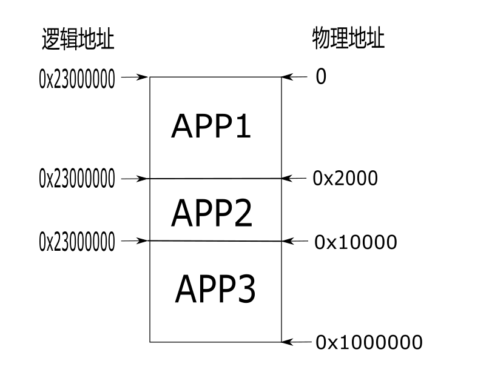

XIP FLASH 设备
=========================

简介
------------------------

XIP：eXecute In Place，即芯片内执行，指应用程序可以直接在 flash 闪存内运行，不必再把代码读到系统 RAM 中。所谓片内执行并不是说程序在存储器内执行，CPU的基本功能是取指、译码、执行，存储器访问，写回。通常我们使用 Nor Flash，Nor Flash能在芯片内执行，指的是 CPU 能够直接从Nor flash 中取指令，供后面的译码器和执行器来使用。

博流系列芯片拥有 XIP FLASH 控制器，并且支持内存映射，BL702/BL704/BL706 的逻辑地址为 0x23000000,最大可支持 8M 的 nor flash。不仅如此，映射的实际物理 flash 地址是可以修改的，举例来说，假设一个 nor flash 大小为 1M，如果应用程序烧录在 flash 物理地址 0，那么就可以将逻辑地址映射到 0 地址，如果应用程序烧录在 flash 物理地址 x，那么就可以将逻辑地址映射到 x 地址，而逻辑地址可以保持不变，一直是 0x23000000，省去了修改 ld 文件的麻烦。

下图演示三块应用程序映射地址分布:

XIP FLASH 设备接口
------------------------

**flash_init**
^^^^^^^^^^^^^^^^^^^^^^^^

``flash_init`` 用于初始化 flash 控制器。

.. code-block:: C

    BL_Err_Type flash_init(void);

- **return** 错误码，0 表示成功，其他表示错误

**flash_read_jedec_id**
^^^^^^^^^^^^^^^^^^^^^^^^

``flash_read_jedec_id`` 用于获取 flash id。

.. code-block:: C

    BL_Err_Type flash_read_jedec_id(uint8_t *data);

- **data** 存储 flash id 的指针，大小 4 字节
- **return** 错误码，0 表示成功，其他表示错误

**flash_erase**
^^^^^^^^^^^^^^^^^^^^^^^^

``flash_init`` 用于 flash 扇区擦除。

.. code-block:: C

    BL_Err_Type flash_erase(uint32_t startaddr, uint32_t len);

- **startaddr** 要擦除的 flash 物理起始地址
- **len** 擦除扇区长度，单位
- **return** 错误码，0 表示成功，其他表示错误

**flash_write**
^^^^^^^^^^^^^^^^^^^^^^^^

.. code-block:: C

    BL_Err_Type flash_write(uint32_t addr, uint8_t *data, uint32_t len);

- **addr** 要写入的 flash 物理起始地址
- **data** 写入数据指针
- **len** 写入长度
- **return** 错误码，0 表示成功，其他表示错误

**flash_read**
^^^^^^^^^^^^^^^^^^^^^^^^

.. code-block:: C

    BL_Err_Type flash_read(uint32_t addr, uint8_t *data, uint32_t len);

- **addr** 要读取的 flash 物理起始地址
- **data** 读入数据指针
- **len** 读取长度
- **return** 错误码，0 表示成功，其他表示错误

**hal_jump2app**
^^^^^^^^^^^^^^^^^^^^^^^^

.. code-block:: C

    void hal_jump2app(uint32_t flash_offset);

- **flash_offset** 要跳转的 flash 物理地址，即烧录新应用程序的物理地址

.. error:: 以上地址均为 flash 物理地址，不可以填入内存映射地址，比如0x23000000。