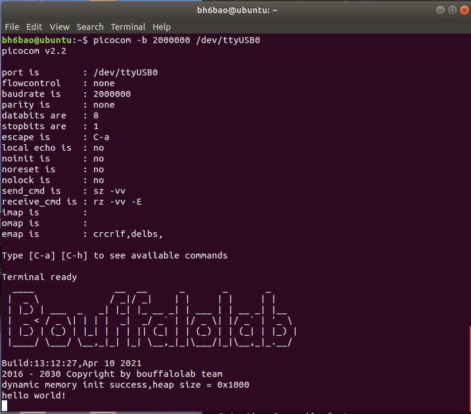

Linux OR WSL 环境开发指南
=============================

本文档介绍了如何在 Linux 安装配置 BL702 系列 MCU 需要的软件开发工具。而 WSL 系统下的安装配置方式与 linux 下一样，WSL 系统的安装请自行查阅网络资料安装。其区别就是一个运行在纯 linux 系统上，一个运行在 windows 上。如果不想装虚拟机或者 linux 系统，可以选择 WSL。

**Windows Subsystem for Linux** （简称 WSL ）是一个在 Windows 10 上能够运行原生 Linux 二进制可执行文件（ELF 格式）的兼容层。它是由微软与 Canonical 公司合作开发，其目标是使纯正的 Ubuntu 映像能下载和解压到用户的本地计算机，并且映像内的工具和实用工具能在此子系统上原生运行。因此，在 WSL 下的操作方式和 linux 下的操作方式是完全相同的。

需要的软硬件环境
-----------------------------

-  一根 mini USB 数据线
-  一个 USB-TTL 串口模块
-  杜邦线若干

配置 RISC-V 工具链
-----------------------------

.. code-block:: bash
   :linenos:
   :emphasize-lines: 4-6

   $ cd ~
   $ wget -c https://gitee.com/bouffalolab/toolchain_gcc_sifive_linux/repository/archive/V10.2
   $ unzip -x V10.2
   $ mv toolchain_gcc_sifive_linux-V10.2/ riscv64-unknown-elf-v10.2
   $ sudo cp -rf ~/riscv64-unknown-elf-v10.2  /usr/bin
   $ echo "export PATH=\"$PATH:/usr/bin/riscv64-unknown-elf-v10.2/bin\""  >> ~/.bashrc
   $ source ~/.bashrc

运行下面的命令，查看工具链是否安装成功，如果出现如下所示的信息则表示工具链安装成功

.. code-block:: bash
   :linenos:
   :emphasize-lines: 1

   $ riscv64-unknown-elf-gcc -v
   Using built-in specs.
   COLLECT_GCC=riscv64-unknown-elf-gcc
   COLLECT_LTO_WRAPPER=/usr/bin/riscv64-unknown-elf-v10.2/bin/../libexec/gcc/riscv64-unknown-elf/10.2.0/lto-wrapper
   Target: riscv64-unknown-elf
   Configured with: /scratch/jenkins/workspace/tpp-freedom-tools/tpp03--build-binary-packages--parameterized/obj/x86_64-linux-ubuntu14/build/riscv64-unknown-elf-gcc/riscv-gcc/configure --target=riscv64-unknown-elf --host=x86_64-linux-gnu --prefix=/scratch/jenkins/workspace/tpp-freedom-tools/tpp03--build-binary-packages--parameterized/obj/x86_64-linux-ubuntu14/install/riscv64-unknown-elf-gcc-10.2.0-2020.12.8-x86_64-linux-ubuntu14 --with-pkgversion='SiFive GCC-Metal 10.2.0-2020.12.8' --with-bugurl=https://github.com/sifive/freedom-tools/issues --disable-shared --disable-threads --enable-languages=c,c++ --enable-tls --with-newlib --with-sysroot=/scratch/jenkins/workspace/tpp-freedom-tools/tpp03--build-binary-packages--parameterized/obj/x86_64-linux-ubuntu14/install/riscv64-unknown-elf-gcc-10.2.0-2020.12.8-x86_64-linux-ubuntu14/riscv64-unknown-elf --with-native-system-header-dir=/include --disable-libmudflap --disable-libssp --disable-libquadmath --disable-libgomp --disable-nls --disable-tm-clone-registry --src=../riscv-gcc --with-system-zlib --enable-checking=yes --enable-multilib --with-abi=lp64d --with-arch=rv64imafdc CFLAGS=-O2 CXXFLAGS=-O2 'CFLAGS_FOR_TARGET=-Os -mcmodel=medany' 'CXXFLAGS_FOR_TARGET=-Os -mcmodel=medany'
   Thread model: single
   Supported LTO compression algorithms: zlib
   gcc version 10.2.0 (SiFive GCC-Metal 10.2.0-2020.12.8)

配置 cmake & make 工具
----------------------------

.. code-block:: bash
   :linenos:
   :emphasize-lines: 5-7

   $ sudo apt update
   $ sudo apt install make
   $ cd ~
   $ wget -c https://cmake.org/files/v3.19/cmake-3.19.3-Linux-x86_64.tar.gz
   $ tar -zxvf cmake-3.19.3-Linux-x86_64.tar.gz
   $ sudo cp -rf ~/cmake-3.19.3-Linux-x86_64  /usr/bin
   $ echo "export PATH=\"$PATH:/usr/bin/cmake-3.19.3-Linux-x86_64/bin\""  >> ~/.bashrc
   $ source ~/.bashrc

硬件连接
----------------------

-  具体开发板的连接, 请参考 :ref:`connect_hardware` 部分
-  请确保开发板正确设置后再进行下面的步骤 (建议 Linux 下采用串口连接)

获取 bl_mcu_sdk
---------------------------

-  打开终端输入以下命令获取 bl_mcu_sdk

.. code-block:: bash
   :linenos:

    $ cd ~
    $ git clone https://gitee.com/bouffalolab/bl_mcu_sdk.git  --recursive

测试 Hello World 工程
------------------------------

打开 Hello World
^^^^^^^^^^^^^^^^^^^^^^^^^^^^^^

-  获取到 SDK 后，进入 sdk 中的 ``examples/hellowd/helloworld`` 目录下，打开 ``main.c``，即可编辑 helloworld 的相关代码。

.. code-block:: bash
   :linenos:

    $ cd ~/bl_mcu_sdk/examples/hellowd/helloworld
    $ vi main.c

-  若编辑完成后，保存修改并关闭文件，接下来进行编译

编译 Hello World
^^^^^^^^^^^^^^^^^^^^^^^^^^^^^^

.. code-block:: bash
   :linenos:

    $ cd ~/bl_mcu_sdk
    $ make build BOARD=bl706_iot APP=helloworld

烧写 Hello World
^^^^^^^^^^^^^^^^^^^^^^^^^^^^

-  输入下面命令进行烧录，默认使用串口烧录，烧录之前需要进入烧录模式，参考 :ref:`bl_dev_cube`。

.. code-block:: bash
   :linenos:

    $ cd ~/bl_mcu_sdk
    $ make download INTERFACE=uart COMx=/dev/ttyUSB1

-  如果下载失败请检查：

   -  1. 是否使用串口烧写，开发板是否供电，硬件连接是否正确。
   -  2. 烧写命令是否在 ``bl_mcu_sdk`` 目录下执行
   -  3. 是否进入 boot_rom 模式
   -  4. 串口是否被占用，以及你的可用串口是否选择正确，如果你的串口不是 ``ttyUSB1``，那么请指定正确的串口

运行 Hello World
^^^^^^^^^^^^^^^^^^^^^^^^^^^^

-  打开新的终端，安装、运行串口工具

.. code-block:: bash
   :linenos:

    $ sudo apt install picocom   # 若已经安装请忽略
    $ picocom -b 2000000 /dev/ttyUSB1 # 注意你的可用串口号 （如使用 Sipeed RV-debugger Plus 的串口那么就是 ``ttyUSB1``）

-  按一下开发板上的 ``rst`` 按键，即可在串口终端中看到 ``hello world！``

   helloworld!

调试 Hello World
^^^^^^^^^^^^^^^^^^^^^^^^^^^^

