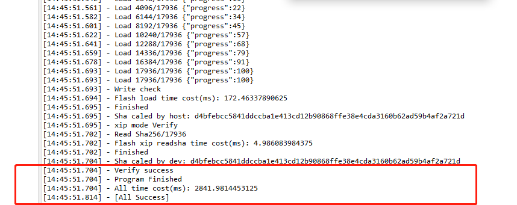
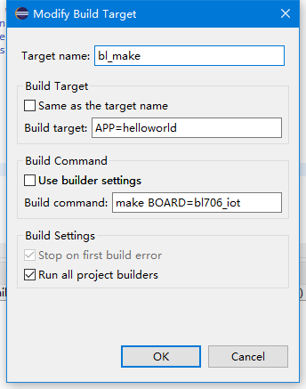

Windows 下使用 Eclipse 开发指南
================================

本文档介绍了如何在 Windows 下使用 eclipse，构建 BL702 系列 MCU 的软件开发环境。

需要的软硬件环境
-----------------------------

-  Eclipse 免安装软件包
-  一个 支持 risc-v 的 jtag 调试器
-  一个 USB-TTL 串口模块（如果调试器自带，忽略）

下载 Eclipse 安装包
-----------------------------

-  从 Bouffalo Lab 开发者社区下载带有 RISC-V 工具链的 `Eclipse https://dev.bouffalolab.com/download <https://dev.bouffalolab.com/media/upload/download/BouffaloLab_eclipse_x86_64_win_v1.2.0.zip>`_ 安装包。

下载 bl_mcu_sdk
-----------------------------

-  从开源社区下载 `bl_mcu_sdk <https://gitee.com/bouffalolab/bl_mcu_sdk.git>`_ 软件开发包。

- 可以使用 ``git clone`` 或者直接 ``download`` 的方式下 SDK
- 使用 ``git clone`` 前请确保已正确安装 ``git``，打开支持 ``git`` 的终端输入以下命令即可获取最新的 SDK。

.. code-block:: bash
   :linenos:
   :emphasize-lines: 1

   $ git clone https://gitee.com/bouffalolab/bl_mcu_sdk.git  --recursive

配置 eclipse 开发环境
----------------------------

-  将获取到的 eclipse 压缩包拷贝到您的工作目录，解压 eclipse 压缩包
-  进入 eclipse 目录，双击 ``eclipse.exe`` 启动 eclipse
-  选择您的 ``Workspace`` 目录，点击 ``Launch`` 进入工作空间

   .. figure:: img/pic1.png
      :alt:

-  点击菜单栏中 ``Window->preferences`` 打开环境配置相关页面，准备导入相关的配置环境

   .. figure:: img/pic2.png
      :alt:

-  点击下图 1 处的图标，打开导入配置界面，按照如图所示步骤，选择 ``eclipse.exe`` 目录下的 ``bflb_mcu_preferences.epf`` 配置文件。

   .. figure:: img/pic3.png
      :alt:

-  选择好对应的文件后，点击 ``Finish``，在弹出的对话框选中点击 ``cancel`` ，不用重新启动。

   .. figure:: img/pic4.png
      :alt:

导入 bl_mcu_sdk
--------------------------

-  点击 菜单栏 ``File->Import`` ，打开导入项目的配置界面

   .. figure:: img/pic5.png
      :alt:

-  在打开的 ``Import`` 窗口中选择 ``General->Existing Projects into Workspace`` ，然后点击 ``Next``

   .. figure:: img/pic6.png
      :alt:

-  加载 bl_mcu_sdk 的工程路径后，点击 ``Finsh`` 完成导入

   .. figure:: img/pic7.png
      :alt:

-  导入完成后，关闭 ``Welcome`` 窗口即可看到导入的工程

   .. figure:: img/pic8.png
      :alt:

   .. figure:: img/pic9.png
      :alt:

-  展开 ``Build Target`` 目录，即可看到 ``bl_clean``、``bl_make``、``download`` 三个功能按钮。

   -  双击 ``bl_clean`` 按钮，会清除 ``build`` 和 ``out`` 两个目录下的编译缓存
   -  双击 ``bl_make`` 按钮，会正常编译设置的 case，若没有修改默认配置则会编译 ``helloworld`` 工程
   -  双击 ``download`` 按钮，会下载代码到芯片中，若没有编译成功则会下载默认的或者上一次的 ``.bin`` 文件

硬件连接
----------------------

-  具体开发板的连接, 请参考 :ref:`connect_hardware` 部分；（eclipse 环境建议使用 ``j-link`` 烧写、调试）
-  请确保开发板正确设置后再进行下面的步骤

测试 Hello World 工程
------------------------------

打开 Hello World
^^^^^^^^^^^^^^^^^^^^^^^^^^^^

-  打开 ``examples/hellowd/helloworld/main.c`` 文件，即可编辑、修改 ``helloworld`` 测试 demo 的代码，若修改了，请保存后在执行编译

编译 Hello World
^^^^^^^^^^^^^^^^^^^^^^^^^^^^

-  双击 ``bl_make`` 即可编 helloworld 工程

-  编译成功后 ``Console`` 窗口可以看到如下图所示的 log 信息

.. figure:: img/pic10.png

烧写 Hello World
^^^^^^^^^^^^^^^^^^^^^^^^^^^^

-  双击 ``download`` 即可烧写 helloworld 工程 ``bin`` 文件到芯片中，默认使用串口烧录，烧录之前需要进入烧录模式，参考 :ref:`bl_dev_cube`。

-  下载成功后 ``Console`` 窗口可以看到如下图所示的 log 信息

运行 Hello World
^^^^^^^^^^^^^^^^^^^^^^^^^^^^

-  将开发板的 ``TXD0``、``RXD0`` 和 ``GND`` 引脚使用杜邦线连接到 USB-TTL 串口模块，将串口模块插入 PC 主机， 使用任意的串口助手软件打开串口
-  烧写成功后，按下板子上的 ``rst`` 按键，如果下载正确，即可在串口助手软件中看到如下图所示的 log 信息。

.. figure:: img/eclipse_run.png

调试 Hello World
^^^^^^^^^^^^^^^^^^^^^^^^^^^^

-  点击 eclipse 工具栏中的 ``Debug`` 按钮，进入 debug 配置窗口
-  选择 ``GDB SEGGER J-Link Debugging->Jlink_bl_mcu_sdk``  Debug 配置，在 ``C/C++ Application:`` 选项中选择需要调试的 ``.elf`` 文件
-  先点击 ``Apply`` 后，在点击 ``Debug`` 即可进行 ``Debug``

.. figure:: img/pic14.png
   :alt:

-  进入 Debug 界面后，即可看到程序停在了 ``main``，点击上方工具栏中的 ``Step Over``，按钮即可对代码工程进行单步调试。

.. figure:: img/pic15.png
   :alt:

   Eclipse Debugging

编译烧写不同的目标工程
-----------------------

-  当右击 ``bl_make`` 按钮，点击 ``Edit`` 后，会弹出更换目标工程的配置界面，如下图所示

-  其中 ``APP=xxx`` 用户可以修改其内容，改为需要编译烧写的目标工程名，例如想要编译烧写 ``gpio/gpio_blink`` 工程，将其修改为 ``APP=gpio_blink`` 即可
-  ``Build command`` 中 ``make BOARD=bl706_iot`` 会指定不同的 Board 类型以指定适配不同类型的开发板。

-  ``Board`` 类型决定编译时选择相应的 ``borad`` 头文件。默认选择的是 BL706 的 iot 开发板 ``make build BOARD=bl706_iot``

