Board 配置系统使用指南
=======================

**Board 配置系统** 主要是用于嵌入式应用中的时钟、GPIO 、外设默认配置三个基本元素进行初始化的配置系统，方便用户统一管理，省去在写多个 case 的时候重复配置。

**Board 配置系统**  包含三个配置文件，以及一个 ``bl_config_wizard`` 图形化配置软件

- **clock_config.h** 时钟配置头文件
- **peripheral_config.h** 外设配置头文件
- **pinmux_config.h** 引脚功能配置头文件
- **bl_config_wizard** 图形化界面配置上述三类文件

用户只需要修改三个配置文件，系统会自动初始化，从而无需在用户程序中，调用一系列的复杂冗长的初始化函数。 Boufflao Lab 为方便用户快速简便的生成项目对应的配置文件，提供了 ``bl_config_wizard`` 配置软件，目前已支持引脚配置和时钟配置功能，但外设配置功能正处于开发阶段。

`bl_config_wizard`_ 支持 PC 端在线配置，目前不支持移动终端在线配置。

.. _bl_config_wizard: https://dev.bouffalolab.com/media/config/index.html

.. figure:: img/config_wizard.png
    :alt:

    bl_config_wizard 软件预览

Board 配置系统中各文件功能介绍
--------------------------------

Board 系统主要针对不同的板子来使用，不同的板子创建不同的 board 文件，放在 ``bsp/board`` 目录下，并且一个 board 文件，在 **引脚不冲突** 的情况下，可以共享给不同的 demo 使用，无需再创建多个工程，减少工程文件大小。

.. error:: 如果引脚冲突，并且非要使用一个 board 文件，请自行修改引脚

**board.c**
^^^^^^^^^^^^^^^^^^^^

``board.c`` 主要对时钟、引脚进行初始化，这个也是 board 配置系统中的核心文件。

**blxxx_config.h**
^^^^^^^^^^^^^^^^^^^^^^^^^^^^

``blxxx_config.h`` 主要是包含一些头文件，给 HAL 层驱动使用。

.. hint:: 以上两个文件无需用户更改，并且相同的 MCU 可以直接复制粘贴到自己的 board 目录使用

**clock_config.h**
^^^^^^^^^^^^^^^^^^^^^^^^^^^^

``clock_config.h`` 主要配置系统和外设的时钟源以及分频系统。

**peripheral_config.h**
^^^^^^^^^^^^^^^^^^^^^^^^^^^^

``peripheral_config.h`` 主要包含外设的使能以及参数的配置。

.. warning:: 以 ``#define BSP_USING_XXX`` 开头的宏，用来开启外设的配置，如果没有使能宏，则无法使用该外设的所有函数

.. warning:: 以 ``XXX_CONFIG`` 开头的宏，用来初始化外设的配置，后面调用 ``device_open`` 来使用该配置

**pinmux_config.h**
^^^^^^^^^^^^^^^^^^^^^^^^^^^^

``pinmux_config.h`` 主要配置外设的 GPIO 引脚功能。

.. warning:: 在 mcu sdk 中，所有 demo 共享这个文件，因此有些 demo 是不能使用的，需要频繁修改该文件的引脚功能配置。如果用户已经定好了引脚的分配，则不用频繁修改。

clock_config.h 的生成与修改
----------------------------------

基于 bl_config_wizard 工具生成 clock_config.h 文件
^^^^^^^^^^^^^^^^^^^^^^^^^^^^^^^^^^^^^^^^^^^^^^^^^^^^^^^^^^

1. 选择 **XCLK** 和 **PLL** 的时钟源； **XCLK** 和 **PLL** 时钟源始终保持一致，可以选择 ``内部 32M RC 震荡电路`` 产生的时钟，也可以选择 ``外部 32M 晶振`` 产生的时钟。

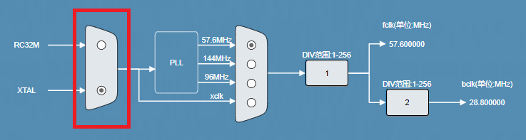

    xclk 时钟源选择

2. 选择 **MCU** 的时钟源，并配置 **MCU** 和 **BCLK** 的分频系数； **MCU** 可以选择 **XCLK** 时钟或者 PLL 输出的某一路时钟作为时钟源， **PLL** 输出的时钟频率分别是 ``57.6MHz`` 、 ``144MHz`` 和 ``96MHz``。

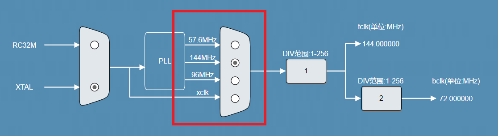

    MCU 时钟源选择

.. hint:: **MCU** 时钟又称为 **FCLK** 。
.. hint:: 修改 ``DIV`` 时，如果时钟值未刷新，请敲回车。

3. 选择 **PMU** 的时钟源。

    PMU 时钟源选择

.. hint:: **PMU** 时钟又称 **F32K_CLK**

4. 选择 **UART** 的时钟源，并配置其分频系数； **UART** 可以选择 **FCLK** 或者 **PLL_96M** 作为时钟源。

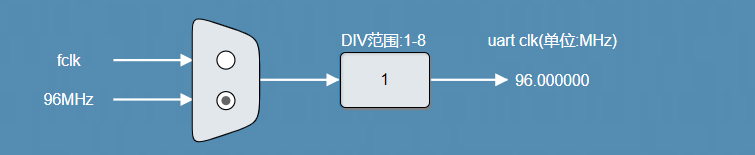

    UART 时钟源选择与分频

5. 配置 **I2C** 和 **SPI** 时钟的分频系数； **I2C** 、 **SPI** 有唯一的时钟源 **BCLK** ， **BCLK** 是 **MCU** 时钟经过 **BCLK_DIV** 分频后的时钟。

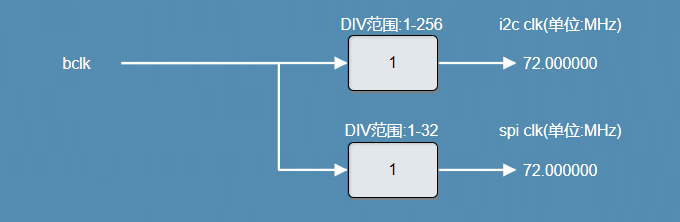

    I2C 和 SPI 时钟分频

6. 选择 **PWM** 的时钟源，并配置其分频系数； **PWM** 可以选择 **XTAL_32K** 、 **BCLK** 或者 **F32K_CLK** 时钟作为时钟源。

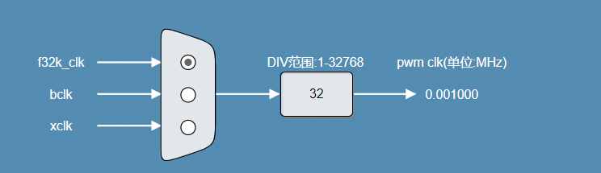

    PWM 时钟源选择

7. 配置 **IR** 时钟的分频系数； **IR** 使用 **XCLK** 时钟作为时钟源，拥有独立的分频器。

    IR 时钟分频器

8. 选择 **I2S** 的时钟源； **I2S** 的时钟来自于 **AUPLL** 输出的时钟，AUPLL 可以选择输出 ``12.288MHz`` 、 ``11.2896MHz`` 、 ``5.6448MHz`` 、 ``24.576MMHz`` 和 ``24MMHz``。

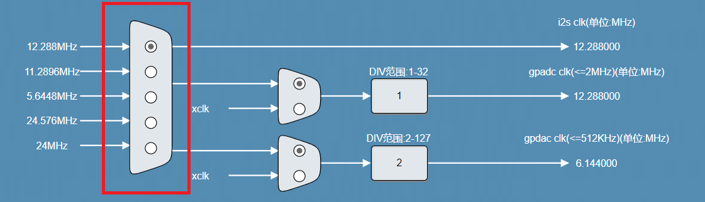

    I2S 时钟源选择

9. 选择 **ADC** 的时钟源，并配置其分频系数； **ADC** 可以选择 **AUPLL** 或者 **XCLK** 作为时钟源。

.. figure:: img/adc_mux.png
    :alt:

    ADC 时钟源选择与分频

.. warning:: ``ADC 时钟`` 不能大于 **2MHz**

10. 选择 **DAC** 的时钟源，并配置其分频系数； **DAC** 可以选择 **AUPLL** 或者 **XCLK** 作为时钟源。

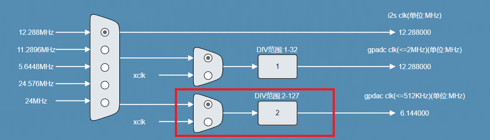

    DAC 时钟源选择与分频

.. warning:: ``DAC 时钟`` 不能大于 **512KHz**

11. 选择 **QDEC** 和 **KYS** 的时钟源，并配置其分频系数； **QDEC** 和 **KYS** 共享一个时钟源，可以选择 **XCLK**  或者 **F32K_CLK**。

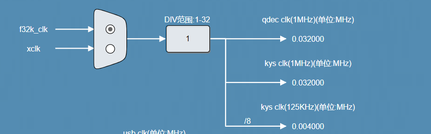

    QDEC 和 KYS 时钟源选择

.. hint:: 建议 **QDEC** 和 **KYS** 使用 **1MHz** 。

12. 选择 **CAM** 的时钟源，并配置其分频系数； **CAM** 可以选择 **PLL_96M** 或者 **F32K_CLK** 作为时钟源。

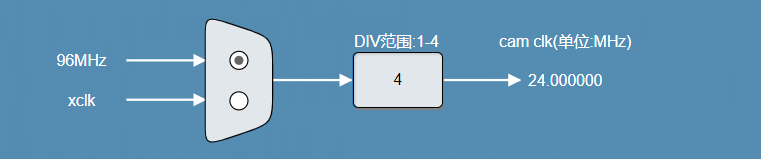

    CAM 时钟源选择

13. 选择 **Timer0** 、 **Timer1** 的时钟源，并配置其分频系数。

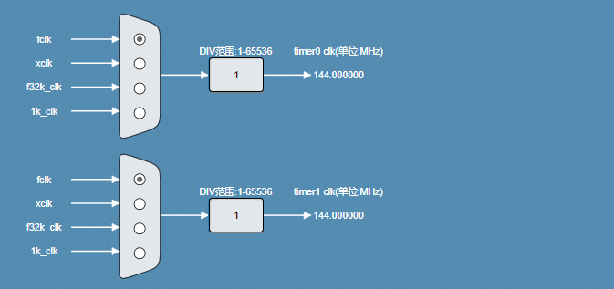

    Timer 时钟源选择

14. 选择 **WDT** 的时钟源，并配置其分频系数。

.. figure:: img/wdt_mux.png
    :alt:

    WDT 时钟源选择

15. 导出配置文件。

.. hint:: ``重置`` 按键用于恢复默认时钟配置。

pinmux_config.h 的生成与修改
----------------------------------

基于 bl_config_wizard 工具生成 pinmux_config.h 文件
^^^^^^^^^^^^^^^^^^^^^^^^^^^^^^^^^^^^^^^^^^^^^^^^^^^^^

1.  在窗口栏选择 ``引脚&外设配置``；
#.  选择 MCU 型号，目前支持 ``BL706引脚配置``、 ``BL704引脚配置`` 、 ``BL702引脚配置`` ；
#.  选择引脚的功能，以 ``BL706引脚配置`` 为例，点击 **PAD_GPIO_XX** 的下拉框，选择需要的功能，如图所示；

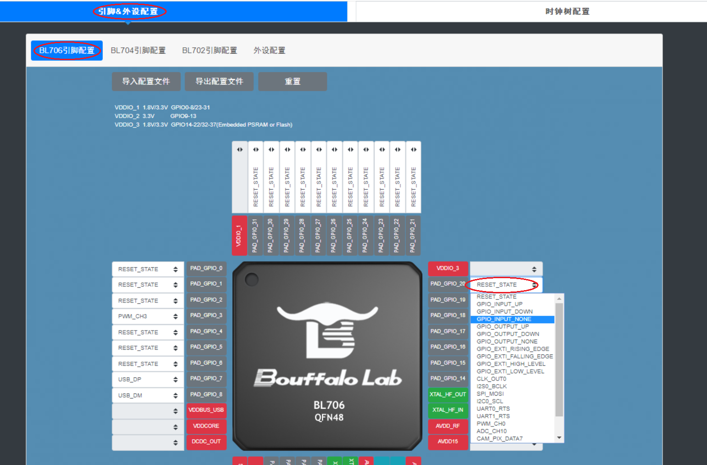

    选择引脚功能图

4. 配置好所有引脚功能后，点击 ``导出配置文件`` ，然后可在弹框内选择路径和修改文件名，如图所示；

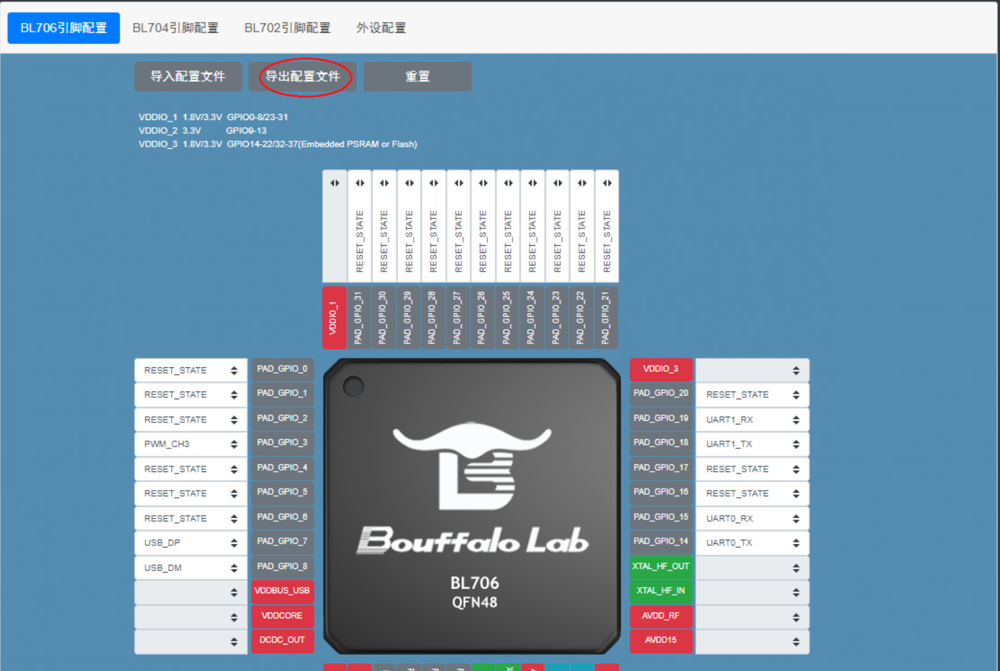

    导出配置文件图

基于 bl_config_wizard 工具修改 pinmux_config.h 文件
^^^^^^^^^^^^^^^^^^^^^^^^^^^^^^^^^^^^^^^^^^^^^^^^^^^^^^

往往在使用中，我们不是生成一个新的 **pinmux_config.h** 文件，而是在原有的 **pinmux_config.h** 文件基础上做修改，``bl_config_wizard`` 支持这样的需求。

1.  在窗口栏选择 ``引脚&外设配置``；
#.  选择 MCU 型号，目前支持 ``BL706引脚配置``、 ``BL704引脚配置`` 、 ``BL702引脚配置`` ；
#.  点击 ``导入配置文件``，然后在弹框内选择 **pinmux_config.h** 文件；
#.  选择需要修改的引脚，点击其下拉框，更改引脚功能；
#.  修改完成后，点击 ``导出配置文件`` ，然后可在弹框内选择路径和修改文件名。

在 CDK 工具中修改 **pinmux_config.h** 文件
^^^^^^^^^^^^^^^^^^^^^^^^^^^^^^^^^^^^^^^^^^^^

-  **pinmux_config.h**  同时还支持在 CDK 使用图形配置向导进行相应引脚功能的调整
-  直接将 **pinmux_config.h** 文件拖入 CDK 文本编辑界面，在文本编辑下方即可看到 ``Configuration Wizard`` 标签

   .. figure:: img/configuration_wizard_1.png
       :alt:

       图形配置向导

-  点击 ``Configuration Wizard`` 标签，即可打开图形配置向导界面
-  通过选择下拉框即可选择该引脚支持的功能

   .. figure:: img/configuration_wizard_2.png
       :alt:

       图形配置向导设置引脚功能

-  图形配置向导的具体功能和代码规则，详情请参考 CDK Help 的图形配置向导章节

与 STM32CUBEMX 配置工具的区别
------------------------------

STM32CUBEMX 也是一个配置时钟、外设和 GPIO 初始化的工具，最终生成一个完整的工程，初始化都放在 ``main.c`` 的最开始 ，GPIO 和外设初始化底层会调用到 ``stm32xxx_hal_msp.c`` 中。

.. code-block:: C

    /* MCU Configuration--------------------------------------------------------*/

    /* Reset of all peripherals, Initializes the Flash interface and the Systick. */
    HAL_Init();

    /* USER CODE BEGIN Init */

    /* USER CODE END Init */

    /* Configure the system clock */
    SystemClock_Config();

    /* USER CODE BEGIN SysInit */

    /* USER CODE END SysInit */

    /* Initialize all configured peripherals */
    MX_GPIO_Init();
    MX_USART1_UART_Init();
    MX_QUADSPI_Init();

.. code-block:: C

    void HAL_UART_MspInit(UART_HandleTypeDef* huart)
    {
        GPIO_InitTypeDef GPIO_InitStruct = {0};
        if(huart->Instance==UART5)
        {
        /* USER CODE BEGIN UART5_MspInit 0 */

        /* USER CODE END UART5_MspInit 0 */
            /* Peripheral clock enable */
            __HAL_RCC_UART5_CLK_ENABLE();

            __HAL_RCC_GPIOB_CLK_ENABLE();
            /**UART5 GPIO Configuration
            PB12     ------> UART5_RX
            PB13     ------> UART5_TX
            */
            GPIO_InitStruct.Pin = GPIO_PIN_12|GPIO_PIN_13;
            GPIO_InitStruct.Mode = GPIO_MODE_AF_PP;
            GPIO_InitStruct.Pull = GPIO_NOPULL;
            GPIO_InitStruct.Speed = GPIO_SPEED_FREQ_LOW;
            GPIO_InitStruct.Alternate = GPIO_AF14_UART5;
            HAL_GPIO_Init(GPIOB, &GPIO_InitStruct);

            /* UART5 interrupt Init */
            HAL_NVIC_SetPriority(UART5_IRQn, 0, 0);
            HAL_NVIC_EnableIRQ(UART5_IRQn);
        /* USER CODE BEGIN UART5_MspInit 1 */

        /* USER CODE END UART5_MspInit 1 */
        }

    }

.. hint:: stm32 生成的工程都是对一个工程起作用，不能够同时编译多个工程。如果使用多个工程，就要生成多个上述两个文件。在使用多个工程时，会间接增加文件大小，增加重复文件。
