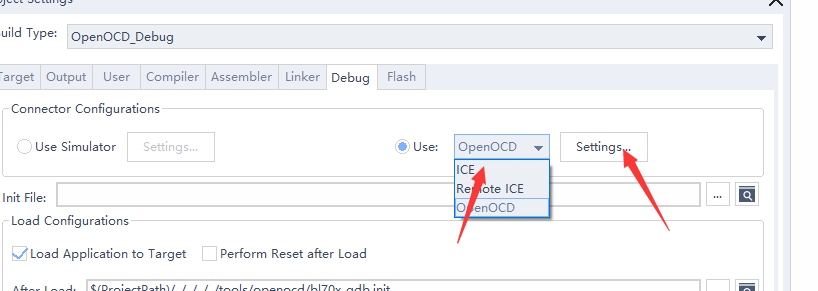

使用 CDK + CK-Link 编译调试
=============================

打开 Hello World
------------------------------

-  获取到 SDK 后，进入 sdk 中的 ``examples/hellowd/helloworld/cdk`` 目录下，双击 ``helloworld.cdkproj``，即可打开 ``Helloworld`` 工程

编译 Hello World
------------------------------

.. figure:: img/cdk1.png
   :alt:

   helloworld.cdkproj

-  在活动工程下拉菜单可以选择 ``CK_Link_Debug`` 或者 ``OpenOCD_Debug`` 工程，本教程基于 ``CK_Link_Debug`` 工程， ``CK_Link_Debug`` 菜单已经选择好了 cklink 调试器，如果没有 ``CK_Link_Debug`` 菜单，其他的菜单只需要在 `Debug` 栏选择 `ICE` 即可。

-  在 CDK 工具栏中，点击编译图标即可编译工程

   -  点击 ``1`` 处 图标 ``Build Project`` 即可编译当前选中的工程
   -  点击 ``2`` 处 图标 ``Clean Project`` 即可清除上次编译的结果
   -  点击 ``3`` 处 图标 ``Flash Download`` 即可将编译好的代码下载到芯片中
   -  点击 ``4`` 处 图标 ``Start/Stop Debug`` 即可进行 debug 的相关操作（在使用 ``CK-Link`` 时可以先将代码 load 到 flash 中）
   -  点击 ``5`` 处 图标 ``Start/Stop Debug whitout Download`` 即可直接进行 debug , 不 load 当前 bin 文件
   -  也可以在 ``Project`` 中，右击工程名称，通过右击菜单中的选项对项目进行编译等操作

烧写 Hello World
----------------------------

-  由于目前 CDK 软件中还没有包含我们的 flash 算法，所以需要我们手动将 flash 算法放到 CDK 安装目录，具体操作如下：

   -  进入 SDK 目录下 ``tools\cdk_flashloader`` 目录
   -  将目录下的 ``bl70x_flasher.elf`` 文件，拷贝到 CDK 工具的 ``C-Sky\CDK\CSKY\Flash`` 目录中

   .. figure:: img/cdk7.png
      :alt:

      CDK Flash Loader

.. figure:: img/cdk8.png
   :alt:

   CDK Project Setting

-  点击 ``Project View`` 中的项目设置按钮，打开 ``Project Setting`` 窗口，或者通过右击 ``Project`` 名称中右击菜单栏中打开

- 在打开的 ``Project Setting`` 窗口中，选择 ``Flash`` 标签，配置需要的 Flash 算法

.. figure:: img/cdk9.png
   :alt:

   CDK Project Flash setting

-  在 ``Flash`` 标签中，点击 ``Add`` 按纽，在打开的列表中选择 ``bl70x_flash`` 算法，点击 ``Add`` 添加到工程中，``Flash`` 标签下的其他设置，如图所示：

-  点击 OK 后，如配置正确，点击 ``Flash Download`` 即可将编译好的代码下载到芯片中

.. figure:: img/cdk5.png
   :alt:

   CDK Flashdownload Success

-  如下载失败请检查：

   -  1. 代码是否被正确编译，并生成 ``.elf`` ``.bin`` 等文件
   -  2. Flash 算法是否被正确设置
   -  3. CK-Link 与开发板是否正确连接
   -  4. 开发板是否正常供电，电源指示灯是否点亮

运行 Hello World
----------------------------

-  从 CDK 的菜单栏 ``View->Serial Pane``，打开串口面板，在打开的 ``Serial Pane`` 中右击，进行串口设置，选择你对应的串口号和波特率

.. figure:: img/cdk4.png
.. figure:: img/cdk3.png
   :alt:

   CDK Serial Pane setting

-  按下板子上的 ``RST`` 按键，即可在串口中看到代码的运行结果

.. figure:: img/cdk6.png
   :alt:

   HelloWorld！

调试 Hello World
----------------------------

-  点击工具栏上方的 ``Start/Stop Debugger`` 按钮，进入 debug 界面，如下图所示

.. figure:: img/cdk10.png
   :alt:

   Debug HelloWorld！

-  在 debug 界面下，左侧的 ``Register`` 窗口中，可以查看 ``CPU`` 内部寄存器数据；右侧的 ``Peripherals`` 外设面板中，
   可以查看相应外设寄存器数据，外设的选择可以在顶部菜单栏的 ``Peripherals->System Viewer`` 选择；
   点击上方工具栏中的相关调试按钮可以进行断点设置、单步调试、指令单步和全速运行等操作。
   当然这些操作都有相应的快捷键和快捷设置方法，详情请参考 ``CDK Help``，这里就不作过多介绍了。

-  我们点击单步运行按钮，运行代码，即可看到指示光标移动到下一句代码，同时可以看到串口面板中显示了我们输出的 ``Hello World！``

.. figure:: img/cdk11.png
   :alt:

   Debug HelloWorld！

