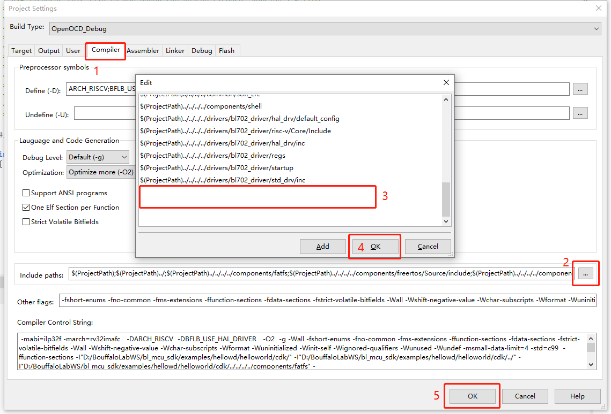
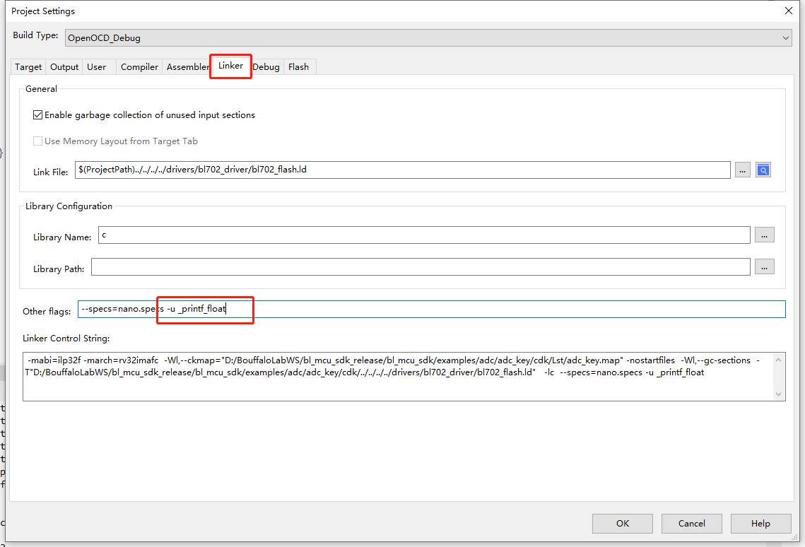

基于 CDK 新建工程指南
================================

本文档将简单介绍一下如何基于本 SDK 新建一个全新的 CDK 项目工程，按本教程操作前请确保正确安装好了 CDK 集成开发环境

examples 的目录结构
------------------------

在 ``bl_mcu_sdk/examples`` 目录下通常存在两层子目录，第一层通常为同一类外设相关的 case 集，一般使用外设名称，第二层通常为该外设具体的某一种测试例程，第二层目录下通常还包含一个以 ``cdk`` 命名的目录，以及该 case 相关的源码，
在 ``cdk`` 目录中通常会包含一个 ``xxx.cdkproj`` 文件，该文件为 CDK 工程文件，在正确安装了 **CDK** 集成开发环境的情况下，双击工程即可打开该项目。新建的项目目录层级应保持与当前 ``examples`` 目录下的 case 层级一致。

.. note:: 该源文件必须包含 c 程序入口，通常为 ``main`` 函数，源文件可以不叫 ``main.c``

-  在 ``examples`` 目录下新建一个 ``my_case`` 目录，用于存放你的 case 集
-  在 ``my_case`` 目录中新建你要测试 case 的名称，比如新建一个 ``gpio_case`` 目录
-  在 ``gpio_case`` 目录中添加 ``main.c`` 文件和 ``cdk`` 文件夹

目录结构如下：

.. code-block:: bash
   :linenos:

   bl_mcu_sdk
   ├── examples
       ├── my_case
           ├── gpio_case
           │   ├── cdk
           │   │   ├──gpio_case.cdkproj
           │   ├── CMakeLists.txt
           │   └── main.c
           └── xxxx_case

添加 cdk 工程相关文件
-------------------------

由于 CDK 当前版本暂不支持新建纯 ``Empty`` 工程，所以请按照下面的步骤进行

-  将 ``helloworld`` case 中 cdk 目录下 ``helloworld.cdkproj`` 拷贝一份到你自己的 cdk 目录下
-  修改文件名称为你的 case 名称，例如：``gpio_case.cdkproj``
-  使用文本编辑器打开 ``gpio_case.cdkproj`` 文件，修改 ``Project Name`` 为你的工程名称，例如：``gpio_case``

.. figure:: img/cdk_start_1.png
   :alt:

-  编辑好之后，保存文件，接下来双击 ``gpio_case.cdkproj`` 打开工程
-  打开工程后，即可右击相应的文件夹，添加你所需要的源码文件

.. figure:: img/cdk_start_2.png
   :alt:

-  右击工程，打开 ``Project Settings`` ，选择 Compiler 标签，在 ``Include paths`` 中添加，新文件需要的相应头文件
-  头文件路径建议使用相对路径
-  点击 ``OK`` 保存编辑，即可

-  在有浮点打印输出需求的情况下，需要在 Linker 标签，在 ``Other flags`` 中，添加 ``-u _printf_float`` 的 flag 选项，否则不能正常 printf 浮点数

-  使用不同开发板的情况下，注意选择不同的 board 文件引用，通常情况下，默认配置的是 **bl706_iot**

.. figure:: img/cdk_start_5.png
   :alt:

