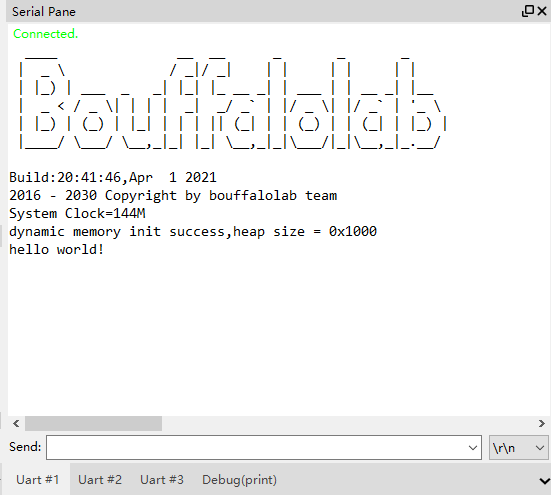
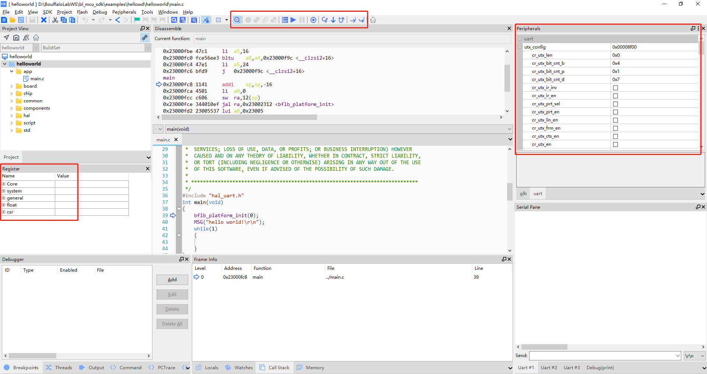

使用 CDK + Sipeed RV-Debugger Plus 编译调试
==============================================

打开 Hello World
------------------------------

-  获取到 SDK 后，进入 sdk 中的 ``examples/hellowd/helloworld/cdk`` 目录下，双击 ``helloworld.cdkproj``，即可打开 ``Helloworld`` 工程

编译 Hello World
------------------------------

.. figure:: img/cdk1.png
   :alt:

   helloworld.cdkproj

-  在活动工程下拉菜单选择 ``OpenOCD_Debug`` 工程，由于 Sipeed RV-Debugger Plus 是使用 OpenOCD 调试的，所以本教程基于 ``OpenOCD_Debug`` 工程；
-  如 Sipeed RV-Debugger Plus 没有正确安装驱动，请参考 :ref:`sipeed_rv_debugger_plus` 部分，设置好驱动程序，在进行下面的步骤

-  在 CDK 工具栏中，点击编译图标即可编译工程

   -  点击 ``1`` 处 图标 ``Build Project`` 即可编译当前选中的工程
   -  点击 ``2`` 处 图标 ``Clean Project`` 即可清除上次编译的结果
   -  点击 ``3`` 处 图标 ``Flash Download`` 即可将编译好的代码下载到芯片中 （**使用 OpenOCD Debug 不能使用 Flash 下载功能**）
   -  点击 ``5`` 处 图标 ``Start/Stop Debug whitout Download`` 即可直接进行 debug , 不 load 当前 bin 文件
   -  也可以在 ``Project`` 中，右击工程名称，通过右击菜单中的选项对项目进行编译等操作

烧写 Hello World
----------------------------

-  在 CDK 中使用 OpenOCD 模式的调试方式时，暂不支持直接使用 CDK 相关 ``flash`` 工具下载代码，所以请使用 BL Dev Cube 工具进行程序烧写，烧写代码请参考 :ref:`bl_dev_cube` 部分进行
-  代码烧写完成后使用 CDK 进行 Debug

运行 Hello World
----------------------------

-  从 CDK 的菜单栏 ``View->Serial Pane``，打开串口面板，在打开的 ``Serial Pane`` 中右击，进行串口设置，选择你对应的串口号和波特率

.. figure:: img/cdk4.png
.. figure:: img/cdk3.png
   :alt:

   CDK Serial Pane setting

-  按下板子上的 ``RST`` 按键，即可在串口中看到代码的运行结果

   HelloWorld！

调试 Hello World
----------------------------

-  点击工具栏上方的 ``Start/Stop Debugger`` 按钮，进入 debug 界面，如下图所示

   Debug HelloWorld！

-  在 debug 界面下，左侧的 ``Register`` 窗口中，可以查看 ``CPU`` 内部寄存器数据；右侧的 ``Peripherals`` 外设面板中，
   可以查看相应外设寄存器数据，外设的选择可以在顶部菜单栏的 ``Peripherals->System Viewer`` 选择；
   点击上方工具栏中的相关调试按钮可以进行断点设置、单步调试、指令单步和全速运行等操作。
   当然这些操作都有相应的快捷键和快捷设置方法，详情请参考 ``CDK Help``，这里就不作过多介绍了。

-  我们点击单步运行按钮，运行代码，即可看到指示光标移动到下一句代码，同时可以看到串口面板中显示了我们输出的 ``Hello World！``

