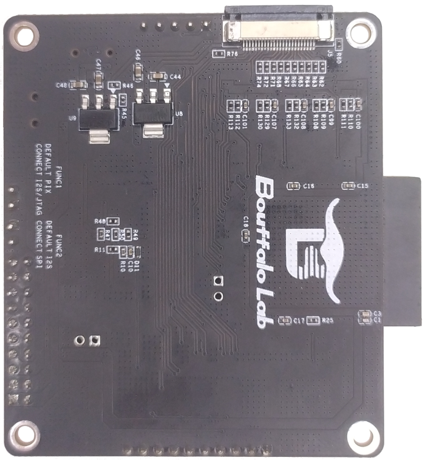

.. _connect_hardware:

硬件连接指南
================

本文档介绍了如何连接 BL70x 系列 MCU 的开发板

BL706_IOT 开发板
-------------------------

使用 CK-Link 烧写、调试连接方法
^^^^^^^^^^^^^^^^^^^^^^^^^^^^^^^^^

-  将 CK-Link USB 接口使用合适的 USB 数据线正确连接到 PC 主机
-  将 Iot 开发板的 ``HD3`` 组的标准 ``JTAG`` 引脚使用杜邦线与 ``CK-Link`` 对应的 ``JTAG`` 引脚连接起来
-  若没有使用 CK-Link 给开发板供电，需要给开发板单独供电

::

    bl706-iot board         CK-Link
    -------------------------------
        JTAG_TDI     <-->     TDI
        JTAG_TDO     <-->     TDO
        JTAG_TCK     <-->     TCK
        JTAG_TMS     <-->     TMS
        VDD33        <-->     VREF
        GND          <-->     GND

.. figure:: img/ck_link_connect_bl706_iot.png
   :alt:

   ck_link connect bl706-iot board

使用 J-Link 烧写、调试连接方法
^^^^^^^^^^^^^^^^^^^^^^^^^^^^^^^

-  将 j-link 的 USB 接口使用合适的 USB 数据线正确连接到 PC 主机
-  将 Iot 开发板的 ``HD3`` 组的标准 ``JTAG`` 引脚使用杜邦线与 ``j-link`` 对应的 ``JTAG`` 引脚连接起来
-  j-link 连接的情况下需要给开发板独立供电，并且将开发板的电源接到 j-link 的 ``VTref`` 引脚

::

    bl706-iot board          j-link
    -------------------------------
        JTAG_TDI     <-->     TDI
        JTAG_TDO     <-->     TDO
        JTAG_TCK     <-->     TCK
        JTAG_TMS     <-->     TMS
        VDD33        <-->     VTref
        GND          <-->     GND

.. figure:: img/jlink_connect_bl706_iot.png
   :alt:

   jlink connect bl706-iot board

使用串口烧写程序连接方法
^^^^^^^^^^^^^^^^^^^^^^^^^^

-  使用串口烧写前，请确保正确安装了 ``Bouffalo Lab Dev Cube`` 或命令行烧写工具

   -  使用 ``Type-C USB`` 数据线 or ``Mini USB`` 数据线连接到开发板上对应的 ``Type-C`` 接口 or ``Mini`` 接口上。
   -  按下开发板上的 ``Boot`` 键，不要释放
   -  按下开发板上的 ``RST`` 键，此时已经进入 ``Boot ROM``，可以释放两个按键
   -  这时就可以从 ``Bouffalo Lab Dev Cube`` 中看到相应的串口 ``COM`` 号，如没有出现，请点击 ``Refresh`` 按钮刷新一下

-  如没有合适的数据线，也可以使用一些常见的 ``USB-TTL`` 模块，连接到开发板的 ``UART0`` 端口进行烧写。 ``UART0`` 在 ``HD1`` 组上，连接方法如下：

::

   USB-TTL      BL702_IoT
   ----------------------
     3V3   <-->   VDD
     TXD   <-->   RX0
     RXD   <-->   TX0
     GND   <-->   GND

-  烧写方法同上

BL706_AVB 开发板
--------------------------

.. important:: BL706_AVB 开发板有多个引脚存在复用情况，请仔细检查所需功能引脚是否被复用了；FUNC1:「Default: PIX; Connect: I2S/JTAG」，FUNC2:「Default: I2S; Connect: SPI」; **如果需要调试，请务必记得将 FUNC1 跳帽连接**

使用 Sipeed RV-Debugger Plus 烧写、调试连接方法
^^^^^^^^^^^^^^^^^^^^^^^^^^^^^^^^^^^^^^^^^^^^^^^^^^

-  将 BL706_AVB 开发板先供电
-  将 RV-Debugger Plus 调试器连接到电脑 USB 口，如没有正确安装驱动，请参考 :ref:`sipeed_rv_debugger_plus` 部分，设置好驱动程序，在进行下面的步骤
-  将调试器和 BL706_AVB 开发板使用排线连接起来（如下图所示）

.. important:: 使用调试功能是一定要将 FUNC1 跳帽连接，否则引脚被复用其他功能，不能使用 JTAG 功能；串口功能可以正常使用

.. figure:: img/bl706_avb_rv_debugger_plus.png
   :alt:

   RV-Debugger connect bl706_avb board

使用 CK-Link 烧写、调试连接方法
^^^^^^^^^^^^^^^^^^^^^^^^^^^^^^^^^^

-  将 CK-Link USB 接口使用合适的 USB 数据线正确连接到 PC 主机
-  将 bl706_avb 开发板的 FUNC1 跳帽短接
-  将 ``HD8`` 组的引脚使用排线引到转接板
-  将转接板的标准 ``JTAG`` 引脚使用杜邦线与 ``CK-Link`` 对应的 ``JTAG`` 引脚连接起来
-  若没有使用 CK-Link 给开发板供电，需要给开发板单独供电

::

    bl706-avb board         CK-Link
    -------------------------------
        JTAG_TDI     <-->     TDI
        JTAG_TDO     <-->     TDO
        JTAG_TCK     <-->     TCK
        JTAG_TMS     <-->     TMS
        VDD33        <-->     VREF
        GND          <-->     GND

.. figure:: img/bl706_avb_ck_link.png
   :alt:

   ck_link connect bl706_avb board

使用串口烧写程序连接方法
^^^^^^^^^^^^^^^^^^^^^^^^^^

-  使用串口烧写前，请确保正确安装了 ``Bouffalo Lab Dev Cube`` 或命令行烧写工具

   -  使用 ``Type-C USB`` 数据线 or ``Mini USB`` 数据线连接到开发板上对应的 ``Type-C`` 接口 or ``Mini`` 接口上。
   -  按下开发板上的 ``Boot`` 键，不要释放
   -  按下开发板上的 ``RST`` 键，此时已经进入 ``Boot ROM``，可以释放两个按键
   -  这时就可以从 ``Bouffalo Lab Dev Cube`` 中看到相应的串口 ``COM`` 号，如没有出现，请点击 ``Refresh`` 按钮刷新一下

-  如没有合适的数据线，也可以使用一些常见的 ``USB-TTL`` 模块，连接到开发板的 ``UART0`` 端口进行烧写。 ``UART0`` 在 ``HD12`` 组上，连接方法如下：

-  如果使用 Sipeed RV-Debugger Plus 通过排线连接了 BL706_AVB 开发板，则也可以使用 Sipeed RV Debugger Plus 的串口

::

   USB-TTL      BL706_AVB
   ----------------------
     TXD   <-->   RX0
     RXD   <-->   TX0
     GND   <-->   GND

BL706 AVB 开发板与其他子模块的连接方法
^^^^^^^^^^^^^^^^^^^^^^^^^^^^^^^^^^^^^^^

-  本节主要介绍 BL706_AVB 板与其他模块的连接的方法，主要包括摄像头的连接、音频 Codec 模块的连接、SPI 屏幕的连接。

**BL706_AVB 连接 GC0308 摄像头模块**

-  1. 首先，将 BL706_AVB 开发板背面的 ``J5`` 抽屉式 FPC 排线座黑色的锁扣部分，从边缘将其拔出

.. figure:: img/connect_camera_1.png
   :alt:

-  2. 完全拔出后，如下图所示；

-  3. FPC 排线座是抽屉下接式，因此接下来将摄像头无金属接触点的一面朝上，插入 FPC 排线座

.. figure:: img/connect_camera_3.png
   :alt:

-  4. 将摄像头插入后，把黑色锁扣压紧

.. figure:: img/connect_camera_4.png
   :alt:

**BL706_AVB 连接 Audio Codec 模块**

-  将 Audio Codec 模块的 ``HD19`` 组排针，插入 BL706_AVB 开发板的 ``HD11`` 排母座；注意模块是向外延申的。
-  示意图如下：

.. figure:: img/connect_codec_1.png
   :alt:

