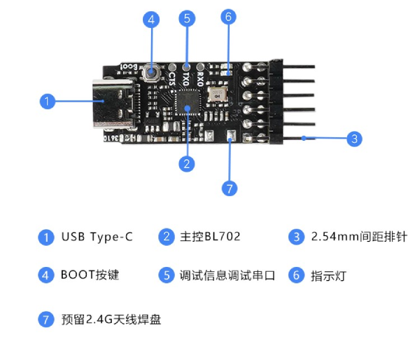
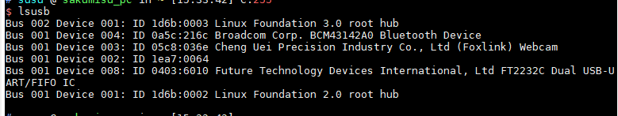

开发前的准备
=============================

硬件环境准备
-----------------------------

- 至少有一块 BL702 系列 MCU 的开发板：

  - BL706_IOT 开发板
  - BL706_AVB 开发板

BL706_Iot 开发板如下图所示

.. figure:: img/bl706_iot.png
   :alt:

   BL706_IoT

BL706_AVB 开发板如下图所示

.. figure:: img/bl706_avb.png
   :alt:

   BL706_AVB

-  一个支持标准 JTAG 功能的调试器，下面几款调试器中选择一款与开发环境适合即可：

  - CK-Link 仿真器
  - Jlink V11 仿真器
  - Sipeed RV-Debugger Plus 调试器
  - Bouffalo Lab Debugger 调试器

-  一台 PC 主机（运行 Windows 或者 Linux 系统）

软件环境准备
--------------------------------

为了更好的进行 BL702 系列 MCU 的开发，建议您应当至少具备以下一种开发环境：

-  Windows 使用 `CDK <Windows_quick_start_cdk.html>`_ 环境开发 (建议 Windows 7 以上版本)
-  `Windows <Windows_quick_start_eclipse.html>`_ 使用 Eclipse 环境开发 (建议 Windows 7 以上版本)
-  `Linux <Linux_quick_start_ubuntu.html>`_ (建议使用 Ubuntu 18 以上的 LTS 版本)

.. _sipeed_rv_debugger_plus:

调试器驱动安装设置
-----------------------------

-  本节主要介绍 **Sipeed RV-Debugger Plus** 调试器的驱动安装设置，若使用 **CK-Link** 或者 **J-Link** 无需阅读本节内容

   Sipeed RV-Debugger plus

**Windows**
^^^^^^^^^^^^^^^^^^^

Sipeed RV-Debugger Plus 调试器在 Windows 系统中使用时我们需要将驱动更换为 ``Win USB`` 驱动

-  1. 首先，将调试器 Type-C USB 接口使用 USB 数据线连接到 PC 主机，打开 PC 的设备管理器，在端口一栏可以看到调试器被识别为两个串口（*注：不是开发板上的串口*），或者在 ``通用串行总线控制器`` 看到 ``USB Serial Converter A`` 和 ``USB Serial Converter B``

   .. figure:: img/sipeed_rv_debugger_1.png

   .. figure:: img/sipeed_rv_debugger_4.png

   .. important:: 1. 调试器的端口号必须以 ``usb serial port`` 开头，如果插了多个类似的设备，请只留一个，确认调试器端口号
   .. important:: 2. 若在设备管理器中看到的串口名称为 “``USB 串行设备(COM*)``”，说明调试器进入了 ``Boot`` 模式。请将调试器断电重新上电，注意先不要将调试器连接到目标板；此时在到设备管理器中看是否正常

   .. figure:: img/sipeed_rv_debugger_7.png

   .. important:: 3. 若在设备管理器中没有显示串口，只显示其他设备，或者只在通用串行总线控制器中看到 ``USB Serial Converter A`` 和 ``USB Serial Converter B``,请到 `FTDI 官网 <https://ftdichip.com/drivers/vcp-drivers/>`_ 下载与系统匹配的驱动

   .. figure:: img/sipeed_rv_debugger_6.png

-  2. 以上都没有问题后，从 sipeed 网站下载 ``zadig-2.4`` 替换驱动程序。下载地址：`http://dl.sipeed.com/MAIX/tools/sipeed-rv-debugger/zadig-2.4.exe <http://dl.sipeed.com/MAIX/tools/sipeed-rv-debugger/zadig-2.4.exe>`_
-  3. 下载好双击打开 ``zadig-2.4.exe``，选择 Options 勾选 List All Devices.

   .. figure:: img/sipeed_rv_debugger_3.png

-  4. 找到 JTAG Debugger(Interface 0)，然后选择替换的驱动为 ``WinUSB`` 点击 Replace Driver 替换
-  5. 再次打开设备管理器， 看到其中一个串口被替换成通用串行总线设备就说明安装成功

   .. figure:: img/sipeed_rv_debugger_2.png

-  6. 到这里 Sipeed RV-Debugger Plus 的设备驱动就更换好了，接下来就可以愉快的玩耍啦~

**可能出现的问题:**

.. caution:: 1. 调试器接上时没有出现两个串口，调试器上有一个 LED 常亮，那么应该是进入了 Boot 模式。请将调试器断电重新上电，注意先不要将调试器连接到目标板；调试器上电后，正常情况下两个 LED 灯会闪烁一下熄灭；此时再看一下任务管理器中的设备是否正确。

.. caution:: 2. 如果经过上面的操作还是不能正常使用，没有出现正确的现象，那么建议从 Sipeed 官方 `GitHub <https://github.com/sipeed/RV-Debugger-BL702>`_ 仓库获取固件，重新烧写；按住调试器上的 ``Boot`` 键不要释放，将调试器插入电脑上电，使调试器进入 Boot 模式，重新刷入固件后；断电重启

**Linux**
^^^^^^^^^^^^^^^^^^^

- 首先，将调试器 Type-C USB 接口使用 USB 数据线连接到 PC 主机，打开 Terminal，在终端中输入 lsusb 命令，即可看到如下信息的设备

.. code-block:: bash

    $ lsusb
    ...
    Bus 001 Device 003: ID 0403:6010 Future Technology Devices International, Ltd FT2232C Dual USB-UART/FIFO IC
    ...

- 如果上述图中不显示 FT2232C 字样，需要安装 ftdi 驱动

.. code-block:: bash

    $ sudo apt install libusb-dev libftdi-dev libhidapi-dev

-  重新插拔调试器使修改生效

- 调试代码需要安装 openocd，使用 openocd 0.11 版本

.. note:: 在 linux 中，串口是使用 /dev/ttyUSB1,调试口使用 /dev/ttyUSB0，如果显示 /dev/ttyACM0 则表示进入 boot 模式
