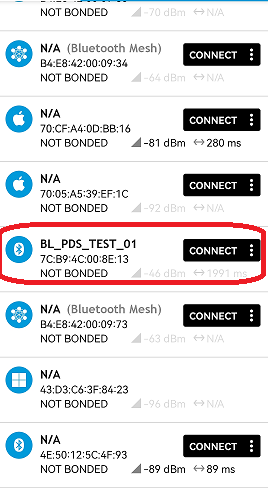
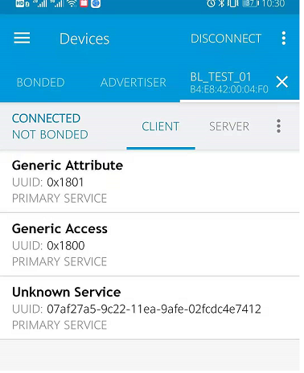
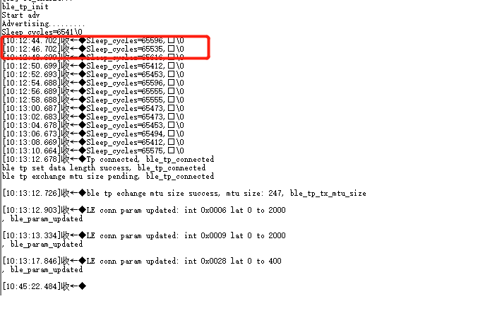

BLE PDS31 
=======================

本 demo 基于 **bl702** 演示 **ble PDS31** 

准备工具
-----------------------

- 一块 bl702 开发板 + 手机 app

软件实现
-----------------------

BLE PDS31 软件实现
^^^^^^^^^^^^^^^^^^^^^^^^

-  软件代码见 ``examples/ble/ble_pds``

.. code-block:: C
    :linenos:

    #define configUSE_TICKLESS_IDLE                 1

-  BLE PDS31 function 需要开启freertos tickless 功能 ， 见 ``components/freertos/portable/gcc/risc-v/bl702/FreeRTOSConfig.h``

.. code-block:: C
    :linenos:

    int ble_start_adv(void)
    {
        struct bt_le_adv_param adv_param = {
            //options:3, connectable undirected, adv one time
            .options = 3, \
            .interval_min = 0x280, \
            .interval_max = 0x280, \
        };

        char *adv_name = "BL_PDS_TEST_01"; // This name must be the same as adv_name in ble_central
        uint8_t data[1] = {(BT_LE_AD_LIMITED | BT_LE_AD_NO_BREDR)};
        uint8_t data_uuid[2] = {0x12, 0x18};//0x1812
        uint8_t data_appearance[2] = {0x80, 0x01};//0x0180
        uint8_t data_manu[4] = {0x71, 0x01, 0x04, 0x13};
        struct bt_data adv_data[] = {
                BT_DATA(BT_DATA_FLAGS, data, 1),
                BT_DATA(BT_DATA_UUID16_ALL, data_uuid, sizeof(data_uuid)),
                BT_DATA(BT_DATA_GAP_APPEARANCE, data_appearance, sizeof(data_appearance)),
                BT_DATA(BT_DATA_NAME_COMPLETE, adv_name, strlen(adv_name)),
                BT_DATA(BT_DATA_MANUFACTURER_DATA, data_manu, sizeof(data_manu))
            };

        return bt_le_adv_start(&adv_param, adv_data, ARRAY_SIZE(adv_data), NULL, 0);
    }

-  在 ``ble_start_adv`` 函数中， ``adv_name`` 设置这次广播的设备名称，设备就开始进行广播

.. code-block:: C
    :linenos:

    void bt_enable_cb(int err)
    {
        MSG("ble_tp_init\r\n");
        ble_tp_init();
        #if defined(CONFIG_BT_OAD_SERVER)
        oad_service_enable(app_check_oad);
        #endif
        MSG("Start adv\r\n");
        ble_start_adv();
        MSG("Advertising.........\r\n");
        pds_start = true;
    }

-  广播开始之后， 在 ``bt_enable_cb`` 中， ``pds_start = true`` 是允许进入PDS31

-  连接成功后，在 ``ble_tp_connected`` 函数， ``pds_start = false`` 会关闭pds31.

-  如果想要连接成功后，继续进入PDS31，需要板子上带有external xtal 32K. 配置以下设置, 当connection interval > 100ms 的时候，会进入PDS31.

.. code-block:: C
    :linenos:

    #define XTAL_32K_TYPE              INTERNAL_XTAL_32K

- pds31 唤醒时钟源配置，见 ``bsp/board/bl706_iot/clock_config.h``

.. code-block:: C
    :linenos:

    #define BLE_CONN_PDS              1

- 连接成功后进入PDS31配置，见 ``examples/ble/ble_pds/ble_peripheral_tp_server.c``

编译和烧录
-----------------------------
- **命令行编译**

.. code-block:: bash
   :linenos:

    $ cd <sdk_path>/bl_mcu_sdk
    $ make build BOARD=bl706_iot SUPPORT_BLECONTROLLER_LIB=m0s1p SUPPORT_FAST_WAKEUP=y SUPPORT_HW_SEC_ENG_DISABLE=y

-  **烧录**

   详见 :ref:`bl_dev_cube`

实验现象
-----------------------------

- **手机连接 bl702**

-  连接成功，如下图所示

-  进入PDS31 显示

