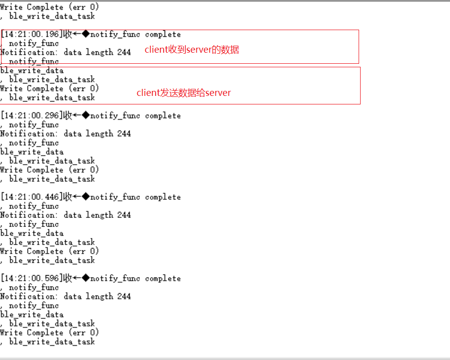
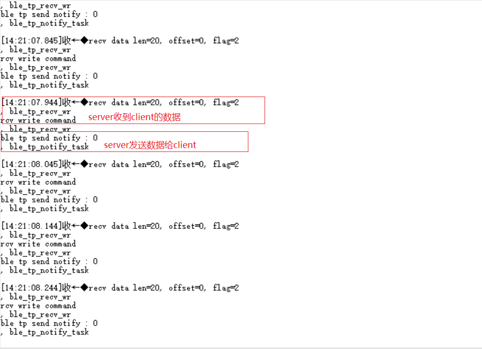
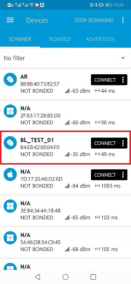
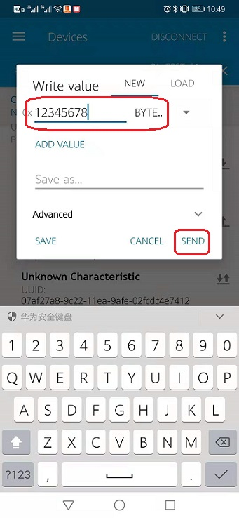

BLE 客户端和服务端互连
=======================

本 demo 基于 **bl702** 演示 **ble server** 和 **ble client** 连接和数据收发。

准备工具
-----------------------

- 两块 bl702 开发板 or 一块 bl702 开发板 + 手机 app

软件实现
-----------------------

BLE client 软件实现
^^^^^^^^^^^^^^^^^^^^^^^^

-  软件代码见 ``examples/ble/ble_central``

.. code-block:: C
    :linenos:

    static struct bt_conn_cb ble_tp_conn_callbacks = {
     .connected = ble_tp_connected,
     .disconnected = ble_tp_disconnected,
    }

    void ble_tp_init()
    {
        if( !isRegister )
        {
            isRegister = 1;
            bt_conn_cb_register(&ble_tp_conn_callbacks);
        }
    }

-  在 ``bt_conn_cb_register`` 函数中，注册连接成功和断开连接的 ``callback`` 函数

-  在 ``ble_start_scan`` 函数中，设备就开始进行扫描

-  在 ``device_found`` 函数中，设备上传扫描到的蓝牙设备，代码通过 ``adv_name`` 来找到需要连接的蓝牙设备，发起连接

.. code-block:: C
    :linenos:

    static void ble_write_data_task(void *pvParameters)
    {
        int error;
        uint8_t buf[20] = {0,1,2,3,4,5,6,7,8,9,10,11,12,13,14,15,16,17,18,19};
        while(1)
       {
            k_sem_take(&write_data_poll_sem, K_FOREVER);
            BT_WARN("ble_write_data\r\n");
            // Send data to server
            error =  bt_gatt_write_without_response(ble_tp_conn,char_hdl.tp_wr_hdl,buf,20,0);
            BT_WARN("Write Complete (err %d)\r\n", error);
       }
    }

-  连接成功后，在 ``ble_write_data_task`` 函数， client 发送 ``buf`` 里面的数据到 server

.. code-block:: C
    :linenos:

    static u8_t notify_func(struct bt_conn *conn,struct bt_gatt_subscribe_params *params,const void *data, u16_t length);

- 连接成功后，在 ``notify_func`` 函数, client 接收来自 server 的数据， ``data`` 是数据内容， ``length`` 是数据长度

BLE server 软件实现
^^^^^^^^^^^^^^^^^^^^^^^^

- 软件代码见 ``examples/ble/ble_peripheral``

.. code-block:: C
    :linenos:

    int ble_start_adv(void)
    {
        struct bt_le_adv_param adv_param = {
            //options:3, connectable undirected, adv one time
            .options = 3, \
            .interval_min = BT_GAP_ADV_FAST_INT_MIN_3, \
            .interval_max = BT_GAP_ADV_FAST_INT_MAX_3, \
        };

        char *adv_name = "BL_TEST_01"; // This name must be the same as adv_name in ble_central
        uint8_t data[1] = {(BT_LE_AD_LIMITED | BT_LE_AD_NO_BREDR)};
        uint8_t data_uuid[2] = {0x12, 0x18};//0x1812
        uint8_t data_appearance[2] = {0x80, 0x01};//0x0180
        uint8_t data_manu[4] = {0x71, 0x01, 0x04, 0x13};
        struct bt_data adv_data[] = {
                BT_DATA(BT_DATA_FLAGS, data, 1),
                BT_DATA(BT_DATA_UUID16_ALL, data_uuid, sizeof(data_uuid)),
                BT_DATA(BT_DATA_GAP_APPEARANCE, data_appearance, sizeof(data_appearance)),
                BT_DATA(BT_DATA_NAME_COMPLETE, adv_name, strlen(adv_name)),
                BT_DATA(BT_DATA_MANUFACTURER_DATA, data_manu, sizeof(data_manu))
            };

        return bt_le_adv_start(&adv_param, adv_data, ARRAY_SIZE(adv_data), NULL, 0);
    }

-  在 ``ble_start_adv`` 函数中， ``adv_name`` 设置这次广播的设备名称，设备就开始进行广播

.. code-block:: C
    :linenos:

    static int ble_tp_recv_wr(struct bt_conn *conn, const struct bt_gatt_attr *attr,const void *buf, u16_t len, u16_t offset, u8_t flags);

-  连接成功后， 在 ``ble_tp_recv_wr`` 中，server接收来自client的数据， ``buf`` 是数据内容， ``len`` 是数据长度

.. code-block:: C
    :linenos:

    static void ble_tp_notify_task(void *pvParameters)
    {
        int err = -1;
        char data[244] = {0x01, 0x02, 0x03, 0x04, 0x05, 0x06, 0x07, 0x08, 0x09};
        k_sem_give(&notify_poll_sem);
        while(1)
        {
            k_sem_take(&notify_poll_sem, K_FOREVER);
            //send data to client
            err = bt_gatt_notify(ble_tp_conn, get_attr(BT_CHAR_BLE_TP_NOT_ATTR_VAL_INDEX), data, (tx_mtu_size - 3));
            BT_WARN("ble tp send notify : %d\n", err);

        }
    }

-  连接成功后，在 ``ble_tp_notify_task`` 函数， server 发送 ``data`` 里面的数据到 client.

编译和烧录
-----------------------------

- **CDK工具编译**

   打开项目中提供的工程文件：ble_contral.cdkproj、ble_peripheral.cdkproj

   参照 :ref:`windows_cdk_quick_start` 的步骤编译下载即可

- **命令行编译**

.. code-block:: bash
   :linenos:

    $ cd <sdk_path>/bl_mcu_sdk
    $ make BOARD=bl706_iot APP=ble_peripheral SUPPORT_FLOAT=y

.. code-block:: bash
   :linenos:

    $ cd <sdk_path>/bl_mcu_sdk
    $ make BOARD=bl706_iot APP=ble_central SUPPORT_FLOAT=y

-  **烧录**

   详见 :ref:`bl_dev_cube`

实验现象
-----------------------------

- **两个 bl702 对连**

- **手机连接 bl702**

-  连接成功，如下图所示

.. figure:: img/phone_connected.png
    :alt:

-  收发数据步骤

   -  点击 ``1`` 处 图标 ``Unknow Service`` 显示具体的 service 属性

   -  点击 ``2`` 处 图标 开启 ``Notification`` ，允许 server 发送数据给 client

   -  点击 ``3`` 处 图标 client 发送数据给 server，填写自己想要发送的数据，点击 ``SEND`` 按钮

.. figure:: img/ble_data.png
    :alt:

.. figure:: img/receive_data.png
    :alt:

