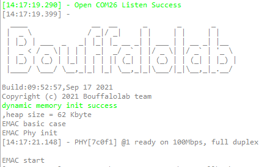
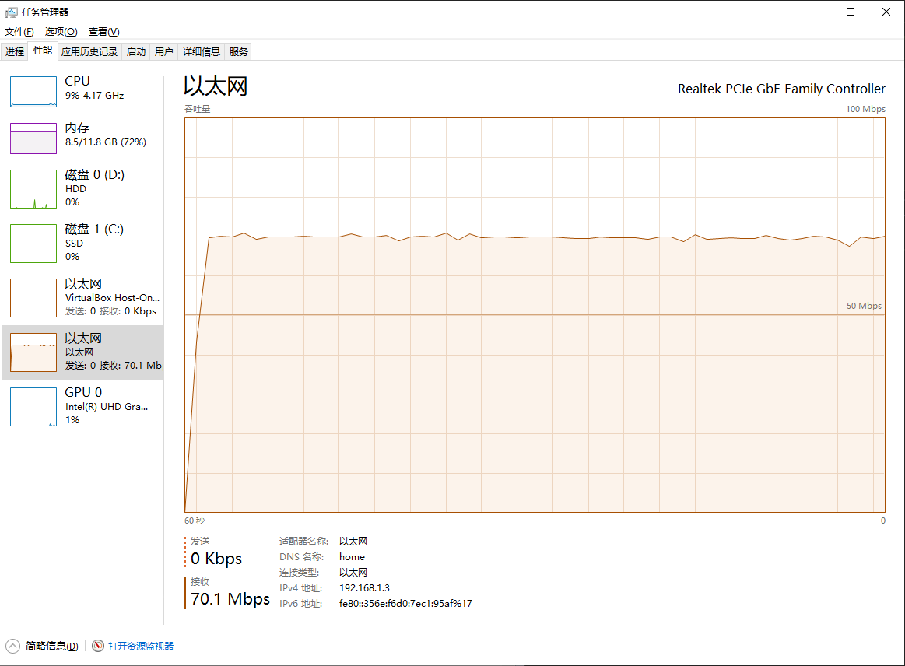

emac basic -- 发送 ARP 数据包
===============================

本 demo 基于 BL706 emac 实现通过以太网发送一个 ARP 裸数据包的例程，通过本例程可以确认 emac 以及 PHY 芯片的配置是否正确。

以太网 PHY 芯片这里使用的是 PHY8720

硬件准备
----------------

-  一块 BL706 ETH 开发板
-  一块 PHY 8720 模块
-  一个串口线
-  一根标准 5/6 类网线

硬件连接
----------------

本 demo 基于 BL706 ETH 开发板，将对应的功能引脚连接到 PHY8720 模块上，连接方式如下：

::

       GPIO function         GPIO pin
    ----------------------------------
        RMII_CLK      <-->    GPIO0
        RMII_TXD0     <-->    GPIO1
        RMII_TXD1     <-->    GPIO2
        RMII_RXD0     <-->    GPIO7
        RMII_RXD1     <-->    GPIO8
        RMII_MDC      <-->    GPIO18
        RMII_MDIO     <-->    GPIO19
        RMII_RXERR    <-->    GPIO20
        RMII_TX_EN    <-->    GPIO21
        RMII_RX_DV    <-->    GPIO22

接下来需要将 PHY8720 模块的 RJ-45 接口通过标准 5/6 类网线连接到与测试 PC 在同一局域网中的路由器或者交换机上。

构造 ARP 数据包
-------------------

通过查阅 ARP 协议可以知道 ARP 包的数据报文组织结构如下：

::

   |dst mac|src mac|frame type|Hardware type|Protocol type|Hardware size|Protocol size|Opcode|src mac|src ip|dst mac|dst ip|
   |6 Byte |6 Byte |2 Byte    |   2 Byte    |   2 Byte    |   1 Byte    |   1 Byte    |2 Byte|6 Byte |4 Byte|6 Byte |4 Byte|
   |<---------------------------------------------------- 42 Byte -------------------------------------------------------->|

因此按照上图所示数据结构，构造一个 ARP 数据包，交由 EMAC，通过 MAC 层将数据发送出去即可，下面的数据报文中的 IP 和 MAC 地址是本机当前的测试环境下的信息，
如在不同网络环境下测试则需要自行修改下列数据帧结构，使其符合当前的测试环境网络，方可正确完成测试。

.. code-block:: c
   :linenos:

   static const uint8_t test_frame[42] = {
    /* ARP reply to 192.168.1.3(b0:7b:25:00:89:53): 192.168.1.221 is at 18:b9:05:12:34:56 */
    0xB0, 0x7B, 0x25, 0x00, 0x89, 0x53,                         // dst mac
    0x18, 0xB9, 0x05, 0x12, 0x34, 0x56,                         // src mac
    0x08, 0x06, 0x00, 0x01, 0x08, 0x00, 0x06, 0x04, 0x00, 0x02, // arp reply
    0x18, 0xB9, 0x05, 0x12, 0x34, 0x56,                         // src mac
    0xc0, 0xa8, 0x01, 0xDD,                                     // src ip
    0xB0, 0x7B, 0x25, 0x00, 0x89, 0x53,                         // dst mac
    0xc0, 0xa8, 0x01, 0x03                                      // dst ip
   };

编译和下载
-----------------

-  **命令行编译**

.. code-block:: bash
   :linenos:

   $ cd bl_mcu_sdk
   $ make APP=emac_basic

-  **烧录**

   详见 :ref:`bl_dev_cube`

实验现象
-----------------

串口 log 信息：

以太网状态：

