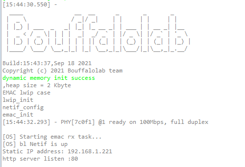
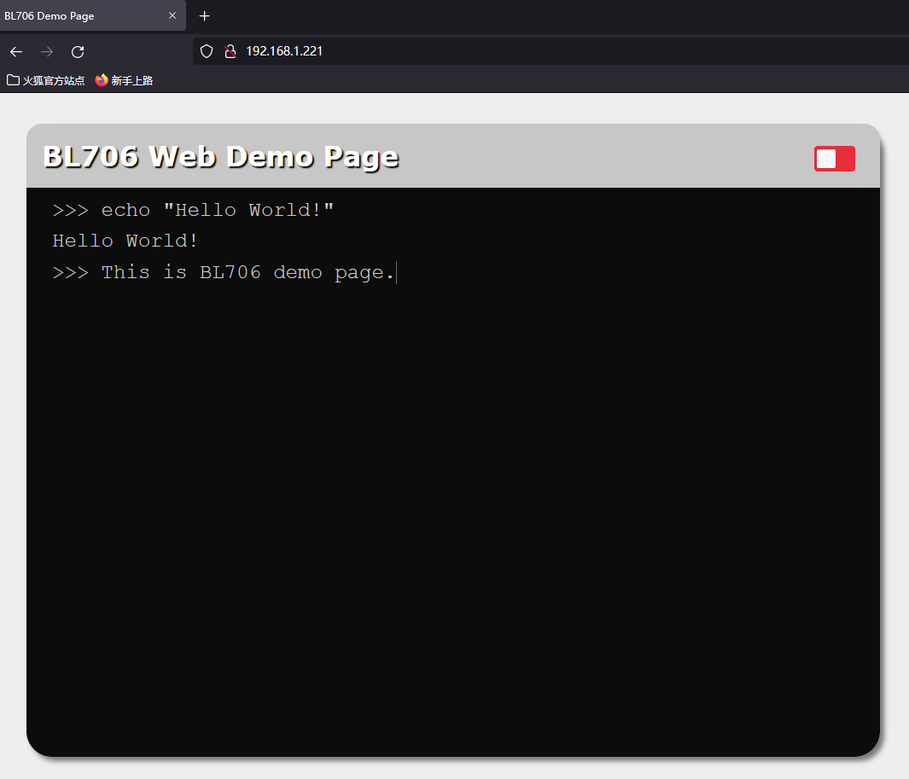
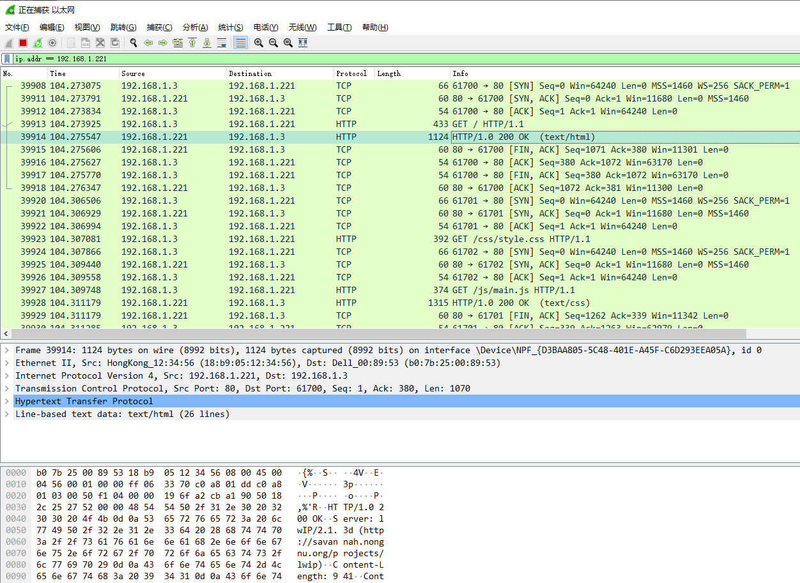

http server -- 网页服务器
============================

HTTP 协议是 Hypertext Transfer Protocol（超文本传输协议）的缩写，是一种用于分布式、协作式和超媒体信息系统的应用层协议。HTTP 是万维网的数据通信的基础。

本 demo 主要是在 BL706 上基于 LwIP 协议栈，实现一个 HTTP 服务器，在 BL706 上部署了一个简单的网页，然后我们可以通过浏览器去访问 BL706 上的网页。

硬件准备
----------------

-  一块 BL706 ETH 开发板
-  一块 PHY 8720 模块
-  一个串口线
-  一根标准 5/6 类网线

硬件连接
----------------

本 demo 基于 BL706 ETH 开发板，将对应的功能引脚连接到 PHY8720 模块上，连接方式如下：

::

       GPIO function         GPIO pin
    ----------------------------------
        RMII_CLK      <-->    GPIO0
        RMII_TXD0     <-->    GPIO1
        RMII_TXD1     <-->    GPIO2
        RMII_RXD0     <-->    GPIO7
        RMII_RXD1     <-->    GPIO8
        RMII_MDC      <-->    GPIO18
        RMII_MDIO     <-->    GPIO19
        RMII_RXERR    <-->    GPIO20
        RMII_TX_EN    <-->    GPIO21
        RMII_RX_DV    <-->    GPIO22

接下来需要将 PHY8720 模块的 RJ-45 接口通过标准 5/6 类网线连接到与测试 PC 在同一局域网中的路由器或者交换机上。

生成 Web 网页及 LwIP 协议栈配置
---------------------------------

Web demo 的源码存放在 ``examples\emac\lwip_http_server\web_demo\pages`` 目录下，网页设计好后，可以使用 ``web_demo`` 目录下的 ``makefsdata.exe`` 工具将网页翻译成 LwIP 协议栈能够解析的文件格式，
在该目录下还有一个 ``makefsdata.bat`` 脚本，该脚本执行后会将 ``pages`` 目录下的 web 网页生成一个 ``fsdata_custom.c`` 文件；
将输出的 ``fsdata_custom.c`` 文件，放到 ``components\lwip\src\apps\http`` 目录下，然后在 ``components/lwip/lwipopts.h`` 文件中，使能 ``HTTPD_USE_CUSTOM_FSDATA`` 宏定义。

注：由于当前测试例程 local ip 地址采用静态 IP 配置进行的测试，如需修改可在 main.c 中进行相应的修改，也可直接使能 LWIP 的 DHCP 功能自动获取 IP 配置。

.. code-block:: c
   :linenos:

   #define LWIP_TCP 1
   #define TCP_TTL  255

   #define HTTPD_USE_CUSTOM_FSDATA 1

编译和下载
-------------------

-  **命令行编译**

.. code-block:: bash
   :linenos:

   $ cd bl_mcu_sdk
   $ make APP=lwip_http_server

-  **烧录**

   详见 :ref:`bl_dev_cube`

实验现象
-----------

编译完成后，烧写到芯片正确运行后，打开浏览器访问 BL706 相应的 IP 地址，即可看到一个测试网页。

串口 log 信息：

使用 Wireshark 抓取网络数据包，我们可以看到 TCP 协议的 “握手” 过程，以及 HTTP 协议的请求和数据传输：

