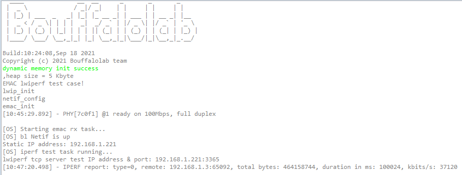
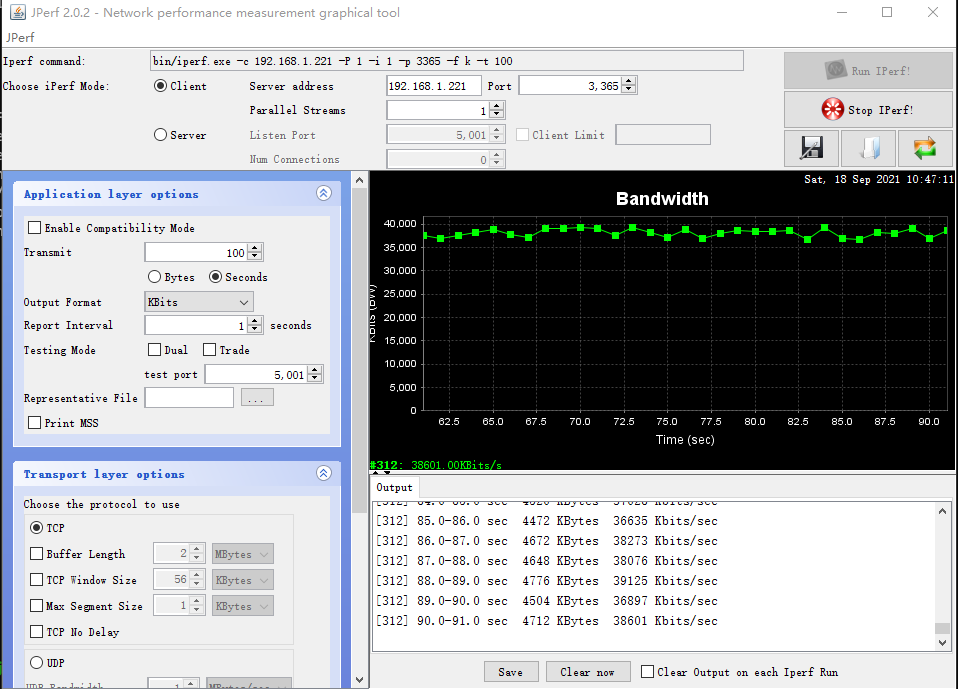
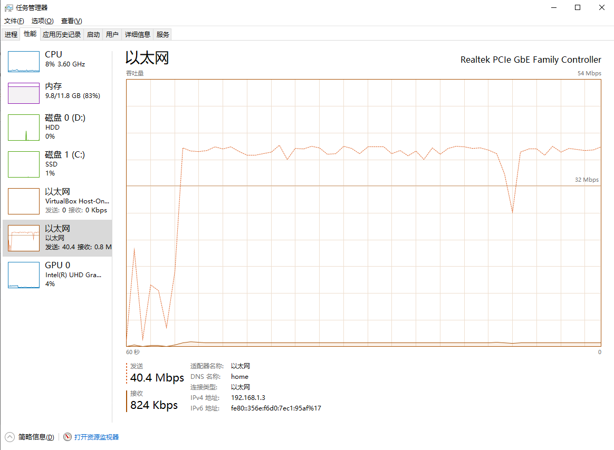
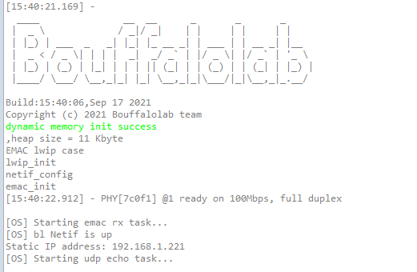
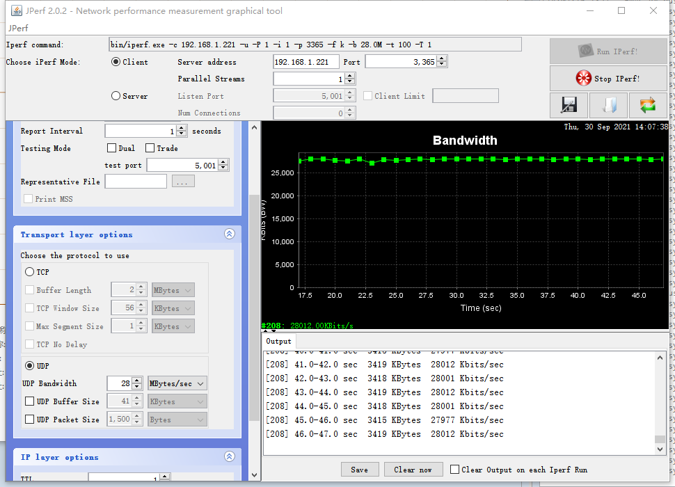
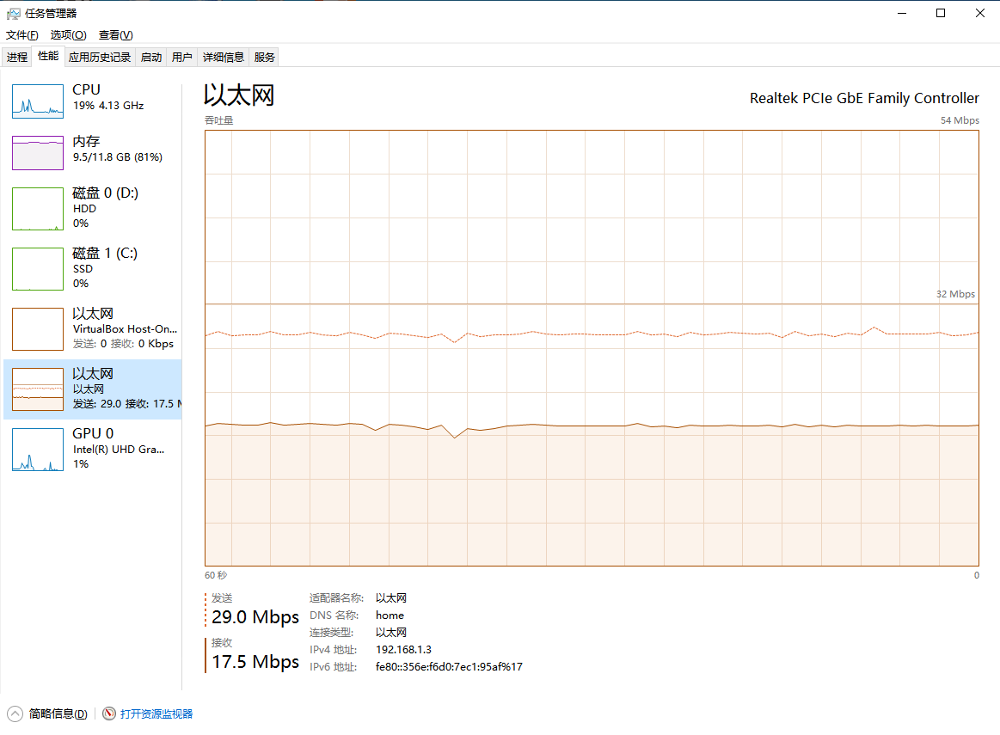
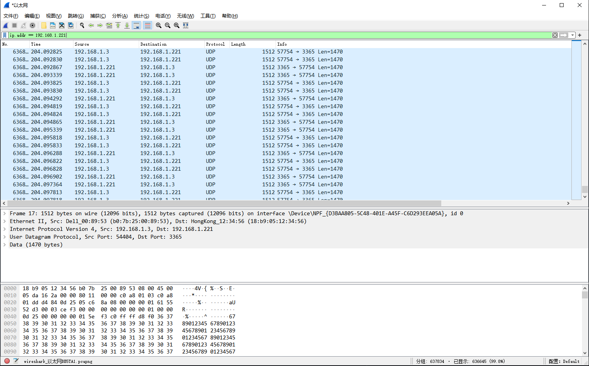

lwip iperf 网络性能测试
=============================

iPerf 是一个跨平台的网络性能测试工具，iPerf 可以测试 TCP 和 UDP 网络带宽性能和质量，但是 iPerf 是一个命令行形式的，对于使用者来说还不够直观，
这里我们使用 iPerf 的一个图形化版本测试程序 —— JPerf，JPerf 简化了复杂的测试命令，并且测试结果可以图形化的实时显示出来。

JPerf 软件直接从互联网上搜索一个下载即可，本文主要介绍如何在 BL706 上实现一个 iPerf 测试线程，BL706 作为服务端，实时监听客户端（PC Jperf 上位机）的连接和发送的数据。

这里主要测试 BL706 TCP 的最大接收速度，其他测试同理。

硬件准备
----------------

-  一块 BL706 ETH 开发板
-  一块 PHY 8720 模块
-  一个串口线
-  一根标准 5/6 类网线

硬件连接
----------------

本 demo 基于 BL706 ETH 开发板，将对应的功能引脚连接到 PHY8720 模块上，连接方式如下：

::

       GPIO function         GPIO pin
    ----------------------------------
        RMII_CLK      <-->    GPIO0
        RMII_TXD0     <-->    GPIO1
        RMII_TXD1     <-->    GPIO2
        RMII_RXD0     <-->    GPIO7
        RMII_RXD1     <-->    GPIO8
        RMII_MDC      <-->    GPIO18
        RMII_MDIO     <-->    GPIO19
        RMII_RXERR    <-->    GPIO20
        RMII_TX_EN    <-->    GPIO21
        RMII_RX_DV    <-->    GPIO22

接下来需要将 PHY8720 模块的 RJ-45 接口通过标准 5/6 类网线连接到与测试 PC 在同一局域网中的路由器或者交换机上。

EMAC 和 LwIP 协议栈的配置
---------------------------

LwIP 协议栈的相关配置文件在 ``components/lwip/lwipopts.h`` 中，详细配置请阅读代码源文件

要测试 TCP 性能，那么必须要在改文件中使能 ``LWIP_TCP`` 宏定义，否则将会使用 LwIP 默认的配置，同时为了获得更好的 TCP 测试性能，还需要加大 ``TCP_SND_BUF``、``TCP_WND`` 以及 EMAC RX buf 深度等参数。
本 demo 测试时修改参数如下：

.. code-block:: c
   :linenos:

   #define MEMP_NUM_TCP_PCB_LISTEN 8
   #define TCP_SND_BUF (8 * TCP_MSS)
   #define TCP_WND (8 * TCP_MSS)
   #define LWIP_TCP 1
   #define TCP_TTL  255

   // emac tx 和 rx buf 的大小
   #define ETH_RXBUFNB 10
   #define ETH_TXBUFNB 2

iPerf 测试本地端口设置
-----------------------------

在 ``examples\emac\lwip_iperf\iperf_server.h`` 文件中，通过修改宏定义即可修改测试端口号

注：由于当前测试例程 local ip 地址采用静态 IP 配置进行的测试，如需修改可在 main.c 中进行相应的修改，也可直接使能 LWIP 的 DHCP 功能自动获取 IP 配置。

.. code-block:: c
   :linenos:

   #define IPERF_SERVER_PORT (3365)

编译和下载
-------------------

-  **命令行编译**

.. code-block:: bash
   :linenos:

   $ cd bl_mcu_sdk
   $ make APP=lwip_iperf

-  **烧录**

   详见 :ref:`bl_dev_cube`

实验现象
-----------

编译完成后，烧写到芯片正确运行后，可以通过配置的测试端口访问芯片。
打开 JPerf 软件开始进行 TCP 性能测试，具体配置如下图，设置好后点击 ``Run IPerf`` 即可。

串口 log 信息：

JPerf 窗口状态：

以太网状态:

UDP 性能测试
--------------

UDP 性能测试，需要使用 ``bl_mcu_sdk/examples/emac/lwip_udp`` 的例程，使用例程的默认代码即可测试 UDP 收发全双工的性能，编译测试请参考 :ref:`eth_udp_echo` 部分教程；

将代码正确编译下载到芯片后，即可通过 JPerf 软件测试 UDP 性能，具体测试配置及性能如下图，设置好后点击 ``Run IPerf`` 即可。

串口 log 信息：

JPerf 窗口状态：

以太网状态：

Wireshark 抓包数据：

IPerf 测试结果
------------------

下表是在实验环境下测试的 BL706 运行 FreeRTOS + Lwip 网络协议栈的以太网性能

.. list-table::
    :widths: 30 30 30 30 30 30 30
    :header-rows: 1

    * - 协议类型
      - API 接口
      - TX(发送速度)
      - RX(接收速度)
      - TX num
      - RX num
      - 备注
    * - ARP send
      - emac tx API
      - 69 Mbps
      - ——
      - 5
      - 5
      - NO lwip,NO OS
    * - UDP send
      - lwip raw API
      - 50 Mbps
      - ——
      - 3
      - 3
      - lwip,FreeRTOS,TX only
    * - UDP Full-duplex
      - lwip raw API
      - 34 Mbps
      - 40 Mbps
      - 3
      - 3
      - lwip,FreeRTOS,Full-duplex
    * - UDP send
      - lwip netconn API
      - 48 Mpbs
      - ——
      - 3
      - 3
      - lwip,FreeRTOS,TX only
    * - UDP Full-duplex
      - lwip netconn API
      - 23 Mpbs
      - 28 Mpbs
      - 5
      - 5
      - lwip,FreeRTOS,Full-duplex
    * - UDP send
      - lwip socket API
      - 47 Mpbs
      - ——
      - 3
      - 3
      - lwip,FreeRTOS,TX only
    * - UDP Full-duplex
      - lwip socket API
      - 14.5 Mpbs
      - 25 Mbps
      - 5
      - 5
      - lwip,FreeRTOS,Full-duplex
    * - TCP send
      - lwip raw API
      - 24 Mbps
      - ——
      - 5
      - 5
      - lwip,FreeRTOS,TX only,modify TCP_WND、TCP_SEND_BUF eg.
    * - TCP recv
      - lwip raw API
      - ——
      - 38 Mbps
      - 2
      - 10
      - lwip,FreeRTOS,RX only,modify TCP_WND、TCP_SEND_BUF eg.
    * - TCP send
      - lwip netconn API
      - 22 Mpbs
      - ——
      - 5
      - 5
      - lwip,FreeRTOS,TX only,modify TCP_WND、TCP_SEND_BUF eg.
    * - TCP recv
      - lwip netconn API
      - ——
      - 32 Mbps
      - 2
      - 10
      - lwip,FreeRTOS,RX only,modify TCP_WND、TCP_SEND_BUF eg.
    * - TCP send
      - lwip socket API
      - 20 Mbps
      - ——
      - 5
      - 5
      - lwip,FreeRTOS,TX only,modify TCP_WND、TCP_SEND_BUF eg.
    * - TCP recv
      - lwip socket API
      - ——
      - 15 Mbps
      - 2
      - 10
      - lwip,FreeRTOS,RX only,modify TCP_WND、TCP_SEND_BUF eg.
