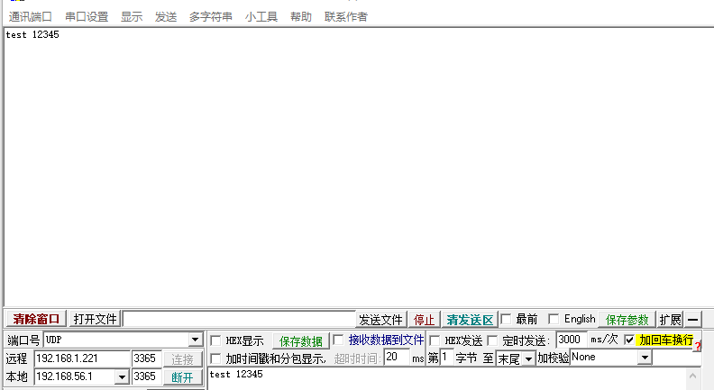
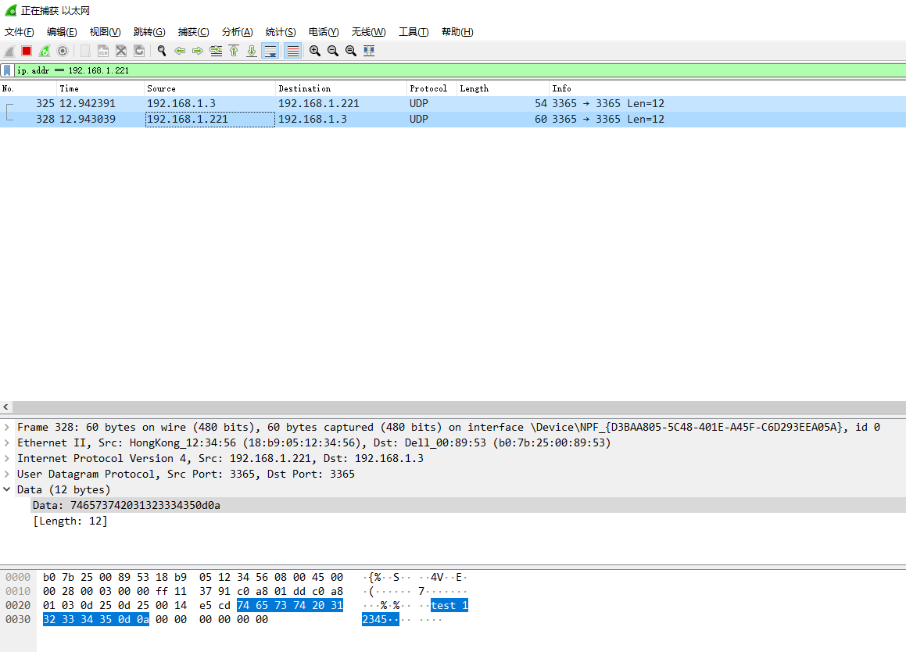

.. _eth_udp_echo:

UDP echo
==================

本 demo 基于 BL706 ETH 开发板，并基于 LwIP 轻量级网络协议栈，实现了一个 UDP 协议通信的例程。

以太网 PHY 芯片这里使用的是 PHY8720

硬件准备
----------------

-  一块 BL706 ETH 开发板
-  一块 PHY 8720 模块
-  一个串口线
-  一根标准 5/6 类网线

硬件连接
----------------

本 demo 基于 BL706 ETH 开发板，将对应的功能引脚连接到 PHY8720 模块上，连接方式如下：

::

       GPIO function         GPIO pin
    ----------------------------------
        RMII_CLK      <-->    GPIO0
        RMII_TXD0     <-->    GPIO1
        RMII_TXD1     <-->    GPIO2
        RMII_RXD0     <-->    GPIO7
        RMII_RXD1     <-->    GPIO8
        RMII_MDC      <-->    GPIO18
        RMII_MDIO     <-->    GPIO19
        RMII_RXERR    <-->    GPIO20
        RMII_TX_EN    <-->    GPIO21
        RMII_RX_DV    <-->    GPIO22

接下来需要将 PHY8720 模块的 RJ-45 接口通过标准 5/6 类网线连接到与测试 PC 在同一局域网中的路由器或者交换机上。

LwIP 协议栈的配置
-----------------------

LwIP 协议栈的相关配置文件在 ``components/lwip/lwipopts.h`` 中，详细配置请阅读代码源文件

如果要使用 UDP 相关功能，需要在文件中使能 LWIP_UDP 宏定义，否则将会使用 LwIP 默认的配置

.. code-block:: c
   :linenos:

   /* ---------- UDP options ---------- */
   #define LWIP_UDP 1
   #define UDP_TTL  255

UDP 测试目标 IP 及端口设置
----------------------------

在 ``examples\emac\lwip_udp\udp_echo.h`` 文件中，通过修改宏定义即可修改不同测试主机 IP 及端口信息

注：由于当前测试例程 local ip 地址采用静态 IP 配置进行的测试，如需修改可在 main.c 中进行相应的修改，也可直接使能 LWIP 的 DHCP 功能自动获取 IP 配置。

.. code-block:: c
   :linenos:

   #define UDP_DST_IP0 (192)
   #define UDP_DST_IP1 (168)
   #define UDP_DST_IP2 (1)
   #define UDP_DST_IP3 (3)

   #define UDP_TEST_PORT (3365)

编译和下载
-------------------

-  **命令行编译**

.. code-block:: bash
   :linenos:

   $ cd bl_mcu_sdk
   $ make APP=lwip_udp

-  **烧录**

   详见 :ref:`bl_dev_cube`

实验现象
-----------

编译完成后，烧写到芯片正确运行后，可以通过配置的测试端口访问芯片。

串口 log 信息：

.. figure:: img/emac_udp_3.png
   :alt:

使用 Wireshark 抓包看到的数据包：

