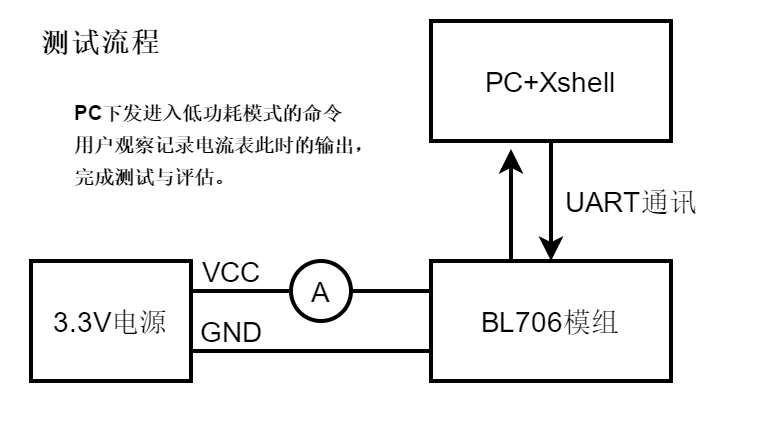
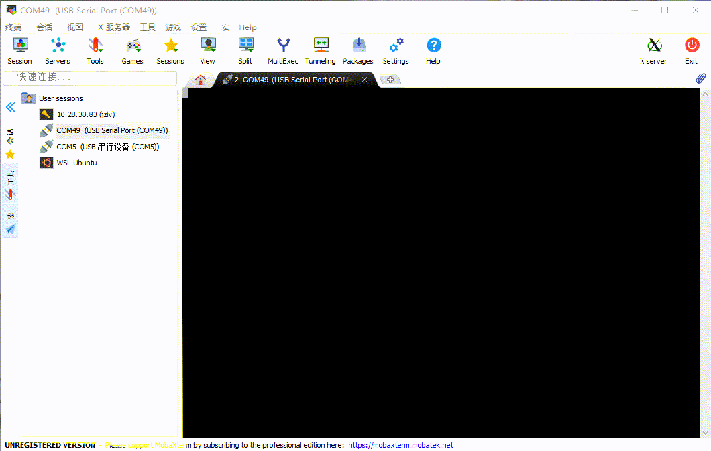

Power Management
=========================

本 demo 主要演示 bl 系列 mcu 低功耗性能。具体低功耗介绍请参考 `BL702/704/706 参考手册 <https://dev.bouffalolab.com/media/upload/doc/BL702_BL704_706_RM_zh_CN_1.1.pdf>`_。

低功耗模式：

- Running : Running 为 CPU 正常运行时的功耗，由客户应用代码执行的功能决定功耗。

- WFI 模式：CPU 的 clock 处于被 Gating 状态，CPU 停止运行，当用户退出WFI模式的时候程序将会继续运行。

- PDS 模式: 根据不同的模式关闭不同的电源域，当关闭了 CPU 电源域时，ITCM，DTCM RAM 不可使用，只有 64K 的 OCRAM 可以使用。

- HBN 模式: 根据不同的模式关闭不同的电源域，ITCM，DTCM OCRAM RAM 无法使用，在 hbn0 下位于 AON 域的 4K RAM 可以使用，其他 hbn 模式下 4K RAM 也不可使用。

演示内容：

- pds3 使用 gpio10 外部中断下降沿唤醒
- pds31 使用 pds 唤醒脚 (gpio6) 唤醒
- pds31 使用 pds timer 唤醒
- hbn0 使用 acomp  (gpio11) 唤醒
- hbn1 使用 rtc 唤醒
- hbn2 使用 hbn 唤醒脚 (gpio12) 唤醒

.. note:: 高级别的唤醒源可以唤醒低级别的功耗模式，比如 hbn 唤醒脚可以唤醒所有的低功耗模式。

准备工具
-----------------------

- pc控制端使用串口终端软件：xshell 或者 mobaxterm
- 可以串联电流表到电源端的电路板
- 电流表
- TTL 转 USB
- 滑动变阻器

硬件连接
-----------------------------

本 demo 基于 BL706_LP 开发板，连接方式如下

::

       GPIO function         GPIO pin
    ----------------------------------
        PDS_WAKEUP    <-->     GPIO6
        EXTI          <-->     GPIO10
        ADC           <-->     GPIO11
        HBN_WAKEUP    <-->     GPIO12
        UART0_TX      <-->     GPIO14
        UART0_RX      <-->     GPIO15

软件实现
-------------------------

软件基于 shell 进行调试，如何注册 shell 命令这里不再说明。

PDS 模式
^^^^^^^^^^^^^^^^

-  软件代码见 ``examples/pm/pds_mode_wakeup``

.. code-block:: C
    :linenos:

    #define CONFIG_GPIO6_FUNC GPIO_FUN_WAKEUP

- pds 唤醒脚配置，pds3 和 pds31 使用，见 ``bsp/board/bl706_lp/pinmux_config.h``

.. code-block:: C
    :linenos:

    #define CONFIG_GPIO10_FUNC GPIO_FUN_GPIO_EXTI_FALLING_EDGE

- 外部中断引脚配置，pds3 使用，见 ``bsp/board/bl706_lp/pinmux_config.h``

.. code-block:: C
    :linenos:

    #define CONFIG_GPIO12_FUNC GPIO_FUN_WAKEUP

- hbn 唤醒脚配置，pds3 和 pds31 使用，见 ``bsp/board/bl706_lp/pinmux_config.h``

.. code-block:: C
    :linenos:

    gpio_attach_irq(GPIO_PIN_10, gpio_int_callback);
    gpio_irq_enable(GPIO_PIN_10, ENABLE); //only used for level3

- 注册 gpio10 外部中断回调函数并使能

.. code-block:: C
    :linenos:

    int pds3_enter(int argc, char *argv[])
    {
        MSG("gpio wake up case,enter pds3 mode\r\n");
        bflb_platform_delay_ms(50);

        pm_pds_mode_enter(PM_PDS_LEVEL_3, 0); /*hbn、pds、exti gpio can wakeup*/
        BL_CASE_SUCCESS;                      /*level 3 can run here*/
        return 0;
    }
    int pds31_enter(int argc, char *argv[])
    {
        int second = 0;

        if (argc == 2) {
            second = atoi(argv[1]);
        } else {
            second = 0;
        }
        MSG("gpio wake up case,enter pds31 mode\r\n");
        bflb_platform_delay_ms(50);

        pm_pds_mode_enter(PM_PDS_LEVEL_31, second); /*hbn、pds gpio can wakeup*/

        return 0;
    }
    SHELL_CMD_EXPORT(pds3_enter, pds3 gpio wakeup test)
    SHELL_CMD_EXPORT(pds31_enter, pds31 gpio wakeup test)

- 注册进入 pds3 和 pds31 的命令

HBN 模式
^^^^^^^^^^^^^^^^

-  软件代码见 ``examples/pm/hbn_mode_wakeup``

.. code-block:: C
    :linenos:

    #define CONFIG_GPIO11_FUNC GPIO_FUN_ADC

- adc 引脚配置，hbn0 下 acomp 使用，见 ``bsp/board/bl706_lp/pinmux_config.h``

.. code-block:: C
    :linenos:

    #define CONFIG_GPIO12_FUNC GPIO_FUN_WAKEUP

- hbn 唤醒脚配置，hbn0、hbn1、hbn2 使用，见 ``bsp/board/bl706_lp/pinmux_config.h``

.. code-block:: C
    :linenos:

    int hbn0_enter(int argc, char *argv[])
    {
        acomp_device_t acomp_device;
        acomp_device.id = 0;
        acomp_device.pos_ch = ACOMP_CHANNEL_ADC_CHANNEL3; /*from gpio11 adc func*/
        acomp_device.neg_ch = ACOMP_CHANNEL_0P375VBAT;
        acomp_device.pos_hysteresis_vol = ACOMP_HYSTERESIS_VOLT_50MV;
        acomp_device.neg_hysteresis_vol = ACOMP_HYSTERESIS_VOLT_50MV;
        acomp_init(&acomp_device);
        bflb_platform_delay_ms(50); /*delay for acomp*/

        for (uint32_t i = 0; i < 30; i++) {
            MSG("status:%d\r\n", acomp_get_result(&acomp_device));
            bflb_platform_delay_ms(100);
        }

        MSG("acomp wake up case,enter hbn0 mode\r\n");
        bflb_platform_delay_ms(50);

        /** cpu will wakeup when acomp status change
        * please note that if you set gpio9-gpio12 with GPIO_FUN_WAKEUP,it will also wakeup this level
        * rtc can wakeup this level when sleep time do not equal 0
        **/
        pm_hbn_mode_enter(PM_HBN_LEVEL_0, 0);

        return 0;
    }

    int hbn1_enter(int argc, char *argv[])
    {
        int second = 0;

        if (argc == 2) {
            second = atoi(argv[1]);
        } else {
            second = 1;
        }

        MSG("rtc wake up case,enter hbn1 mode\r\n");
        bflb_platform_delay_ms(50);
        /** cpu will wakeup when rtc sleep time timeout
        * please note that if you set gpio9-gpio12 with GPIO_FUN_WAKEUP,it will also wakeup this level
        **/
        pm_hbn_mode_enter(PM_HBN_LEVEL_1, second);

        return 0;
    }

    int hbn2_enter(int argc, char *argv[])
    {
        MSG("gpio wake up case,enter hbn2 mode\r\n");
        bflb_platform_delay_ms(50);

        /*cpu will wakeup when you set gpio9-gpio12 with GPIO_FUN_WAKEUP
        * rtc can not wakeup level2
        **/
        pm_hbn_mode_enter(PM_HBN_LEVEL_2, 0);

        return 0;
    }

- 注册进入 hbn0、hbn1、hbn2 的命令

编译和烧录
-----------------------------

-  **CDK 编译**

    暂无，用户可以自己添加

-  **命令行编译**

.. code-block:: bash
   :linenos:

    $ cd <sdk_path>/bl_mcu_sdk
    $ make BOARD=bl706_lp APP=pds_mode_wakeup
    $ make BOARD=bl706_lp APP=hbn_mode_wakeup

-  **烧录**

   详见 :ref:`bl_dev_cube`

实验现象
-----------------------------

- 首先唤醒脚唤醒方式默认均为下降沿唤醒，所以需要将 GPIO6、GPIO10、GPIO12 引脚外接电阻到 3.3V。
- acomp 变化电压阈值在 1.2375V，所以需要使用滑动电阻器，调整到 1.2375V（0.375VBAT）后再使用。
- 打开终端，并按下 TAB 键可以列出命令。
- 输入需要执行命令回车即可运行。

**PDS 模式**

.. figure:: img/lowpower_pds.gif
   :alt:

**HBN 模式**

详细测试结果见 `BL702/704/706 数据手册 page 28 <https://dev.bouffalolab.com/media/upload/doc/BL702_BL704_BL706_DS_zh_CN_Combo_1.9.pdf>`_。

.. figure:: img/powerTable.png
