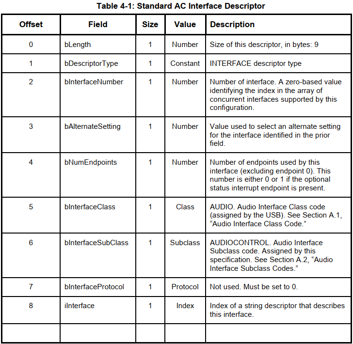
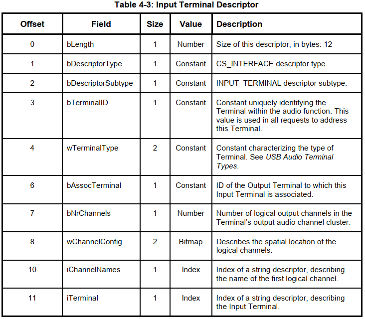
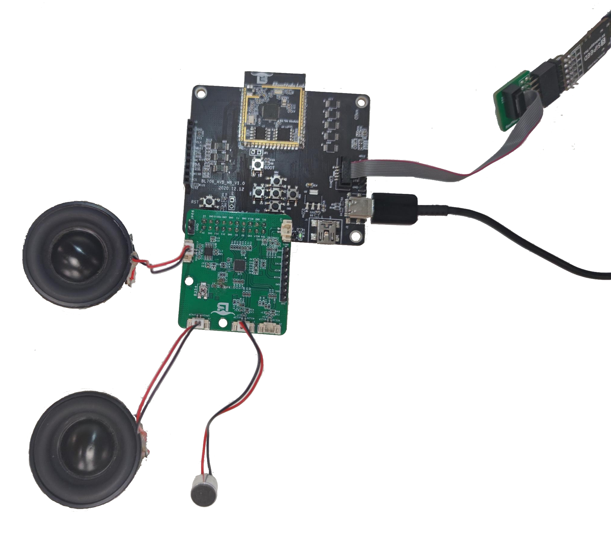
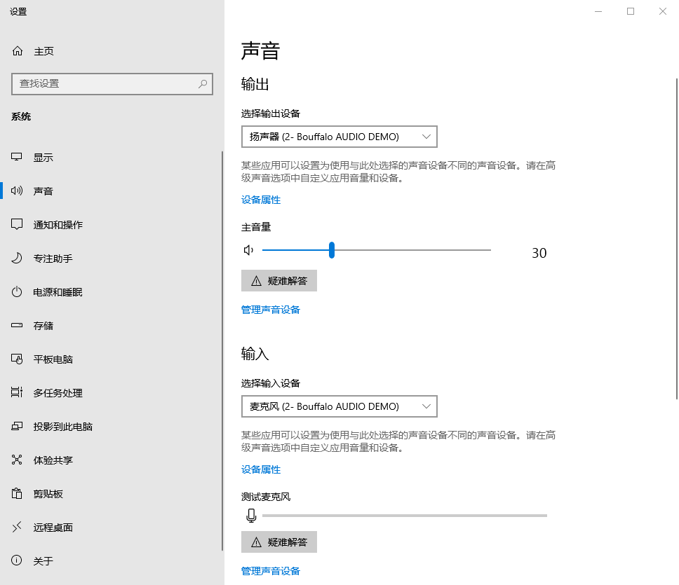

AUDIO - 声卡
====================

本 demo 将演示 USB Device AUDIO 类实现的一个声卡设备。

通过 usb 外设将其枚举为 AUDIO 类录音播音复合设备，从而可以播放与录制声音,支持双通道录音与播音, 无需专用软件即可播放与录制，如微信电话、播放音乐等。

在 USB 官方手册中，我们可以找到 USB 设备枚举符与端口描述符的定义, 根据定义配置正确的枚举符。

采集声音与播放声音需要用到音频子板模块，这里使用的是 ESP8388 模块

准备工具
-----------------------

BL706 AVB + ES8388音频模块 + windows 录音(任意用到音频的软件，如微信电话)

硬件连接
-----------------------------

本 demo 基于 BL706_AVB 开发板，连接方式如下

.. list-table::
    :widths: 30 30
    :header-rows: 1

    * - GPIO function
      - GPIO pin
    * - CLK_OUT(MCLK)
      - GPIO6
    * - I2S_BCLK
      - GPIO4
    * - I2S_FS
      - GPIO29
    * - I2S_DO
      - GPIO30
    * - I2S_DI
      - GPIO3
    * - I2C_SCL
      - GPIO16
    * - I2C_SDA
      - GPIO11
    * - USB_DP
      - GPIO7
    * - USB_DM
      - GPIO8

软件实现
-----------------------------

- USB 相关枚举符在 ``example/usb/usb_audio_mic_speaker/main.c`` 中定义
- 音频 I2S 配置与使用也在 ``example/usb/usb_audio_mic_speaker/main.c`` 中实现
- USB 协议栈 在 ``component/usb_stack/`` 中实现, 其中 ``component/usb_stack/class/audio/`` 中有对于 AUDIO 特定类设备的回调函数。
- E38388 子板的相关驱动在 bsp/bsp_common/es8388/中。

- 使用到的外设时钟源见 ``bsp/board/bl706_avb/clock_config.h``，如有改动，请自行修改:

.. code-block:: C
    :linenos:

    #define BSP_AUDIO_PLL_CLOCK_SOURCE ROOT_CLOCK_SOURCE_AUPLL_12288000_HZ

    #define BSP_I2S_CLOCK_SOURCE ROOT_CLOCK_SOURCE_XCLK
    #define BSP_I2S_CLOCK_DIV    0

    #define BSP_I2C_CLOCK_SOURCE ROOT_CLOCK_SOURCE_BCLK
    #define BSP_I2C_CLOCK_DIV    9

- 使用到的 GPIO 配置见 ``bsp/board/bl706_avb/pinmux_config.h``,如有改动，请自行修改:

.. code-block:: C
    :linenos:

    #define CONFIG_GPIO6_FUNC GPIO_FUN_CLK_OUT
    #define CONFIG_GPIO3_FUNC GPIO_FUN_I2S
    #define CONFIG_GPIO4_FUNC GPIO_FUN_I2S
    #define CONFIG_GPIO29_FUNC GPIO_FUN_I2S
    #define CONFIG_GPIO30_FUNC GPIO_FUN_I2S
    #define CONFIG_GPIO11_FUNC GPIO_FUN_I2C
    #define CONFIG_GPIO16_FUNC GPIO_FUN_I2C
    #define CONFIG_GPIO7_FUNC  GPIO_FUN_USB
    #define CONFIG_GPIO8_FUNC  GPIO_FUN_USB

- 使能外设宏定义，见 ``bsp/board/bl706_avb/peripheral_config.h`` ,外设配置可以保持默认，在程序中已经重新配置:

.. code-block:: C
    :linenos:

    #define BSP_USING_I2C0
    #define BSP_USING_I2S0
    #define BSP_USING_USB
    #define BSP_USING_DMA0_CH2
    #define BSP_USING_DMA0_CH3
    #define BSP_USING_DMA0_CH4

在 ``example/usb/usb_audio_mic_speaker/main.c`` 中, 前部分都是 USB 相关宏定义与 USB 枚举符定义, 包括设备枚举符与端口枚举符，
这些枚举符都根据 usb 官方文档而定义, 包含了usb硬件信息、设备类型、audio 参数、端口信息等关键信息,让主机得以正确识别与使用设备，例如：

例1：官方文档规定的设备描述符：

程序中定义的设备描述符：

.. code-block:: C
    :linenos:

    * ------------------ AudioControl Interface ------------------ */
    /* USB Microphone Standard AC Interface Descriptor */
    0x09,                          /* bLength */
    USB_DESCRIPTOR_TYPE_INTERFACE, /* bDescriptorType */
    0x00,                          /* bInterfaceNumber */
    0x00,                          /* bAlternateSetting */
    0x00,                          /* bNumEndpoints */
    USB_DEVICE_CLASS_AUDIO,        /* bInterfaceClass */
    AUDIO_SUBCLASS_AUDIOCONTROL,   /* bInterfaceSubClass */
    AUDIO_PROTOCOL_UNDEFINED,      /* bInterfaceProtocol */
    0x00,                          /* iInterface */
    /* 09 byte*/

例2：官方文档规定的麦克风端口描述符：

程序中定义的端口描述符, 其中一个描述符是控制端口, 一个是数据端口, 由其他描述符所定义的：

.. code-block:: C
    :linenos:

    /* --------------- AudioStreaming Interface --------------- */
    /* USB Microphone Standard AS Interface Descriptor - Audio Streaming Zero Bandwith */
    /* Interface 1, Alternate Setting 0                                             */
    0x09,                          /* bLength */
    USB_DESCRIPTOR_TYPE_INTERFACE, /* bDescriptorType */
    0x01,                          /* bInterfaceNumber */
    0x00,                          /* bAlternateSetting */
    0x00,                          /* bNumEndpoints */
    USB_DEVICE_CLASS_AUDIO,        /* bInterfaceClass */
    AUDIO_SUBCLASS_AUDIOSTREAMING, /* bInterfaceSubClass */
    AUDIO_PROTOCOL_UNDEFINED,      /* bInterfaceProtocol */
    0x00,                          /* iInterface */
    /* 09 byte*/

    /* USB Microphone Standard AS Interface Descriptor - Audio Streaming Operational */
    /* Interface 1, Alternate Setting 1                                           */
    0x09,                          /* bLength */
    USB_DESCRIPTOR_TYPE_INTERFACE, /* bDescriptorType */
    0x01,                          /* bInterfaceNumber */
    0x01,                          /* bAlternateSetting */
    0x01,                          /* bNumEndpoints */
    USB_DEVICE_CLASS_AUDIO,        /* bInterfaceClass */
    AUDIO_SUBCLASS_AUDIOSTREAMING, /* bInterfaceSubClass */
    AUDIO_PROTOCOL_UNDEFINED,      /* bInterfaceProtocol */
    0x00,                          /* iInterface */
    /* 09 byte*/

还有其他多个端口枚举符, 其作用可以查阅 usb 官方文档, 其中有详细介绍含义。
USB 的协议流程控制程序在 ``component/usb_stack`` 中, 这是一个由博流开发的极为轻量级的 usb 协议栈。
协议栈使用描述符完成枚举过程, 向主机表达了设备类型与传输端口, 并根据 usb 协议规则控制后续的数据交互流程。
USB 协议栈可以参考 API 手册下的 USB Stack 章节的说明。

在 ``example/usb/usb_audio_mic_speaker/main.c`` 中 ``audio_init()`` 函数,完成了对音频部分的初始化,
包括 ES8388 音频模块的初始化(I2C配置接口), I2S 接口的配置，使用了 DMA 来提高效率降低 cpu 负载。
具体作用请查看 ``基础外设例程`` 下的 ``I2S`` 示例，这里不再详细描述。

在 ``main()`` 函数中，首先是调用了音频初始化函数，然后配置注册了 USB 相关端口，由于使用了 USB 同步传输,
还使用了一路 DMA 来发送数据, 进一步提升效率:

.. code-block:: C
    :linenos:

    bflb_platform_init(0);

    audio_init();

    usbd_desc_register(audio_descriptor);
    usbd_audio_add_interface(&audio_class, &audio_control_intf);
    usbd_audio_add_interface(&audio_class, &audio_stream_intf);
    usbd_audio_add_interface(&audio_class, &audio_stream_intf2);
    usbd_interface_add_endpoint(&audio_stream_intf, &audio_out_ep);

    usb_fs = usb_dc_init();

    if (usb_fs) {
        device_control(usb_fs, DEVICE_CTRL_SET_INT, (void *)(USB_EP2_DATA_OUT_IT));
    }
    dma_register(DMA0_CH4_INDEX, "dma_ch4_usb_tx");
    dma_ch4_usb_tx = device_find("dma_ch4_usb_tx");

    if (dma_ch4_usb_tx) {
        DMA_DEV(dma_ch4_usb_tx)->direction = DMA_MEMORY_TO_PERIPH;
        DMA_DEV(dma_ch4_usb_tx)->transfer_mode = DMA_LLI_ONCE_MODE;
        DMA_DEV(dma_ch4_usb_tx)->src_req = DMA_REQUEST_NONE;
        DMA_DEV(dma_ch4_usb_tx)->dst_req = DMA_REQUEST_USB_EP1;
        DMA_DEV(dma_ch4_usb_tx)->src_width = DMA_TRANSFER_WIDTH_8BIT;
        DMA_DEV(dma_ch4_usb_tx)->dst_width = DMA_TRANSFER_WIDTH_8BIT;
        DMA_DEV(dma_ch4_usb_tx)->src_burst_size = DMA_BURST_16BYTE;
        DMA_DEV(dma_ch4_usb_tx)->dst_burst_size = DMA_BURST_1BYTE;

        device_open(dma_ch4_usb_tx, 0);
        // device_set_callback(dma_ch4_usb_tx, dma2_irq_callback);
        // device_control(dma_ch4_usb_tx, DEVICE_CTRL_SET_INT, NULL);
        device_control(usb_fs, DEVICE_CTRL_ATTACH_TX_DMA, dma_ch4_usb_tx);
        device_control(usb_fs, DEVICE_CTRL_USB_DC_SET_TX_DMA, (void *)AUDIO_IN_EP);
    }

之后启动 I2S 录音, 并根据 USB 状态来判断是否需要上传录制的音频数据; 同时判断是否有下传的需要播放的数据,如果有就使用 I2S 播放：

.. code-block:: C
    :linenos:

    /* i2s record start */
    device_read(i2s, 0, record_data_buff[0], BUFF_SIZE);

    while (1) {
        /* Waiting for record data update */
        if (record_updata_flag) {
            if (!device_control(dma_ch4_usb_tx, DEVICE_CTRL_DMA_CHANNEL_GET_STATUS, NULL)) {
                device_write(usb_fs, AUDIO_IN_EP, record_data_buff[!record_buff_using_num], BUFF_SIZE);
                record_updata_flag = 0;
                record_buff_using_num = !record_buff_using_num;
                device_read(i2s, 0, record_data_buff[record_buff_using_num], BUFF_SIZE);
            }
        }

        if (play_updata_flag) {
            device_control(dma_ch2_i2s_tx, DEVICE_CTRL_DMA_CHANNEL_STOP, NULL);
            play_buff_using_num = !play_buff_using_num;
            device_write(i2s, 0, play_data_buff[play_buff_using_num], BUFF_SIZE);
            play_updata_flag = 0;
            usb_data_offset = 0;
        }

    }

编译和烧录
-----------------------------

-  **CDK 编译**

   打开项目中提供的工程文件：usb_video.cdkproj

   参照 :ref:`windows_cdk_quick_start` 的步骤编译下载即可

-  **命令行编译**

.. code-block:: bash
   :linenos:

    $ cd <sdk_path>/bl_mcu_sdk
    $ make BOARD=bl706_avb APP=usb_audio_mic_speaker

-  **烧录**

   详见 :ref:`bl_dev_cube`

实验现象
-----------------------------

如图, 将 ES8388 子板插入 BL706_AVB 板上, 并烧录程序后, 用 USB 线连接电脑:

打开电脑声音设置窗口, 在输入与输入的设备中找到并选择 Bouffalo AUDIO DEMO 设备, 如下图：

发出声音, 如敲击麦克风，可看见麦克风进度条跳动, 拖动输出的主音量，音量进度条也有跳动，
并且喇叭会发出提示音。如果找到设备但无法输入输出音频, 请检查 board 引脚与外设配置,和硬件连接。

打开任意音频软件, 如音乐播放器, 即可使用设备播放音乐。