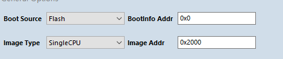
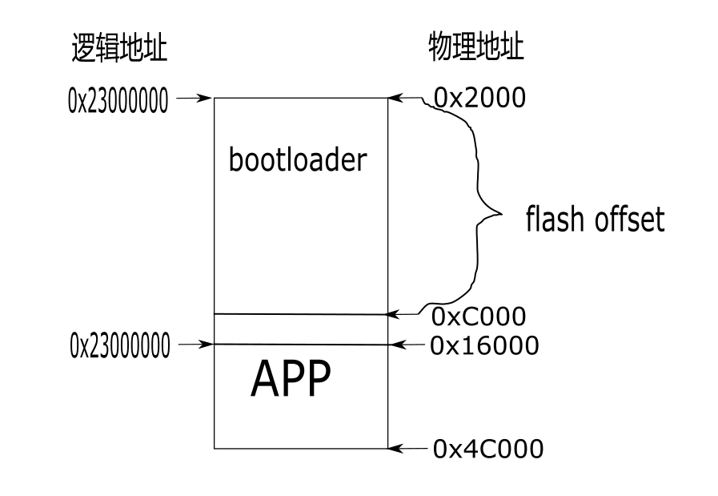

MSC - U 盘升级
====================

本 demo 主要演示使用 usb 将 xip flash 模拟成 u 盘设备，将其作为一个 BootLoader 使用，用来升级固件。

USB大容量存储设备类（The USB mass storage device class）是一种计算机和移动设备之间的传输协议，它允许一个通用串行总线（USB）设备来访问主机的计算设备，使两者之间进行文件传输。

MSC 协议介绍参考 `USB 官方文档 <https://www.usb.org/documents>`_。

bootloader 我们将其编译后烧录在 flash 0x2000 开始的物理地址，工具默认也是这个地址。

我们使用 flash 物理地址 0x0000c000 (48K) 开始的地方，用来模拟 u 盘，u 盘大小为 256K（64 个扇区，每个扇区 4KB ），根据文件系统格式，可以知道，数据的地址在 u 盘的第 10 个扇区（0x16000），也即 APP 的入口地址。BootLoader 与 APP 分区表如下：

准备工具
-----------------------

- 一根 usb 数据线

硬件连接
-----------------------------

- 内部 flash 不需要额外电路
- 外部 flash 需要连接 flash 控制器接口

::

       GPIO function         GPIO pin
    ----------------------------------
      USB_DP         <-->     GPIO7
      USB_DM         <-->     GPIO8
      UART0_TX       <-->     GPIO14
      BOOTLOADER_PIN <-->     GPIO15

软件实现
-------------------------

-  软件代码见 ``examples/usb/usb_msc_flash_boot``

.. code-block:: C
    :linenos:

    #define BLOCK_SIZE  4096
    #define BLOCK_COUNT 64
    #define FLASH_ADDR  0x0000c000 /*addr start from 48k */
    void usbd_msc_get_cap(uint8_t lun, uint32_t *block_num, uint16_t *block_size)
    {
        *block_num = BLOCK_COUNT;
        *block_size = BLOCK_SIZE;
    }
    int usbd_msc_sector_read(uint32_t sector, uint8_t *buffer, uint32_t length)
    {
        flash_read(FLASH_ADDR + sector * BLOCK_SIZE, buffer, length);
        return 0;
    }

    int usbd_msc_sector_write(uint32_t sector, uint8_t *buffer, uint32_t length)
    {
        flash_erase(FLASH_ADDR + sector * BLOCK_SIZE, BLOCK_SIZE);
        flash_write(FLASH_ADDR + sector * BLOCK_SIZE, buffer, length);
        return 0;
    }

- 实现 usb msc 需要的底层接口，u 盘大小 256K，flash 物理地址从 0x0000c000 开始。

.. code-block:: C
    :linenos:

    gpio_set_mode(GPIO_PIN_15, GPIO_INPUT_PD_MODE);

    if (gpio_read(GPIO_PIN_15)) {
        MSG("*************Welcome to usb msc boot,update your app bin*************\r\n");

        usbd_desc_register(msc_ram_descriptor);
        usbd_msc_class_init(MSC_OUT_EP, MSC_IN_EP);

        usb_fs = usb_dc_init();

        if (usb_fs) {
            device_control(usb_fs, DEVICE_CTRL_SET_INT, (void *)(USB_EP4_DATA_OUT_IT | USB_EP5_DATA_IN_IT));
        }
        while (!usb_device_is_configured()) {
        }
    } else {
        uint8_t bin_header;
        flash_read(FLASH_ADDR + 10 * BLOCK_SIZE, &bin_header, 1);
        if ((bin_header == 0x00) && (bin_header == 0xff)) {
            MSG("*************Illegal bin!! Please update your bin*************\r\n");
            while (1) {
            }
        }

        MSG("*************Let's go to application*************\r\n");
        bflb_platform_delay_ms(20);
        bflb_platform_deinit();
        hal_jump2app(FLASH_ADDR + 10 * BLOCK_SIZE);
    }

- 配置 GPIO15 作为输入模式，默认拉低，拉高进入 u 盘升级。
- 如果 GPIO15 为高，则进入 u 盘 升级程序。
- 如果 GPIO15 为低，则表示不需要升级直接进入 app，此时需要修改内存映射地址，将逻辑地址映射的物理地址（flash offset ）从 0x2000 改成实际 app 存储在 flash 的地址为：FLASH_ADDR + 10 * BLOCK_SIZE。
- ``hal_jump2app`` 中对物理地址进行了判断，bootloader 程序预留 48K，物理地址小于 4M。

编译和烧录
-----------------------------

-  **CDK 编译**

    暂无，用户可以自己添加

-  **命令行编译**

.. code-block:: bash
   :linenos:

    $ cd <sdk_path>/bl_mcu_sdk
    $ make BOARD=bl706_iot APP=usb_msc_flash_boot

-  **烧录**

   详见 :ref:`bl_dev_cube`

实验现象
-----------------------------

- 将 GPIO15 拉高，然后使用 USB 数据线插到电脑上，识别出一个 U 盘。
- 将编译的 APP bin 文件拖入 U 盘。
- 拔下 USB ，拉低 GPIO15，供电以后进入 APP 。

.. figure:: img/usb_msc3.gif