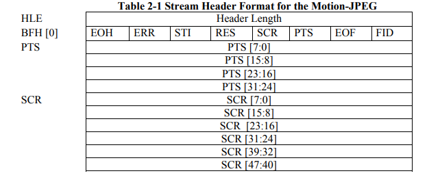
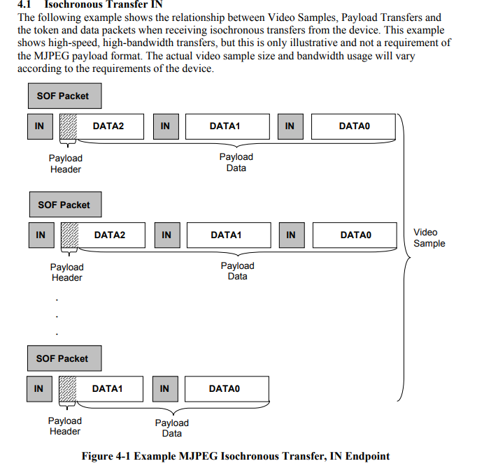

VIDEO - 摄像头
====================

本 demo 将演示 USB Device VIDEO 类实现的一个摄像头设备。

通过 usb 外设将其枚举成 VIDEO 类设备，从而可以使用摄像头模块将采集到的数据通过 usb 发送给主机进行显示，这里使用 windows 自带的相机进行显示,支持 usb video 类驱动。发送的数据需要满足一定的格式，这里我们选择 MJPEG，从 usb 官方手册中我们可以看到具体的数据头部信息以及传输示例。

video stream header

examples for isoch transfer IN

采集数据需要摄像头，我们使用的模块为 gc0308，支持 RGB555 或者 YUV 格式输出，这里我们选择输出 YUV 格式。除了摄像头模块，我们还需要外设来驱动摄像头，BL706 拥有 CAM 外设，可以驱动该摄像头。

准备工具
-----------------------

BL706 AVB + GC0308摄像头模块 + windows 相机

硬件连接
-----------------------------

本 demo 基于 BL706_AVB 开发板，连接方式如下：

.. list-table::
    :widths: 30 30
    :header-rows: 1

    * - GPIO function
      - GPIO pin
    * - CAM
      - GPIO0
    * - CAM
      - GPIO1
    * - CAM
      - GPIO2
    * - CAM
      - GPIO3
    * - CAM
      - GPIO4
    * - CAM
      - GPIO5
    * - CAM
      - GPIO6
    * - USB_DP
      - GPIO7
    * - USB_DM
      - GPIO8
    * - CLK_OUT
      - GPIO9
    * - I2C_SCL
      - GPIO11
    * - I2C_SDA
      - GPIO16
    * - CAM
      - GPIO29
    * - CAM
      - GPIO30
    * - CAM
      - GPIO31

.. note:: 注意 706 AVB FUN1 的跳冒不要接，默认连接到摄像头引脚，如果接了则连接到了 i2s codec

软件实现
-----------------------------

-  软件代码见 ``examples/usb/usb_video``

.. code-block:: C
    :linenos:

    #define BSP_I2C_CLOCK_SOURCE ROOT_CLOCK_SOURCE_BCLK
    #define BSP_I2C_CLOCK_DIV    0

    #define BSP_CAM_CLOCK_SOURCE ROOT_CLOCK_SOURCE_PLL_96M
    #define BSP_CAM_CLOCK_DIV    3

- 使用到的外设时钟源见 ``bsp/board/bl706_avb/clock_config.h``，如有改动，请自行修改

.. code-block:: C
    :linenos:

    #define CONFIG_GPIO0_FUNC  GPIO_FUN_CAM
    #define CONFIG_GPIO1_FUNC  GPIO_FUN_CAM
    #define CONFIG_GPIO2_FUNC  GPIO_FUN_CAM
    #define CONFIG_GPIO3_FUNC  GPIO_FUN_CAM
    #define CONFIG_GPIO4_FUNC  GPIO_FUN_CAM
    #define CONFIG_GPIO5_FUNC  GPIO_FUN_CAM
    #define CONFIG_GPIO6_FUNC  GPIO_FUN_CAM
    #define CONFIG_GPIO7_FUNC  GPIO_FUN_USB
    #define CONFIG_GPIO8_FUNC  GPIO_FUN_USB
    #define CONFIG_GPIO9_FUNC  GPIO_FUN_CLK_OUT
    #define CONFIG_GPIO11_FUNC GPIO_FUN_I2C
    #define CONFIG_GPIO12_FUNC GPIO_FUN_CAM
    #define CONFIG_GPIO16_FUNC GPIO_FUN_I2C
    #define CONFIG_GPIO29_FUNC GPIO_FUN_CAM
    #define CONFIG_GPIO30_FUNC GPIO_FUN_CAM
    #define CONFIG_GPIO31_FUNC GPIO_FUN_CAM

- 使用到的 GPIO 配置见 ``bsp/board/bl706_avb/pinmux_config.h``

.. code-block:: C
    :linenos:

    #define BSP_USING_CAM
    #define BSP_USING_I2C0
    #define BSP_USING_USB
    #define BSP_USING_DMA0_CH2

    #if defined(BSP_USING_I2C0)
    #ifndef I2C0_CONFIG
    #define I2C0_CONFIG          \
        {                        \
            .id = 0,             \
            .mode = I2C_HW_MODE, \
            .phase = 15,         \
        }
    #endif
    #endif

    #if defined(BSP_USING_DMA0_CH2)
    #ifndef DMA0_CH2_CONFIG
    #define DMA0_CH2_CONFIG                             \
        {                                               \
            .id = 0,                                    \
            .ch = 2,                                    \
            .direction = DMA_MEMORY_TO_PERIPH,          \
            .transfer_mode = DMA_LLI_ONCE_MODE,         \
            .src_req = DMA_REQUEST_NONE,                \
            .dst_req = DMA_REQUEST_UART1_TX,            \
            .src_addr_inc = DMA_ADDR_INCREMENT_ENABLE,  \
            .dst_addr_inc = DMA_ADDR_INCREMENT_DISABLE, \
            .src_burst_size = DMA_BURST_1BYTE,          \
            .dst_burst_size = DMA_BURST_1BYTE,          \
            .src_width = DMA_TRANSFER_WIDTH_8BIT,       \
            .dst_width = DMA_TRANSFER_WIDTH_8BIT,       \
        }
    #endif
    #endif

- 使能外设并配置，见 ``bsp/board/bl706_avb/peripheral_config.h`` ，外设配置可以保持默认，在程序中修改，如下

.. code-block:: C
    :linenos:

    DMA_DEV(dma_ch2)->direction = DMA_MEMORY_TO_PERIPH;
    DMA_DEV(dma_ch2)->transfer_mode = DMA_LLI_ONCE_MODE;
    DMA_DEV(dma_ch2)->src_req = DMA_REQUEST_NONE;
    DMA_DEV(dma_ch2)->dst_req = DMA_REQUEST_USB_EP1;
    DMA_DEV(dma_ch2)->src_addr_inc = DMA_ADDR_INCREMENT_ENABLE;
    DMA_DEV(dma_ch2)->dst_addr_inc = DMA_ADDR_INCREMENT_DISABLE;
    DMA_DEV(dma_ch2)->src_burst_size = DMA_BURST_16BYTE;
    DMA_DEV(dma_ch2)->dst_burst_size = DMA_BURST_1BYTE;
    DMA_DEV(dma_ch2)->src_width = DMA_TRANSFER_WIDTH_8BIT;
    DMA_DEV(dma_ch2)->dst_width = DMA_TRANSFER_WIDTH_8BIT;
    device_open(dma_ch2, 0);

.. code-block:: C
    :linenos:

    #define FORMAT_SEL UYVY

- gc0308 输出格式选择 ``UYVY``,见 ``bsp/bsp_common/bsp_image_sensor.c``

编译和烧录
-----------------------------

-  **CDK 编译**

   打开项目中提供的工程文件：usb_video.cdkproj

   参照 :ref:`windows_cdk_quick_start` 的步骤编译下载即可

-  **命令行编译**

.. code-block:: bash
   :linenos:

    $ cd <sdk_path>/bl_mcu_sdk
    $ make BOARD=bl706_avb APP=usb_video

-  **烧录**

   详见 :ref:`bl_dev_cube`

实验现象
-----------------------------

.. figure:: img/usb_video.gif
   :alt:
