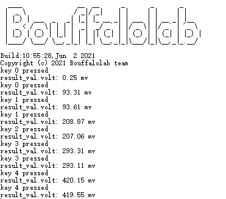

ADC - 按键检测电压
====================

本 demo 主要介绍一个基于 ADC 的按键功能，使用 ADC 检测按键输入引脚的电压值，根据不同的分压值判断相应的按键是否按下

硬件连接
-----------------------------
本 demo 基于 BL706_AVB 开发板，连接方式如下:

.. list-table::
    :widths: 30 30
    :header-rows: 1

    * - GPIO function
      - GPIO pin
    * - ADC CH8
      - GPIO18

**分压电路：**

.. figure:: img/adc_key_demo.png
    :alt:

    adc key

软件实现
-----------------------------

-  软件代码见 ``examples/adc/adc_key``

.. code-block:: C
    :linenos:

    #define BSP_ADC_CLOCK_SOURCE  ROOT_CLOCK_SOURCE_XCLK
    #define BSP_ADC_CLOCK_DIV  0

-  配置 ``ADC`` 设备时钟源，见 ``bsp/board/bl706_avb/clock_config.h``

.. code-block:: C
    :linenos:

    #define CONFIG_GPIO18_FUNC GPIO_FUN_ADC

-  配置 ``ADC`` 设备复用引脚，见 ``bsp/board/bl706_avb/pinmux_config.h``

.. code-block:: C
    :linenos:

    #define BSP_USING_ADC0

    #if defined(BSP_USING_ADC0)
    #ifndef ADC0_CONFIG
    #define ADC0_CONFIG \
    {   \
        .clk_div = ADC_CLOCK_DIV_32,\
        .vref = ADC_VREF_3P2V,\
        .continuous_conv_mode = DISABLE,\
        .differential_mode = DISABLE,\
        .data_width = ADC_DATA_WIDTH_16B_WITH_256_AVERAGE,\
        .fifo_threshold = ADC_FIFO_THRESHOLD_1BYTE,\
        .gain = ADC_GAIN_1\
    }
    #endif
    #endif

-  使能 ``BSP_USING_ADC0`` 并配置 ``ADC`` 设备配置，见 ``bsp/board/bl706_avb/peripheral_config.h``

.. code-block:: C
    :linenos:

    adc_channel_cfg_t adc_channel_cfg;
    adc_channel_cfg.pos_channel = posChList;
    adc_channel_cfg.neg_channel = negChList;

    adc_register(ADC0_INDEX, "adc_key");

    adc_key = device_find("adc_key");

    if(adc_key)
    {
        ADC_DEV(adc_key)->continuous_conv_mode = ENABLE;
        device_open(adc_key, DEVICE_OFLAG_STREAM_RX);
        device_control(adc_key,DEVICE_CTRL_ADC_CHANNEL_CONFIG,&adc_channel_cfg);

    }else{
        MSG("device open failed\r\n");
    }

    adc_channel_start(adc_key);

- 首先调用 ``adc_register`` 函数注册 ``adc_key`` 设备，当前注册为 ADC0
- 然后通过 ``find`` 函数找到设备对应的句柄，保存于 ``adc_key`` 句柄中
- 然后使用 ``device_open`` 以轮询模式来打开 ``adc_key`` 设备，调用 ``device_control`` 完成 ADC 相关的配置
- 最后调用 ``adc_channel_start`` 启用ADC的转换

.. code-block:: C
    :linenos:

    device_read(adc_key,0,(void *)&result_val,1);
    keyValue = get_adc_key_value(result_val.volt * 1000);
    if( keyValue!=KEY_NO_VALUE){

        MSG("key %d pressed\r\n",keyValue);
        MSG("result_val.volt: %0.2f mv\n", (result_val.volt * 1000));
    }

- 调用 ``device_read`` 读取 ``adc_key`` 设备信息保存到 ``result_val`` 结构体中
- 调用 ``get_adc_key_value`` 函数获取当前的键值和电压值

编译和烧录
-----------------------------

-  **CDK工具编译**

   打开项目中提供的工程文件：adc_key.cdkproj

   参照 :ref:`windows_cdk_quick_start` 的步骤编译下载即可

-  **命令行编译**

.. code-block:: bash
   :linenos:

    $ cd <sdk_path>/bl_mcu_sdk
    $ make BOARD=bl706_avb APP=adc_key SUPPORT_FLOAT=y

-  **烧录**

   详见 :ref:`bl_dev_cube`

实验现象
-----------------------------
本实验依次按下开发板上的 SW1 ~ SW5 会得到不同的电压值:

- key 0: 0V 左右
- key 1: 0.1V 左右
- key 2: 0.2V 左右
- key 3: 0.3V 左右
- key 4: 0.43V 左右

实际运行结果如下图所示：

见视频展示：

.. raw:: html

    <iframe src="//player.bilibili.com/player.html?aid=887712205&bvid=BV1xK4y1P7ur&cid=330261457&page=5" scrolling="no" border="0" frameborder="no" framespacing="0" allowfullscreen="true"> </iframe>

