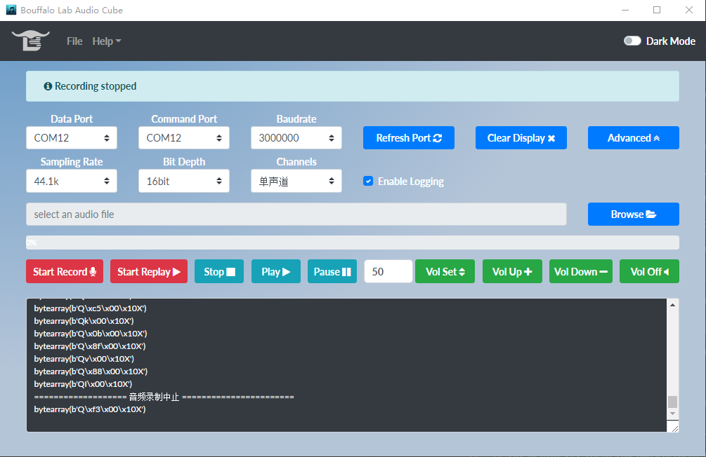

I2S - 使用DMIC配合audio cube实现在线录音
========================================

本 demo 演示 I2S 外设 驱动板载 DMIC 的音频电路板,通过Audio Cube在线播放的功能。

准备工具
-----------------------

- 一块 bl702 开发板 + DMIC音频子板 + PC 端 Audio_Cube 工具

硬件连接
-----------------------------

本 demo 基于 BL706_AVB 开发板，需要用到 DMIC 音频子板，连接方式如下：

.. list-table::
    :widths: 30 30
    :header-rows: 1

    * - GPIO function
      - GPIO pin
    * - CLK_OUT(MCLK)
      - GPIO6
    * - I2S_BCLK
      - GPIO4
    * - I2S_FS
      - GPIO29
    * - I2S_DI
      - GPIO3
    * - UART0_TX
      - GPIO15
    * - UART0_RX
      - GPIO14

如果使用的是BL706_AVB板，请确保FUN1 FUN2两个跳帽处于短接的状态,如下图所示

  .. figure:: img/tiaomao.png
    :alt:

本 demo 用到的内部外设资源如下：

.. list-table::
    :widths: 10 40
    :header-rows: 1

    * - peripheral
      - role
    * - I2S
      - 标准音频数据接口，用于接受DMIC音频子板传送来的音频数据
    * - UART
      - 串口,用于与上位机 Audio_cube 软件通讯
    * - DMA-CH2/CH3
      - 直接存储访问技术，用于配合 I2S 高效发送音频数据，减少对 CPU 的负载
    * - CLK_OUT
      - 引脚复用对外输出指定时钟信号，用作提供MCLK时钟

软件实现
-----------------------

软件代码见 ``examples/audio_cube`` 文件夹, 其中 ``data_protocol.c`` 数据协议控制,用以与 Audio_Cube 工具交互通讯,获取控制信息、传输音频数据,
 ``data_protocol.c`` 是音频驱动相关程序,配置相关外设与音频数据解析, 播放与录制音频。main.c 使用以上程序,完成本 demo 的功能实现。

本文档不再详细功能实现的细节,仅概述功能过程,可以参考 I2S 与 UART 相关文档。

配置 ``I2S, I2C, CLK_OUT(MCLK)`` 相关复用引脚，见 ``bsp/board/bl706_iot/pinmux_config.h`` 中的宏定义选项:

.. code-block:: C
    :linenos:

    #define CONFIG_GPIO3_FUNC GPIO_FUN_I2S
    #define CONFIG_GPIO4_FUNC GPIO_FUN_I2S
    #define CONFIG_GPIO6_FUNC GPIO_FUN_CLK_OUT
    #define CONFIG_GPIO11_FUNC GPIO_FUN_I2C
    #define CONFIG_GPIO14_FUNC GPIO_FUN_UART0_TX
    #define CONFIG_GPIO15_FUNC GPIO_FUN_UART0_RX
    #define CONFIG_GPIO16_FUNC GPIO_FUN_I2C
    #define CONFIG_GPIO29_FUNC GPIO_FUN_I2S
    #define CONFIG_GPIO30_FUNC GPIO_FUN_I2S

编译和烧录
-----------------------------

-  **CDK 编译**

打开项目中提供的工程文件：audio_cube.cdkproj

参照 :ref:`windows_cdk_quick_start` 的步骤编译下载即可

-  **命令行编译**

.. code-block:: bash
   :linenos:

    $ cd <sdk_path>/bl_mcu_sdk
    $ make BOARD=bl706_iot APP=audio_cube

-  **烧录**
	详见 :ref:`bl_dev_cube`

Audio Cube 上位机的使用
-----------------------------

正确编译烧录程序后,复位启动,通过串口连接 PC,打开 Audio Cube 软件,界面如图:

选择对应的串口号(Data Port 与 command Port 相同),设置与已烧录的程序里相同的波特率(默认为3M,在 ``data_protocol.c`` 中修改),
Refresh Port 按键用于刷新串口信息,Clear Display 用于清除显示的信息,Advanced 按键展开关于录音的设置,包括采样率、声道数、采样位宽(固定为16bit)

录制音频
^^^^^^^^^^^^^^^^

录制音频前若正在播放音乐，需要点击 Stop 停止播放。点击 Start Record 录制音频,再次点击停止录制,会将录制的音频保存在 record 文件夹下，
录制的音频会以时间作为文件名。如果需要播放录制的音频,点击 Browse 选择录制的音频，再点击 Play 即可。

实验现象
-----------------------------

见视频展示：
