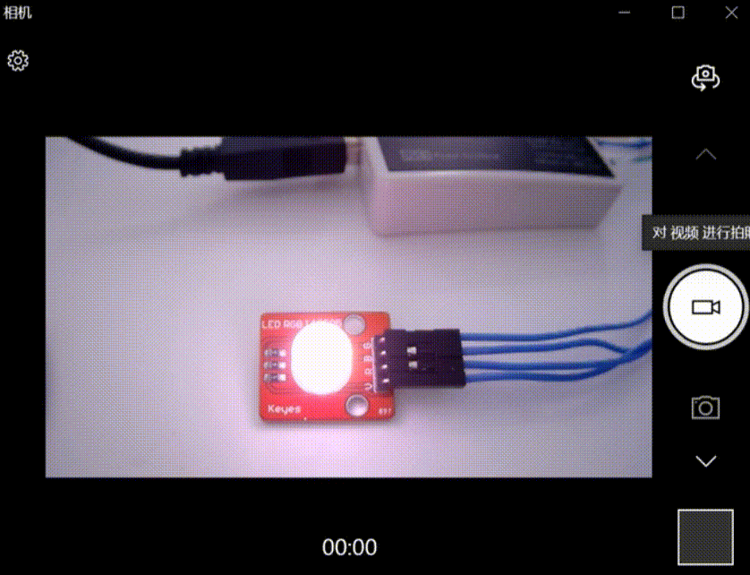

PWM - 呼吸灯
====================

    本 demo 基于 PWM 外设轮询模式编写。

硬件连接
-----------------------------

本 demo 基于BL706_IOT开发板，连接方式如下：

.. list-table::
    :widths: 30 30
    :header-rows: 1

    * - GPIO function
      - GPIO pin
    * - PWM_CH2
      - GPIO22

.. figure:: img/blink_breath_sch.png
    :alt:

软件实现
-----------------------------

-  软件代码见 ``examples/pwm/pwm_breath_led``

.. code-block:: C
    :linenos:

    #define BSP_PWM_CLOCK_SOURCE  ROOT_CLOCK_SOURCE_XCLK
    #define BSP_PWM_CLOCK_DIV  1

-  配置 ``PWM`` 设备时钟源，见 ``bsp/board/bl706_iot/clock_config.h``

.. code-block:: C
    :linenos:

    #define CONFIG_GPIO22_FUNC GPIO_FUN_PWM

-  配置 ``PWM`` 设备复用引脚，见 ``bsp/board/bl706_iot/pinmux_config.h``

.. code-block:: C
    :linenos:

    #define BSP_USING_PWM_CH2

    #if defined(BSP_USING_PWM_CH2)
    #ifndef PWM_CH2_CONFIG
    #define PWM_CH2_CONFIG \
    {   \
        .ch = 2, \
        .frequency = 1000000, \
        .dutycycle = 0, \
        .it_pulse_count = 0,\
    }
    #endif
    #endif

-  使能 ``BSP_USING_PWM_CH2`` 并配置 ``PWM`` 设备配置，见 ``bsp/board/bl706_iot/peripheral_config.h``

.. code-block:: C
    :linenos:

    pwm_register(PWM_CH2_INDEX, "led_breath");

    struct device *led_breath = device_find("led_breath");

    if (led_breath) {
        PWM_DEV(led_breath)->period = 32; //frequence = 32M/1/32 = 1Mhz
        PWM_DEV(led_breath)->threshold_low = 16;
        PWM_DEV(led_breath)->threshold_high = 32;
        device_open(led_breath, DEVICE_OFLAG_STREAM_TX);
        pwm_channel_start(led_breath);
    }

-  首先调用 ``pwm_register`` 函数注册 ``PWM`` 设备的一个通道，当前注册 ``PWM_CH2``
-  然后通过 ``find`` 函数找到设备对应的句柄，保存于 ``led_breath`` 句柄中
-  设置 ``PWM_CH2`` 的频率为 1Mhz，占空比为50%
-  使用 ``device_open`` 以轮询模式来打开 ``led_breath`` 设备

.. code-block:: C
    :linenos:

        for (pwm_cfg.threshold_high = 0; pwm_cfg.threshold_high <= 32; pwm_cfg.threshold_high++) {
            device_control(led_breath, DEVICE_CTRL_PWM_DUTYCYCLE_CONFIG, &pwm_cfg);
            bflb_platform_delay_ms(50);
        }

        for (pwm_cfg.threshold_high = 32; 0 <= pwm_cfg.threshold_high && pwm_cfg.threshold_high <= 32; pwm_cfg.threshold_high--) {
            device_control(led_breath, DEVICE_CTRL_PWM_DUTYCYCLE_CONFIG, &pwm_cfg);
            bflb_platform_delay_ms(50);
        }

- 使用 ``device_contorl`` 函数，配合 ``DEVICE_CTRL_PWM_DUTYCYCLE_CONFIG`` 指令，可以修改当前 PWM 通道的占空比。

编译和烧录
-----------------------------

-  **CDK 编译**

   打开项目中提供的工程文件：pwm_breath_led.cdkproj

   参照 :ref:`windows_cdk_quick_start` 的步骤编译下载即可

-  **命令行编译**

.. code-block:: bash
   :linenos:

    $ cd <sdk_path>/bl_mcu_sdk
    $ make BOARD=bl706_iot APP=pwm_breath_led

-  **烧录**

   详见 :ref:`bl_dev_cube`

实验现象
-----------------------------

pwm breath led!

见视频展示：

.. raw:: html

    <iframe src="//player.bilibili.com/player.html?aid=887712205&bvid=BV1xK4y1P7ur&cid=326227924&page=4" scrolling="no" border="0" frameborder="no" framespacing="0" allowfullscreen="true"> </iframe>
