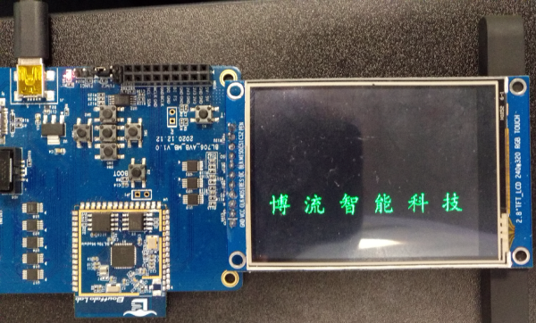

SPI - TFT LCD 显示
====================

本 demo 演示通过 SPI 驱动带 il9431 芯片的TFT 屏显示。

硬件连接
-----------------------------

本 demo 基于 BL706_AVB 开发板，连接方式如下：

.. list-table::
    :widths: 30 30
    :header-rows: 1

    * - GPIO function
      - GPIO pin
    * - LCD_CS
      - GPIO10
    * - LCD_DC
      - GPIO22
    * - SPI_SCK
      - GPIO19
    * - SPI_MISO
      - GPIO20
    * - SPI_MOSI
      - GPIO21

软件实现
-----------------------------

-  软件代码见 ``examples/spi/spi_lcd``

.. code-block:: C
    :linenos:

    #define BSP_SPI_CLOCK_SOURCE  ROOT_CLOCK_SOURCE_BCLK
    #define BSP_SPI_CLOCK_DIV  0

-  配置 ``SPI`` 设备时钟源，见 ``bsp/board/bl706_avb/clock_config.h``

.. code-block:: C
    :linenos:

    #define CONFIG_GPIO19_FUNC GPIO_FUN_SPI
    #define CONFIG_GPIO20_FUNC GPIO_FUN_SPI
    #define CONFIG_GPIO21_FUNC GPIO_FUN_SPI

-  配置 ``SPI`` 设备复用引脚，见 ``bsp/board/bl706_avb/pinmux_config.h``,，如有改动，请自行修改

.. note:: 为适配 bl702_avb 硬件, SPI 的 MOSI 和 MISO 默认进行了调换，如果想要恢复默认，修改 ``bsp/board/bl706_avb/pinmux_config.h`` 中 ``pin_swap_enable`` 为 0

.. code-block:: C
    :linenos:

    #define BSP_USING_SPI0

    #if defined(BSP_USING_SPI0)
    #ifndef SPI0_CONFIG
    #define SPI0_CONFIG \
    {   \
    .id = 0, \
    .clk = 36000000,\
    .mode = SPI_MASTER_MODE, \
    .direction = SPI_MSB_BYTE0_DIRECTION_FIRST, \
    .clk_polaraity = SPI_POLARITY_LOW, \
    .clk_phase = SPI_PHASE_1EDGE, \
    .datasize = SPI_DATASIZE_8BIT, \
    .fifo_threshold = 4, \
    }
    #endif
    #endif

-  使能 ``BSP_USING_SPI0`` 并配置 ``SPI`` 设备配置，见 ``bsp/board/bl706_avb/peripheral_config.h``

.. code-block:: C
    :linenos:

    gpio_set_mode(LCD_CS_PIN,GPIO_OUTPUT_MODE);
    gpio_set_mode(LCD_DC_PIN,GPIO_OUTPUT_MODE);
    gpio_write(LCD_CS_PIN,1); //CS1
    gpio_write(LCD_DC_PIN,1); //DC

    spi0 = device_find("spi0");
    if(spi0)
    {
        device_close(spi0);
    }
    else{
        spi_register(SPI0_INDEX,"spi0");
        spi0 = device_find("spi0");
    }
    if(spi0)
    {
        device_open(spi0,DEVICE_OFLAG_STREAM_TX|DEVICE_OFLAG_STREAM_RX);
    }

- 配置 ``LCD_CS`` 和 ``LCD_DC`` 引脚为输出模式并拉高
- 调用 ``spi_register`` 函数注册  ``SPI`` 设备，当前注册 ``SPI0``
- 然后通过 ``find`` 函数找到设备对应的句柄，保存于 ``spi0`` 句柄中
- 最后使用 ``device_open`` 以轮询发送模式来打开 ``spi0`` 设备

.. code-block:: C
    :linenos:

    void LCD_WR_Byte(uint8_t data)
    {
        CS1_LOW;
        DC_HIGH;
        spi_transmit(spi0,&data,1,SPI_TRANSFER_TYPE_8BIT);
        CS1_HIGH;
    }

    void LCD_WR_HalfWord(uint16_t data)
    {
        CS1_LOW;
        DC_HIGH;
        spi_transmit(spi0,&data,1,SPI_TRANSFER_TYPE_16BIT);
        CS1_HIGH;
    }

    void LCD_WR_Word(uint32_t data)
    {
        CS1_LOW;
        DC_HIGH;
        spi_transmit(spi0,&data,1,SPI_TRANSFER_TYPE_32BIT);
        CS1_HIGH;
    }

- 为 LCD 显示驱动提供接口

编译和烧录
-----------------------------

-  **CDK 编译**

   打开项目中提供的工程文件：spi_lcd.cdkproj

   参照 :ref:`windows_cdk_quick_start` 的步骤编译下载即可

-  **命令行编译**

.. code-block:: bash
   :linenos:

    $ cd <sdk_path>/bl_mcu_sdk
    $ make BOARD=bl706_avb APP=spi_lcd

-  **烧录**

   详见 :ref:`bl_dev_cube`

实验现象
-----------------------------

spi display!
