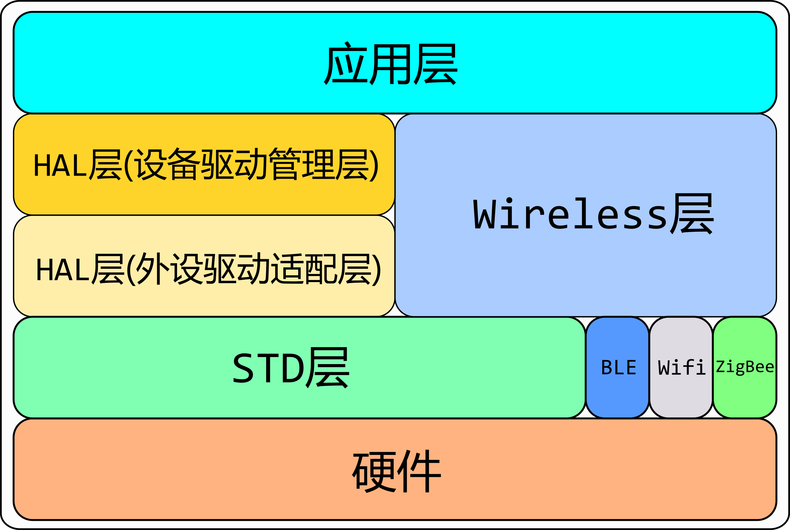

API Overview
=========================

Introduction
------------------

**bl_mcu_sdk** code hierarchy is divided into the following main layers.

- The application layer: codes written by users.
- The component layer: some opensource components,the interface calls the HAL layer, while the wireless layer is used for wireless functions.
- HAL layer and wireless layer for adaptation to different MCUs, where the HAL layer is divided into two layers
    - Device driver management: provides a standard set of interfaces, which are implemented by the peripheral driver adaptation layer
    - Peripheral driver adaptation layer: implements the standard interface of the device driver management and extends its own unique interface
- Standard driver layer based on register packaging
- Hardware layer, also known as the register layer

    code structure

Device driver management layer
---------------------------------

The realization of the device driver management layer adopts the object-oriented idea. First of all, we regard the peripheral as a device or a file, adhering to the concept of **everything is a file**, and files have standard calling interfaces: ``open``, ``close``, ``ctrl``, ``write``, ``read``, ``callback``. Different file types are different (such as serial device, ADC device, SPI device), and the way of opening is also different (such as polling, interrupt, DMA), from this, we can construct a base class (parent class) of an object.

**Base class**

.. code-block:: C

    struct device
    {
        char name[NAME_MAX];            /*name of device */
        dlist_t list;                   /*list node of device */
        enum device_status_type status; /*status of device */
        enum device_class_type type;    /*type of device */
        uint16_t oflag;                 /*oflag of device */

        int (*open)(struct device *dev, uint16_t oflag);
        int (*close)(struct device *dev);
        int (*control)(struct device *dev, int cmd, void *args);
        int (*write)(struct device *dev, uint32_t pos, const void *buffer, uint32_t size);
        int (*read)(struct device *dev, uint32_t pos, void *buffer, uint32_t size);
        void (*callback)(struct device *dev, void *args, uint32_t size, uint32_t event);
        void *handle;
    };

**Base class member: name**

Name the device and use ``device_find`` to find the device.

**Base class member: type**

``type`` records the category of the current device, and the ``type`` that can be selected are as follows.

.. code-block:: C

    enum device_class_type
    {
        DEVICE_CLASS_NONE = 0,
        DEVICE_CLASS_GPIO,
        DEVICE_CLASS_UART,
        DEVICE_CLASS_SPI,
        DEVICE_CLASS_I2C,
        DEVICE_CLASS_ADC,
        DEVICE_CLASS_DMA,
        DEVICE_CLASS_TIMER,
        DEVICE_CLASS_PWM,
        DEVICE_CLASS_SDIO,
        DEVICE_CLASS_USB,
        DEVICE_CLASS_I2S,
        DEVICE_CLASS_CAMERA,
        DEVICE_CLASS_SEC_HASH,
    } ;

**Base class member: status**

``status`` is used to record the current status of the device and provides 4 statuses.

.. code-block:: C

    enum device_status_type
    {
        DEVICE_UNREGISTER = 0,
        DEVICE_REGISTERED,
        DEVICE_OPENED,
        DEVICE_CLOSED
    } ;

**Base class member: oflag**

``oflag`` records the flag information filled in during registration and the ``oflag`` information filled in when using ``device_open``.

**Base class members: list**

The addition and deletion of equipment is stored in a doubly linked list, which saves memory.

**Base class members: standard function pointers**

Provides a standard function interface for different peripherals. When the peripheral implements this type of interface and assigns it to the member, the function of rewriting can be achieved.

Device driver management layer standard interface
---------------------------------------------------

**device_register**
^^^^^^^^^^^^^^^^^^^^

``device_register`` is used to register the device and register the device information in the linked list.

.. code-block:: C

    int device_register(struct device *dev, const char *name);

- dev: device handle.
- name: the name of the device.
- return: return error code, 0 means registration is successful, others mean errors.

**device_unregister**
^^^^^^^^^^^^^^^^^^^^^^^

``device_unregister`` is used to delete the device and delete the device information from the linked list.

.. code-block:: C

    int device_unregister(const char *name);

- dev: device handle
- name: the name of the device to be deleted
- return: error code, 0 means delete, others mean error

**device_find**
^^^^^^^^^^^^^^^^

``device_find`` is used to find the device from the linked list according to ``name``, and return the first address of the device handle.

.. code-block:: C

    struct device *device_find(const char *name);

- dev: device handle
- name: the name of the device to be searched
- return: error code,! 0 means the device handle was found, NULL means the device was not found.

**device_open**
^^^^^^^^^^^^^^^^

``device_open`` is used to open the device, and ``oflag`` represents the opening method. Currently, there are 6 opening methods available. The bottom layer calls the ``open`` member in the ``dev`` handle.

.. code-block:: C

    int device_open(struct device *dev, uint16_t oflag);

- dev: device handle
- oflag: open method
- return: error code, 0 means opening is successful, others mean errors

``oflag`` can write the following parameters:

.. code-block:: C

    #define DEVICE_OFLAG_STREAM_TX  0x001 /* The device is turned on in polling sending mode */
    #define DEVICE_OFLAG_STREAM_RX  0x002 /* The device is turned on in polling receiving mode */
    #define DEVICE_OFLAG_INT_TX     0x004 /* The device is turned on in interrupt sending mode */
    #define DEVICE_OFLAG_INT_RX     0x008 /* The device is turned on in interrupt receiving mode */
    #define DEVICE_OFLAG_DMA_TX     0x010 /* The device is turned on in DMA transmission mode */
    #define DEVICE_OFLAG_DMA_RX     0x020 /* The device is turned on in DMA receiving mode */

**device_close**
^^^^^^^^^^^^^^^^

``device_close`` is used to close the device. The bottom layer calls the ``close`` member in the ``dev`` handle.

.. code-block:: C

    int device_close(struct device *dev);

-dev: device handle
-return: error code, 0 means closing is successful, others mean error

**device_control**
^^^^^^^^^^^^^^^^^^^

``device_control`` is used to control the device and modify parameters according to commands. The bottom layer calls the ``control`` member in the ``dev`` handle.

.. code-block:: C

    int device_control(struct device *dev, int cmd, void *args);

- dev: device handle
- cmd: device control command
- args: control parameters
- return: Different control commands return different meanings.

``cmd`` provides the following standard commands. In addition, different peripherals also have their own commands

.. code-block:: C

    #define DEVICE_CTRL_SET_INT             0x01    /* set interrupt */
    #define DEVICE_CTRL_CLR_INT             0x02    /* clear interrupt */
    #define DEVICE_CTRL_GET_INT             0x03    /* get interrupt status*/
    #define DEVICE_CTRL_RESUME              0x04    /* resume device */
    #define DEVICE_CTRL_SUSPEND             0x05    /* suspend device */
    #define DEVICE_CTRL_CONFIG              0x06    /* config device */
    #define DEVICE_CTRL_GET_CONFIG          0x07    /* get device configuration */
    #define DEVICE_CTRL_ATTACH_TX_DMA       0x08
    #define DEVICE_CTRL_ATTACH_RX_DMA       0x09
    #define DEVICE_CTRL_TX_DMA_SUSPEND      0x0a
    #define DEVICE_CTRL_RX_DMA_SUSPEND      0x0b
    #define DEVICE_CTRL_TX_DMA_RESUME       0x0c
    #define DEVICE_CTRL_RX_DMA_RESUME       0x0d
    #define DEVICE_CTRL_RESVD1              0x0E
    #define DEVICE_CTRL_RESVD2              0x0F

**device_write**
^^^^^^^^^^^^^^^^

``device_write`` is used to send data, and the sending mode can be polling, interrupt, dma. The bottom layer calls the ``write`` member in the ``dev`` handle.

.. code-block:: C

    int device_write(struct device *dev, uint32_t pos, const void *buffer, uint32_t size);

- dev: device handle
- pos: different devices have different meanings for pos
- buffer: the buffer to be written
- size: the length to be written
- return: error code, 0 means writing is successful, others mean errors

**device_read**
^^^^^^^^^^^^^^^^

``device_read`` is used to receive data, and the receiving mode can be polling, interrupt, dma. The bottom layer calls the ``read`` member in the ``dev`` handle.

.. code-block:: C

    int device_read(struct device *dev, uint32_t pos, void *buffer, uint32_t size);

- dev: device handle
- pos: different devices have different meanings for pos
- buffer: the buffer to be read
- size: the length to be read
- return: error code, 0 means successful reading, others mean errors

**device_set_callback**
^^^^^^^^^^^^^^^^^^^^^^^^

``device_set_callback`` is used to register interrupt callback function. The bottom layer calls the ``callback`` member in the ``dev`` handle.

.. code-block:: C

    int device_set_callback(struct device *dev, void (*callback)(struct device *dev, void *args, uint32_t size, uint32_t event));

- dev: device handle
- callback: the interrupt callback function to be registered

    * dev: device handle
    * args: Different peripherals have different meanings
    * size: transmission length
    * event: interrupt event type

Peripheral driver adaptation layer
---------------------------------------

**Subclass inherits from parent class**

The first member of different peripherals is ``struct device``, which is equivalent to the inheritance of the parent class, so that the subclass can be used to access the parent class member. When the subclass is used to modify the members of the parent class, it has its own functions. The realization principle is that the first address of different structures is the address of the first member in the structure.

.. code-block:: C

    typedef struct xxx_device
    {
        struct device parent;

    } xxx_device_t;

**Rewrite standard interface**

Each peripheral has a ``xxx_register`` function, which is used to rewrite the standard interface.

.. code-block:: C

    dev->open = xxx_open;
    dev->close = xxx_close;
    dev->control = xxx_control;
    dev->write = xxx_write;
    dev->read = xxx_read;
