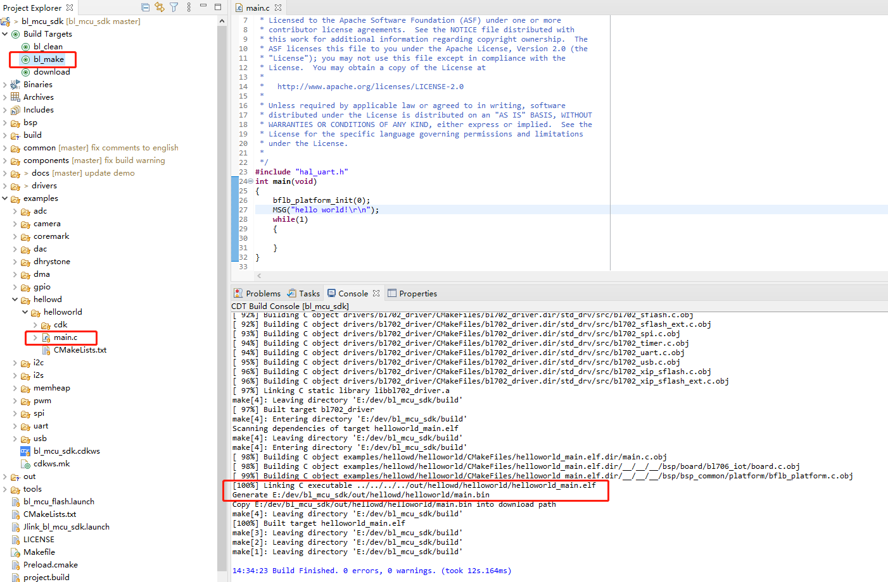
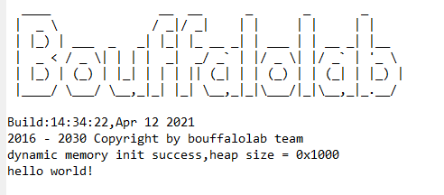
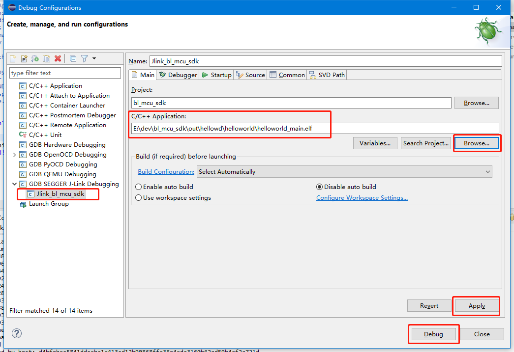
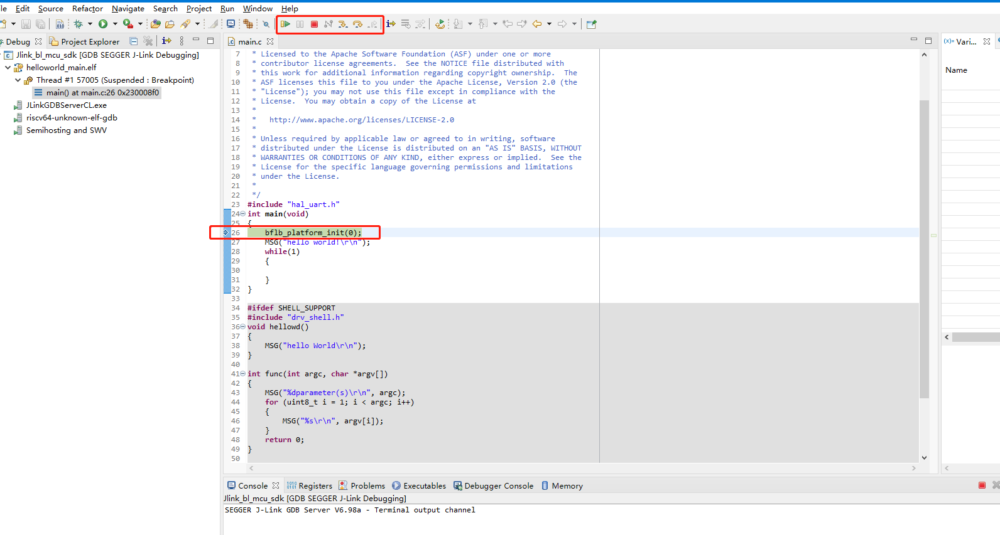

Eclipse Development Guide under Windows
==========================================

This document introduces the use of eclipse under Windows to build a software development environment for BL702 series MCU.

Software and hardware environment
------------------------------------

- Eclipse free installation package
- Serial port assistant software
- A USB Type-A data cable
- A j-link emulator
- A USB-TTL serial port module
- Several Dupont lines

Download Eclipse
-----------------------------

- Download the installation package with the RISC-V toolchain from the Bouffalo Lab developer community `Eclipse https://dev.bouffalolab.com/download <https://dev.bouffalolab.com/media/upload/download/BouffaloLab_eclipse_x86_64_win.zip>`_ .

Download bl_mcu_sdk
-----------------------------

- Download from the open source community `bl_mcu_sdk <https://gitee.com/bouffalolab/bl_mcu_sdk.git>`_.

- You can use ``git clone`` or directly ``download`` to download the SDK
- Before using ``git clone``, please make sure that ``git`` has been installed correctly. Open a terminal that supports ``git`` and enter the following command to get the latest SDK.

.. code-block:: bash
   :linenos:
   :emphasize-lines: 1

   $ git clone https://gitee.com/bouffalolab/bl_mcu_sdk.git  --recursive

Configure eclipse
----------------------------

- Copy the eclipse compressed package to the working directory, unzip the eclipse compressed package
- Enter the eclipse directory, double-click ``eclipse.exe`` to start eclipse
- Select your ``Workspace`` directory, click ``Launch`` to enter the workspace

   .. figure:: img/pic1.png
      :alt:

- Click ``Window->preferences`` in the menu bar to open the environment configuration related page, ready to import the related configuration environment

   .. figure:: img/pic2.png
      :alt:

- Click the icon at "1" in the figure below to open the import configuration interface, follow the steps shown in the figure, and select the ``bflb_mcu_preferences.epf`` configuration file in the ``eclipse.exe`` directory.
   .. figure:: img/pic3.png
      :alt:

- After selecting the corresponding file, click ``Finish``, select and click ``cancel`` in the dialog box without restarting.

   .. figure:: img/pic4.png
      :alt:

Import bl_mcu_sdk
--------------------------

- Click on the menu bar ``File->Import`` to open the configuration interface of the imported project

    .. figure:: img/pic5.png
       :alt:

- In the opened ``Import`` window, select ``General->Existing Projects into Workspace``, and then click ``Next``

    .. figure:: img/pic6.png
       :alt:

- After loading the project path of bl_mcu_sdk, click ``Finsh`` to complete the import

    .. figure:: img/pic7.png
       :alt:

- After the import is complete, close the ``Welcome`` window to see the imported project

    .. figure:: img/pic8.png
       :alt:

    .. figure:: img/pic9.png
       :alt:

- Expand ``Build Target``, you can see the three function buttons ``bl_clean``, ``bl_make``, and ``download``.

   - Double-click the ``bl_clean`` button, it will clear the compilation cache in the ``build`` and ``out`` directories
   - Double-click the ``bl_make`` button, the set case will be compiled normally, if the default configuration is not modified, the ``helloworld`` project will be compiled
   - Double-click the ``download`` button, the code will be downloaded to the chip, if it is not compiled successfully, the default or last ``.bin`` file will be downloaded

Hardware connection
----------------------

- For specific board connection, please refer to :ref:`connect_hardware`; (The eclipse environment recommends using ``j-link`` for programming and debugging)
- Please make sure that the development board is set up correctly before proceeding to the following steps

Test the Hello World project
-------------------------------

Open Hello World
^^^^^^^^^^^^^^^^^^^^^^^^^^^^

- Open ``examples/hellowd/helloworld/main.c``, you can edit and modify the code of the ``helloworld`` test demo. If you modify it, please save it and execute the compilation

Compile Hello World
^^^^^^^^^^^^^^^^^^^^^^^^^^^^

- Double click ``bl_make`` to compile the helloworld project

- After successful compilation, you can see the log information as shown in the figure below in the ``Console`` window

Program Hello World
^^^^^^^^^^^^^^^^^^^^^^^^^^^^

- Double-click ``download`` to program the helloworld project ``bin`` file to the chip

- After the download is successful, you can see the log information as shown in the figure below in the ``Console`` window

.. figure:: img/pic11.png

Run Hello World
^^^^^^^^^^^^^^^^^^^^^^^^^^^^

- Connect the ``TXD0``, ``RXD0`` and ``GND`` pins of the board to the USB-TTL serial port module with a DuPont cable, insert the serial port module into the PC, and use any serial port assistant software to open the serial port
- After the programming is successful, press the ``rst`` button on the board. If the download is correct, you can see the log information as shown in the figure below in the serial port assistant software.

Debug Hello World
^^^^^^^^^^^^^^^^^^^^^^^^^^^^

- Click the ``Debug`` button in the eclipse toolbar to enter the debug configuration window
- Select ``GDB SEGGER J-Link Debugging->Jlink_bl_mcu_sdk``, select the ``.elf`` file that needs to be debugged in ``C/C++ Application:``
- Click ``Apply`` first, then click ``Debug`` to start ``Debug``

- After entering the Debug interface, you can see that the program stops at ``main``, click the ``Step Over`` button in the upper toolbar to perform single-step debugging of the code project.

   Eclipse Debugging

Compile and program different target projects
-------------------------------------------------

- When you right-click the ``bl_make`` button and click ``Edit``, the configuration interface for replacing the target project will pop up, as shown in the figure below

.. figure:: img/pic12.png
   :alt:

- Where ``APP=xxx`` can be changed to the name of the target project that needs to be compiled and programmed. For example, if you want to compile and program the ``gpio/gpio_blink`` project, modify it to ``APP=gpio_blink``.
- ``make BOARD=bl706_iot`` in ``Build command`` will specify different Board types to adapt to different types of boards.

- The ``Board`` type determines the corresponding ``borad`` header file when compiling. The default selection is ``make build BOARD=bl706_iot``

