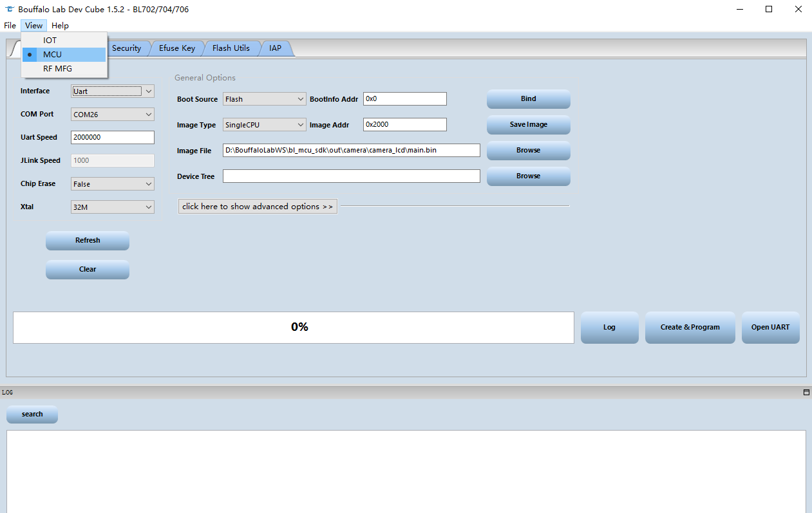

.. _bl_dev_cube:

BLDevCube start guide
===============================

This document mainly introduces the use of Bouffalo Lab Dev Cube for code programming. For more details, please refer to `BLDevCube user manual <https://dev.bouffalolab.com/media/upload/doc/DevCube%E7%94%A8%E6%88%B7%E6%89%8B%E5%86%8Cv1.2.pdf>`_

Download Bouffalo Lab Dev Cube
------------------------------------

-  Download the version suitable for your operating system from the developer community, download address:`https://dev.bouffalolab.com/download <https://dev.bouffalolab.com/download>`_

   -  For users who do not have a registered account, click on the guest portal

-  After the download is complete, you can use it after decompression

Configure tool download method
----------------------------------

- Double-click ``BLDevCube.exe``, in the ``Chip Type`` drop-down box, select the corresponding chip model, click ``Finish`` to enter the ``Dev Cube`` interface
- Enter the interface, select ``MCU`` under ``View`` in the menu bar to enter the MCU program download interface

   select mcu

- Select the corresponding download method in the ``Interface`` column under ``Image``, and choose according to your actual physical connection
- ``Image file`` configure the absolute path of the downloaded image, click ``Browse`` to select the **Bin** file
- When you click ``click here to show advanced options``, the advanced mirroring configuration will be expanded, usually keep the default configuration; it should be noted that ``Flash Clock`` will affect the clock frequency of Flash and PSRAM at the same time , If you need to use PSRAM, you can increase the clock frequency to get better performance

Download with UART
^^^^^^^^^^^^^^^^^^^^^

- ``COM Port`` is used for UART download, select the COM number connected to the chip, and click ``Refresh`` to refresh the COM number
- When ``Uart Speed`` is used for UART download, configure the appropriate baud rate, the default is 2M

-  Please make sure the hardware configuration is correct before downloading:

   - Use ``Type-C USB`` or ``Mini USB`` to connect to the corresponding USB ``Type-C`` port or ``Mini`` port on the board.
   - Press the ``Boot`` key on the board, don't release it
   - Press the ``RST`` key on the board, now you have entered ``Boot ROM`` model, you can release the two keys
   - At this time, you can see the corresponding serial port ``COM`` number from the ``Bouffalo Lab Dev Cube``, if it does not appear, please click the ``Refresh`` button to refresh

- After completing the above configuration correctly, click the ``Create&Program`` button to download

- After the download is successful, you will see the status bar turn green and display ``Success``

.. figure:: img/dev_cube_download.png
   :alt:

   download success!

Download with Openocd
^^^^^^^^^^^^^^^^^^^^^^^^

- Download using openocd is basically the same as using serial port download option configuration, just switch ``Interface`` to ``Openocd``
- The hardware connection needs to be changed to a debugger connection that supports Openocd (this tutorial takes Sipeed RV Debugger as an example):

   - 1. Connect the RV debugger to the USB port of the computer, open the device manager, you will find that the debugger is recognized as two serial ports (note: not the serial port on the board)

   .. figure:: img/sipeed_rv_debugger_1.png

   - 2. Download the ``zadig-2.4`` replacement driver from sipeed. Download link: `http://dl.sipeed.com/MAIX/tools/sipeed-rv-debugger/zadig-2.4.exe <http://dl.sipeed.com/MAIX/tools/sipeed-rv-debugger/ zadig-2.4.exe>`_
   - 3. After downloading, double-click to open ``zadig-2.4.exe``, and check List All Devices in Options.
   - 4. Find JTAG Debugger (Interface 0), then select the replacement driver as WinUSB and click Replace Driver to replace
   - 5. Open the device manager again and see that one of the serial ports has been replaced with a universal serial bus device, indicating that the installation is successful

   .. figure:: img/sipeed_rv_debugger_2.png

   - 6. Connect the JTAG pins of the debugger with the JTAG pins of the board

- After completing the above configuration correctly, click the ``Create&Program`` button to download
- After the download is successful, you will see the status bar turn green and display ``Success``

Download with Jlink
^^^^^^^^^^^^^^^^^^^^^^

- The tool configuration for downloading using Jlink and Openocd is basically the same, just switch ``Interface`` to ``Jlink``
- The hardware connection needs to be changed to use Jlink connection (this tutorial takes Jlink V11 as an example, it is recommended to use Jlink V10 or later):

   - 1. Download the appropriate Jlink driver from Segger official website and install it
   - 2. Connect the Jlink debugger to the USB port of the computer
   - 3. Connect the JTAG pins of the JLink debugger with the JTAG pins of the board

- After completing the above configuration correctly, click the ``Create&Program`` button to download

- After the download is successful, you will see the status bar turn green and display ``Success``

