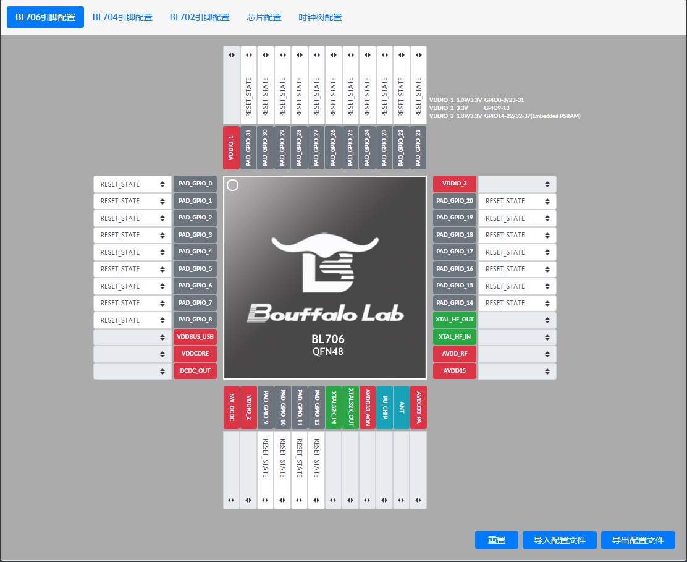

Board Configuration System User Guide
=========================================

In order to implement the idea of **everything is a file**, we propose a Board configuration system for embedded applications with different hardware configuration requirements. The **Board configuration system** is mainly used for initializing the three basic elements of clock, GPIO, and peripheral default configuration in embedded applications.

**Board Configuration System** contains three configuration files, and a ``bl_config_wizard`` graphical configuration software

- **clock_config.h** Clock configuration Include file
- **peripheral_config.h** Peripheral configuration Include file
- **pinmux_config.h** Pin Function Configuration Include file
- **bl_config_wizard** The graphical interface configures the above three types of files

The user only needs to modify three configuration files and the system will be initialized automatically, thus eliminating the need to call a series of complex and lengthy initialization functions in the user program. Boufflao Lab provides ``bl_config_wizard`` configuration software for users to quickly and easily generate configuration files for their projects.

`bl_config_wizard`_ supports PC-side online configuration, but currently does not support mobile terminal online configuration.

.. _bl_config_wizard: https://dev.bouffalolab.com/media/config/index.html

    bl_config_wizard Preview

The features of each file in the Board configuration system
----------------------------------------------------------------

The board system is mainly used for different boards, different boards create different board files and put them in ``bsp/board`` directory, and a board file, in the case of **pins not conflicting**, can be shared to different demos, no need to create multiple projects and reduce the project file size.

.. error:: If there is a pin conflict and you have to use the same Board file, please modify the pins yourself

**board.c**
^^^^^^^^^^^^^^^^^^^^

``board.c`` Main initialization of clock and pins

**blxxx_config.h**
^^^^^^^^^^^^^^^^^^^^^^^^^^^^

``blxxx_config.h`` Mainly contains some header files for the HAL layer driver.

.. hint:: The above two files do not need to be changed by the user, and the same MCU can be copied and pasted directly into your own board directory for use

**clock_config.h**
^^^^^^^^^^^^^^^^^^^^^^^^^^^^

``clock_config.h`` Mainly configures the clock sources for the system and peripherals as well as the frequency division system.

**peripheral_config.h**
^^^^^^^^^^^^^^^^^^^^^^^^^^^^

``peripheral_config.h`` It mainly contains the enablement of peripherals and the configuration of parameters.

.. warning:: Macros starting with ``#define BSP_USING_XXX`` are used to enable the configuration of the peripheral, if the macro is not enabled, all functions of the peripheral cannot be used

.. warning:: Macro starting with ``XXX_CONFIG``, used to initialize the configuration of the peripheral, which is later used by calling ``device_open``

**pinmux_config.h**
^^^^^^^^^^^^^^^^^^^^^^^^^^^^

``pinmux_config.h`` Mainly configures the GPIO pin function of the peripheral.

.. warning:: In mcu sdk, all demos share this file, so some demos are not usable and require frequent changes to the pin function configuration in this file. If the user has already set the pin assignments, there is no need to modify them frequently.

Use of the Board configuration tool **bl_config_wizard**
---------------------------------------------------------------

-  The ``bl_config_wizard`` can be accessed by clicking on this link `https://dev.bouffalolab.com/media/config/index.html <https://dev.bouffalolab.com/media/config/index.html>`_ wizard in the online version. Chrome, Firefox, Microsoft Edge browsers are recommended.

Generate a new **pinmux_config.h** file
^^^^^^^^^^^^^^^^^^^^^^^^^^^^^^^^^^^^^^^^^^^^

1.  Select ``Pin & Peripheral Configuration`` in the window bar.
#.  Select MCU model, currently supports ``BL706 pin configuration``, ``BL704 pin configuration``, ``BL702 pin configuration``.
#.  Select the function of the pin, take ``BL706 pin configuration`` as an example, click on the drop-down box of **PAD_GPIO_XX** and select the desired function, as shown in the figure.

.. figure:: img/config_wizard_example1.png
    :alt:

    Select pin function

4. After configuring all the pin functions, click ``Export Configuration File`` and then you can select the path and modify the file name in the pop-up box, as shown in the figure.

.. figure:: img/config_wizard_example2.png
    :alt:

    Exporting configuration files

Modify the original **pinmux_config.h** file
^^^^^^^^^^^^^^^^^^^^^^^^^^^^^^^^^^^^^^^^^^^^^^^^^^^^

Often in use, instead of generating a new **pinmux_config.h** file, we make changes to the original **pinmux_config.h** file, and ``bl_config_wizard`` supports such a need.

1.  Select ``Pin & Peripheral Configuration`` in the window bar.
#.  Select MCU model, currently supports ``BL706 pin configuration``, ``BL704 pin configuration``, ``BL702 pin configuration``.
#.  Click on ``import configuration file`` and select the **pinmux_config.h** file in the pop-up box.
#.  Select the pin to be modified and click on its drop-down box to change the pin function
#.  When you are done, click ``Export Profile`` and then you can select the path and modify the file name in the pop-up box.

Modify the **pinmux_config.h** file in the CDK tool
^^^^^^^^^^^^^^^^^^^^^^^^^^^^^^^^^^^^^^^^^^^^^^^^^^^^^^^^^

-  **pinmux_config.h** Also supports the use of graphical configuration wizards in the CDK for adjusting the corresponding pin functions
-  Drag the **pinmux_config.h** file directly into the CDK text editor interface, and you will see the ``Configuration Wizard`` tab at the bottom of the text editor

   .. figure:: img/configuration_wizard_1.png
       :alt:

       Configuration Wizard

-  Click on the ``Configuration Wizard`` tab to open the graphical configuration wizard interface
-  The functions supported by the pin can be selected by selecting the drop-down box

   .. figure:: img/configuration_wizard_2.png
       :alt:

       Graphical configuration wizard to set pin functions

-  Please refer to the Graphical Configuration Wizard section of CDK Help for more information on the specific functions and code rules of the Graphical Configuration Wizard.

Differences with STM32CUBEMX Configuration Tool
--------------------------------------------------

STM32CUBEMX is also a tool to configure the clock, peripherals and GPIO initialization, eventually generating a complete project with initialization at the very beginning of ``main.c``, and the GPIO and peripheral initialization base will be called in ``stm32xxx_hal_msp.c``.

.. code-block:: C

    /* MCU Configuration--------------------------------------------------------*/

    /* Reset of all peripherals, Initializes the Flash interface and the Systick. */
    HAL_Init();

    /* USER CODE BEGIN Init */

    /* USER CODE END Init */

    /* Configure the system clock */
    SystemClock_Config();

    /* USER CODE BEGIN SysInit */

    /* USER CODE END SysInit */

    /* Initialize all configured peripherals */
    MX_GPIO_Init();
    MX_USART1_UART_Init();
    MX_QUADSPI_Init();

.. code-block:: C

    void HAL_UART_MspInit(UART_HandleTypeDef* huart)
    {
        GPIO_InitTypeDef GPIO_InitStruct = {0};
        if(huart->Instance==UART5)
        {
        /* USER CODE BEGIN UART5_MspInit 0 */

        /* USER CODE END UART5_MspInit 0 */
            /* Peripheral clock enable */
            __HAL_RCC_UART5_CLK_ENABLE();

            __HAL_RCC_GPIOB_CLK_ENABLE();
            /**UART5 GPIO Configuration
            PB12     ------> UART5_RX
            PB13     ------> UART5_TX
            */
            GPIO_InitStruct.Pin = GPIO_PIN_12|GPIO_PIN_13;
            GPIO_InitStruct.Mode = GPIO_MODE_AF_PP;
            GPIO_InitStruct.Pull = GPIO_NOPULL;
            GPIO_InitStruct.Speed = GPIO_SPEED_FREQ_LOW;
            GPIO_InitStruct.Alternate = GPIO_AF14_UART5;
            HAL_GPIO_Init(GPIOB, &GPIO_InitStruct);

            /* UART5 interrupt Init */
            HAL_NVIC_SetPriority(UART5_IRQn, 0, 0);
            HAL_NVIC_EnableIRQ(UART5_IRQn);
        /* USER CODE BEGIN UART5_MspInit 1 */

        /* USER CODE END UART5_MspInit 1 */
        }

    }

.. hint:: The projects generated by stm32 all work for one project and cannot be compiled for more than one project at the same time. If you use more than one project, you have to generate more than one of these two files. When using multiple projects, it will indirectly increase the file size and add duplicate files.
