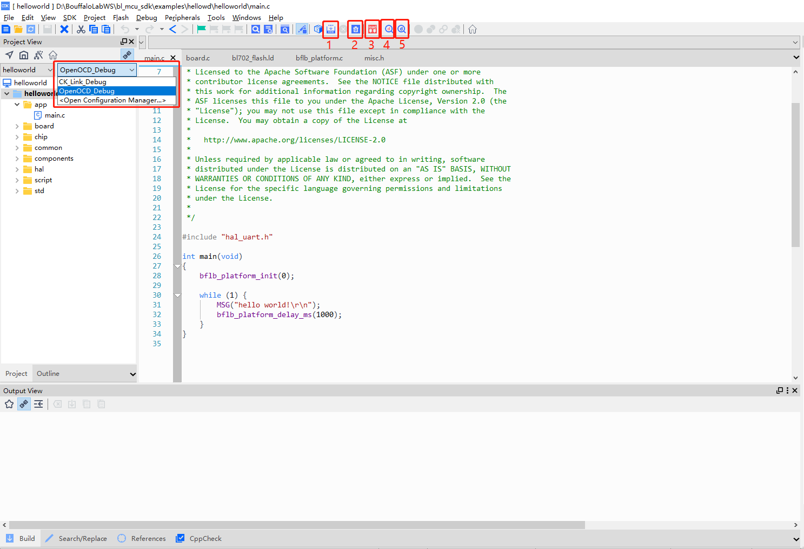
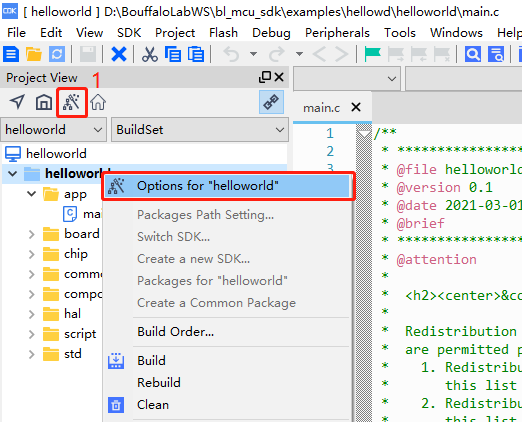
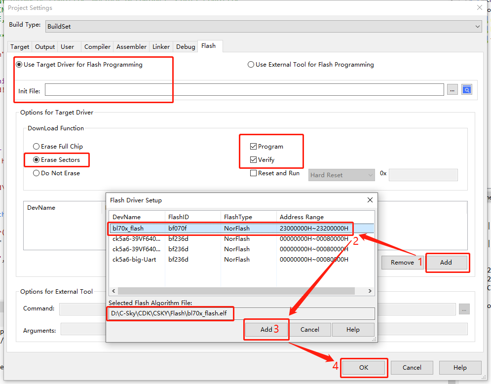
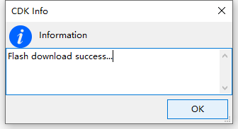
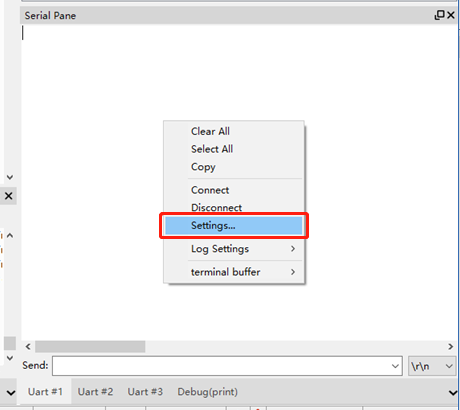
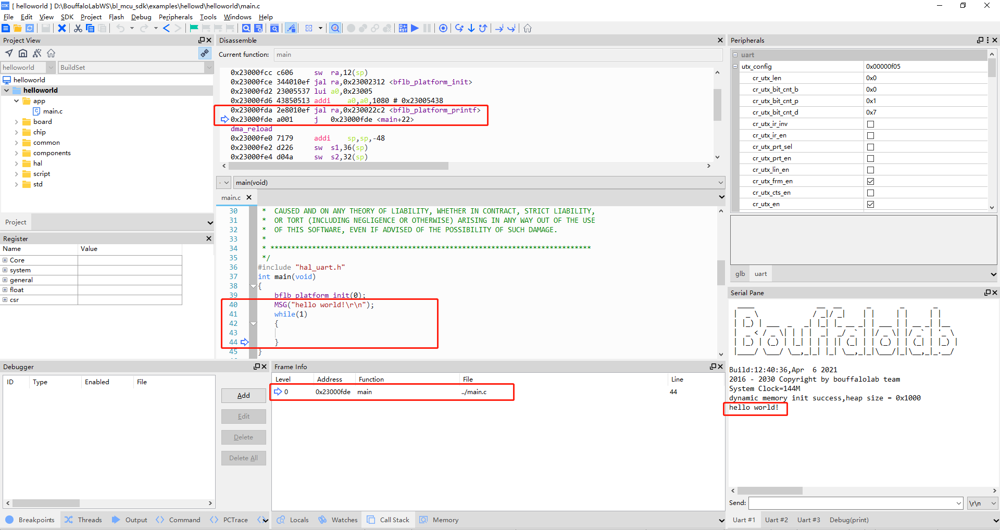

Use CDK + CK-Link to compile and debug
=========================================

Open Hello World
------------------------------

- After obtaining the SDK, enter the ``examples/hellowd/helloworld/cdk`` directory in the SDK, double-click ``helloworld.cdkproj``, and you can open the ``Helloworld`` project

Compile Hello World
------------------------------

   helloworld.cdkproj

- In the drop-down menu, you can select the ``CK_Link_Debug`` or ``OpenOCD_Debug`` project, this tutorial is based on the ``CK_Link_Debug`` project

- In the CDK toolbar, click the compile icon to compile the project

   - Click the icon ``Build Project`` at ``1`` to compile the currently selected project
   - Click the icon ``Clean Project`` at ``2`` to clear the result of the last compilation
   - Click the ``3`` icon ``Flash Download`` to download the compiled code to the chip
   - Click the icon ``Start/Stop Debug`` at ``4`` to perform debugging related operations (when using ``CK-Link``, you can load the code to flash first)
   - Click the ``5`` icon ``Start/Stop Debug whitout Download`` to debug directly without loading the current bin file
   - You can also right-click the project name in ``Project``, and compile the project through the options in the right-click menu

Program Hello World
----------------------------

- Since our flash algorithm is not currently included in the CDK software, we need to put the flash algorithm in the CDK installation directory. The specific operations are as follows:

    - Enter the ``tools\cdk_flashloader`` directory under the SDK directory
    - Copy the ``bl70x_flasher.elf`` file in the directory to the ``C-Sky\CDK\CSKY\Flash`` directory of the CDK tool

   .. figure:: img/cdk7.png
      :alt:

      CDK Flash Loader

   CDK Project Setting

- Click the project setting button in the ``Project View`` to open the ``Project Setting`` window, or open it through the ``Project`` menu bar

- In the opened ``Project Setting`` window, select the ``Flash`` tab to configure the required Flash algorithm

   CDK Project Flash setting

- In the ``Flash`` tab, click the ``Add`` button, select the ``bl70x_flash`` algorithm in the opened list, and click ``Add`` to add it to the project. Others in ``Flash`` configuration, as shown in the figure:

- After clicking OK, if the configuration is correct, click ``Flash Download`` to download the compiled code to the chip

   CDK Flashdownload Success

- If the download fails, please check:

    - 1. Whether the code is compiled correctly and generate files such as ``.elf``, ``.bin``, etc.
    - 2. Is the Flash algorithm correctly set?
    - 3. Whether the CK-Link and the board are properly connected
    - 4. Whether the development board is powered normally and whether the power indicator is on

Run Hello World
----------------------------

- From the menu bar of the CDK ``View->Serial Pane``, open the serial port panel, right-click in the opened ``Serial Pane``, set the serial port, select your corresponding serial port number and baud rate

.. figure:: img/cdk3.png
   :alt:

   CDK Serial Pane setting

- Press the ``RST`` key on the board, you can see the result of the code in the serial port

.. figure:: img/cdk6.png
   :alt:

   HelloWorld！

Debug Hello World
----------------------------

- Click the ``Start/Stop Debugger`` button at the top of the toolbar to enter the debug interface, as shown in the figure below

.. figure:: img/cdk10.png
   :alt:

   Debug HelloWorld！

- In the debug interface, the ``Register`` window can view the ``CPU`` internal register data; the ``Peripherals`` peripheral panel, you can view the corresponding peripheral register data, the top menu bar ``Peripherals-> System Viewer`` can select peripherals; click the relevant debugging button in the upper toolbar to perform operations such as breakpoint setting, single-step debugging, single-step instruction, and full-speed operation. Of course, these operations have corresponding shortcut keys and shortcut setting methods. For details, please refer to ``CDK Help``.

- We click the single step button to run the code, and we can see that the cursor moves to the next sentence of code, and we can see our output ``Hello World!`` displayed in the serial port panel.

   Debug HelloWorld！

