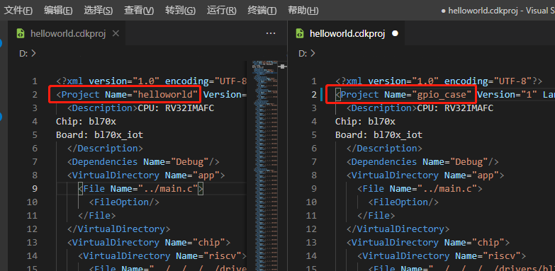
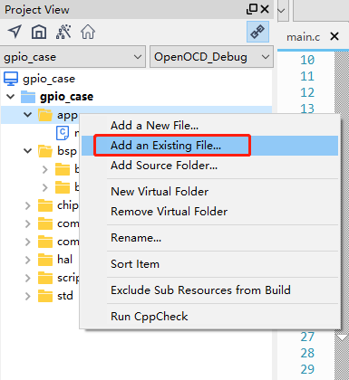

New Project Guide based on CDK
==================================

This document will briefly explain how to create a new CDK project based on this SDK, please make sure that the CDK IDE is properly installed before following this tutorial.

Examples directory structure
----------------------------------

There are two levels of subdirectories under ``bl_mcu_sdk/examples``, the first level is the folders of different peripherals. The second level is a specific test case of the peripheral, The second level directory usually also contains a directory named ``cdk`` and the source code associated with the case.
The ``cdk`` directory usually contains a ``xxx.cdkproj`` file, which is a CDK project file. If the **CDK** IDE is properly installed, double-click the project to open it. The newly created project should be at the same level as the case level in the current ``examples`` directory.

.. note:: The source file must contain the c program entry, usually the ``main`` function, the source file may not be called ``main.c``

-  Create a new ``my_case`` folder under ``examples`` to store your case
-  Create a new folder that needs to be tested in the ``my_case`` directory, such as ``gpio_case``
-  Then add the ``main.c`` file and ``cdk`` directory in the ``gpio_case`` directory

The directory structure is as follows:

.. code-block:: bash
   :linenos:

   bl_mcu_sdk
   ├── examples
       ├── my_case
           ├── gpio_case
           │   ├── cdk
           │   │   ├──gpio_case.cdkproj
           │   ├── CMakeLists.txt
           │   └── main.c
           └── xxxx_case

Add cdk project related files
--------------------------------

Since the current version of CDK does not support new pure ``Empty`` projects, please follow the steps below

-  Copy ``helloworld.cdkproj`` from the cdk directory in the ``helloworld`` case to your own cdk directory
-  Change the file name to your case name, for example: ``gpio_case.cdkproj``
-  Open the ``gpio_case.cdkproj`` file with a text editor and change ``Project Name`` to your project name, for example: ``gpio_case``

-  After editing, save the file and double-click ``gpio_case.cdkproj`` to open the project
-  Once you open the project, you can right-click on the appropriate folder and add the source code files you need

-  Right-click the project, open ``Project Settings``, select the Compiler tab, and add the corresponding header files needed for the new file in ``Include paths``.
-  Relative paths are recommended for header file paths
-  Click ``OK`` to save the edit

.. figure:: img/cdk_start_3.png
   :alt:

-  In case of floating point printouts, you need to add the flag option ``-u _printf_float`` in the Linker tag, in ``Other flags``, otherwise you can't printf floating point properly

.. figure:: img/cdk_start_4.png
   :alt:

-  In the case of using different development boards, pay attention to choose different board file references, usually, the default configuration is **bl706_iot**

.. figure:: img/cdk_start_5.png
   :alt:

