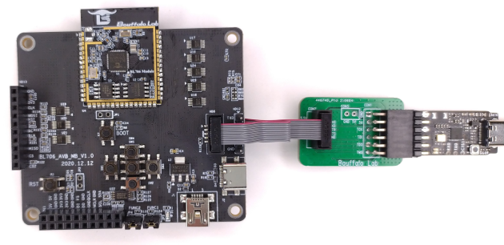
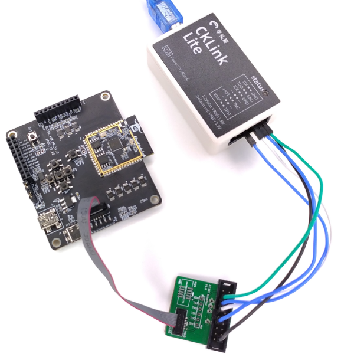
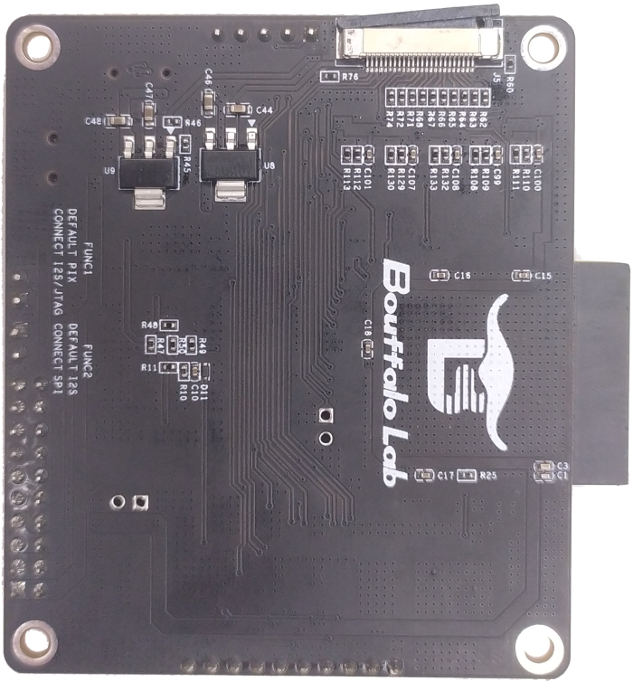
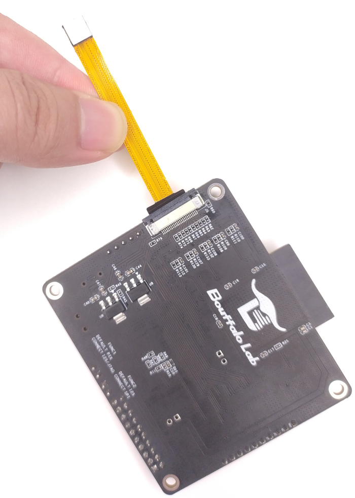
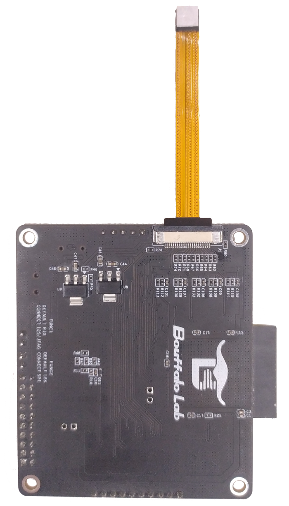
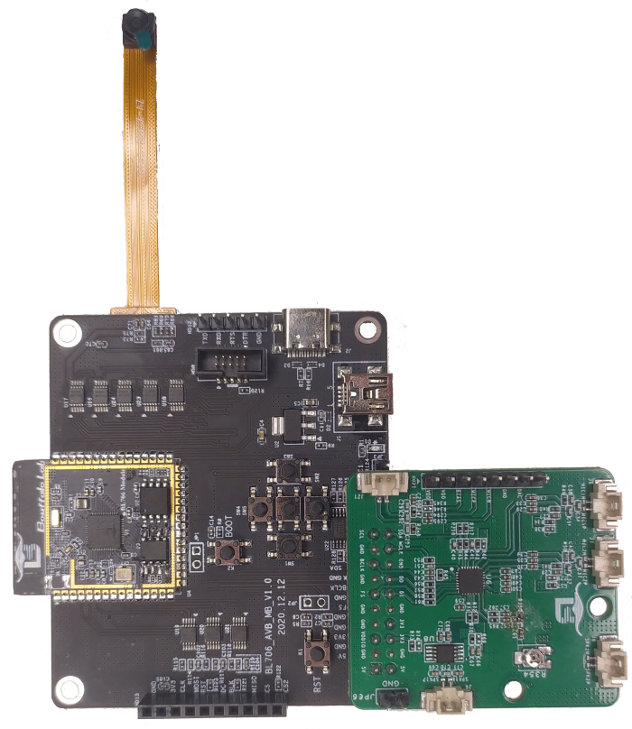

.. _connect_hardware:

Hardware connection
=======================

This document introduces how to connect the board of BL70x series MCU.

BL706_IOT
-------------------------

Use CK-Link to Programming and debug
^^^^^^^^^^^^^^^^^^^^^^^^^^^^^^^^^^^^^^^^

- Connect the CK-Link USB interface to the PC with a suitable USB data cable
- Connect the standard ``JTAG`` pin of the ``HD3`` group of the Iot board with the ``JTAG`` pin of ``CK-Link`` using a DuPont cable
- If you do not use CK-Link to power the board, you need to power the board separately

::

    bl706-iot board         CK-Link
    -------------------------------
        JTAG_TDI     <-->     TDI
        JTAG_TDO     <-->     TDO
        JTAG_TCK     <-->     TCK
        JTAG_TMS     <-->     TMS
        VDD33        <-->     VREF
        GND          <-->     GND

.. figure:: img/ck_link_connect_bl706_iot.png
   :alt:

   ck_link connect bl706-iot board

Use J-Link to Programming and debug
^^^^^^^^^^^^^^^^^^^^^^^^^^^^^^^^^^^^^^^

- Connect the USB interface of j-link to the PC with a USB data cable
- Connect the standard ``JTAG`` pins of the ``HD3`` group of the Iot board with the ``JTAG`` pins of the ``j-link`` using DuPont wires
- In the case of j-link connection, the board needs to be independently powered, and the power supply of the board is connected to the ``VTref`` pin of j-link

::

    bl706-iot board          j-link
    -------------------------------
        JTAG_TDI     <-->     TDI
        JTAG_TDO     <-->     TDO
        JTAG_TCK     <-->     TCK
        JTAG_TMS     <-->     TMS
        VDD33        <-->     VTref
        GND          <-->     GND

.. figure:: img/jlink_connect_bl706_iot.png
   :alt:

   jlink connect bl706-iot board

Use serial port to Programming
^^^^^^^^^^^^^^^^^^^^^^^^^^^^^^^^^^

-  Before using the serial port to Programming, please make sure that ``Bouffalo Lab Dev Cube`` or the command programming tool is installed correctly

   -  Use ``Type-C USB`` data cable or ``Mini USB`` data cable to connect to the ``Type-C`` interface or ``Mini`` interface on the board.
   -  Press the ``Boot`` key on the board, don't release it.
   -  Press the ``RST`` key on the board, now you have entered ``Boot ROM``, you can release the two keys.
   -  At this time, you can see the corresponding serial port ``COM`` number from the ``Bouffalo Lab Dev Cube``, if it does not appear, please click the ``Refresh`` key to refresh.

-  If you don't have a suitable data cable, you can also use some common ``USB-TTL`` modules to connect to the UART0 port of the development board for programming. ``UART0`` is on the ``HD1`` group, the connection method is as follows:

::

   USB-TTL      BL702_IoT
   ----------------------
     3V3   <-->   VDD
     TXD   <-->   RX0
     RXD   <-->   TX0
     GND   <-->   GND

- The programming step is the same as above

BL706_AVB
--------------------------

.. important::
   BL706_AVB has multiple multiplexed pins, please check carefully whether the required function pins are multiplexed; FUNC1: "Default: PIX; Connect: I2S/JTAG", FUNC2: "Default: I2S; Connect: SPI" ; **If you need to debug, please remember to connect the FUNC1 jumper**

Use Sipeed RV-Debugger Plus to programming and debug
^^^^^^^^^^^^^^^^^^^^^^^^^^^^^^^^^^^^^^^^^^^^^^^^^^^^^^^^^

- Powering the BL706_AVB
- Connect the RV-Debugger Plus debugger to the USB port of the computer. If the driver is not installed correctly, please refer to :ref:`sipeed_rv_debugger_plus`, set the driver, and proceed to the following steps
- Connect the debugger and the BL706_AVB with a cable (as shown in the figure below)

.. important::
   The FUNC1 jumper must be connected when debugging, otherwise the pins will be multiplexed with other functions and the JTAG function cannot be used; the serial port function can be used normally

   RV-Debugger connect bl706_avb board

Use CK-Link to programming and debug
^^^^^^^^^^^^^^^^^^^^^^^^^^^^^^^^^^^^^^^^^^

- Connect the CK-Link USB interface to the PC with a suitable USB data cable
- Connect the FUNC1 jump caps of the bl706_avb
- Connect the pins of the ``HD8`` group to the adapter board using a flat cable
- Connect the ``JTAG`` pin of the adapter board with the corresponding ``JTAG`` pin of ``CK-Link`` using a Dupont wire
- If you do not use CK-Link to power the board, you need to power the board separately

::

    bl706-avb board         CK-Link
    -------------------------------
        JTAG_TDI     <-->     TDI
        JTAG_TDO     <-->     TDO
        JTAG_TCK     <-->     TCK
        JTAG_TMS     <-->     TMS
        VDD33        <-->     VREF
        GND          <-->     GND

   ck_link connect bl706_avb board

Use serial port to programming
^^^^^^^^^^^^^^^^^^^^^^^^^^^^^^^^^^^

-  Before using the serial port to programming, please make sure that ``Bouffalo Lab Dev Cube`` or the command programming tool is installed correctly

   -  Use the ``Type-C USB`` or ``Mini USB`` data cable to connect to the corresponding ``Type-C`` port or ``Mini`` port on the board.
   -  Press the ``Boot`` key on the board, don't release it.
   -  Press the ``RST`` key on the board, now you have entered ``Boot ROM``, you can release the two keys.
   -  At this time, you can see the corresponding serial port ``COM`` number from the ``Bouffalo Lab Dev Cube``, if it does not appear, please click the ``Refresh`` button to refresh.

-  If you don't have a suitable data cable, you can also use some common ``USB-TTL`` modules to connect to the UART0 port of the development board for programming. ``UART0`` on the ``HD12`` group, the connection method is as follows:

-  If you use Sipeed RV-Debugger Plus to connect BL706_AVB through a flat cable, you can also use the serial port of Sipeed RV Debugger Plus

::

   USB-TTL      BL706_AVB
   ----------------------
     TXD   <-->   RX0
     RXD   <-->   TX0
     GND   <-->   GND

Connect BL706 AVB sub-modules
^^^^^^^^^^^^^^^^^^^^^^^^^^^^^^^^

-  This section describes how to connect the BL706_AVB board with other modules, mainly including camera connection, Audio Codec module connection, and SPI screen connection.

**BL706_AVB Connects to GC0308 Camera Module**

-  1. First, take the black locking part of the ``J5`` drawer type FPC cable holder on the back of the BL706_AVB development board and pull it out from the edge

-  2. When fully disconnected, as shown in the figure below.

.. figure:: img/connect_camera_2.png
   :alt:

-  3. The FPC cable holder is a drawer down type, so next insert the camera with the side without metal contact points facing upwards into the FPC cable holder

-  After inserting the camera, press the black latch tightly

**BL706_AVB Connecting Audio Codec Modules**

-  Insert the ``HD19`` group of pins of Audio Codec module into the ``HD11`` row female socket of BL706_AVB development board; note that the module is extended outward.
-  The schematic diagram is as follows：

