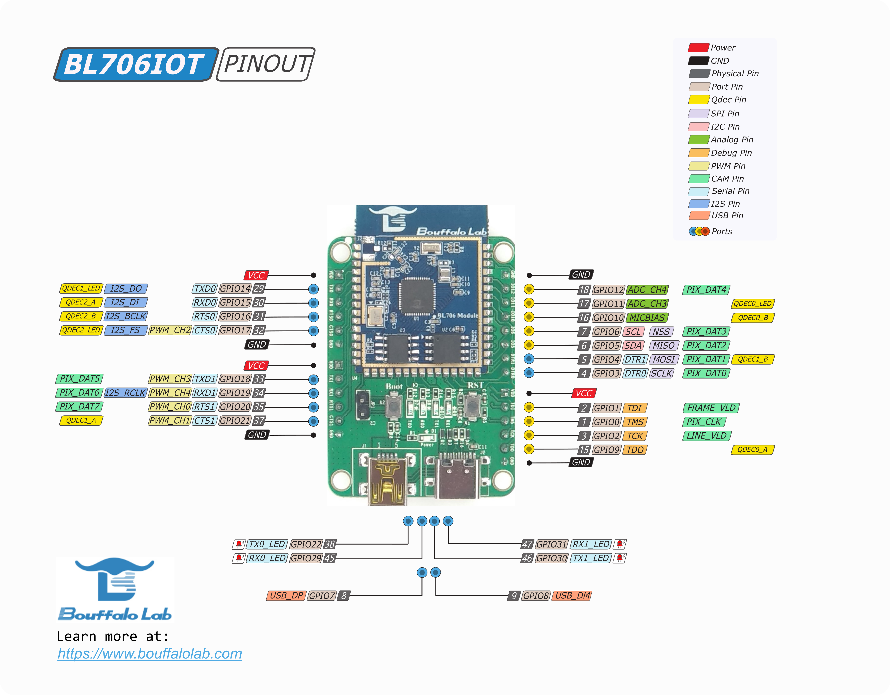
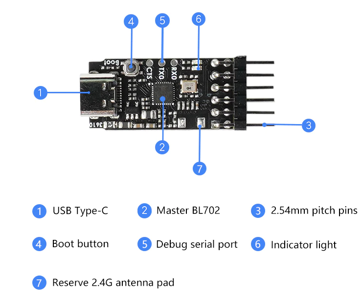

Preparation
=============================

Hardware environment
-----------------------------

- At least one board for BL702 series MCU:

  - BL706_IOT
  - BL706_AVB

BL706_Iot as shown in the figure below

   BL706_IoT

BL706_AVB as shown in the figure below

.. figure:: img/bl706_avb.png
   :alt:

   BL706_AVB

- A debugger that supports standard JTAG, just choose one of the following debuggers:

  - CK-Link
  - Jlink V11
  - Sipeed RV-Debugger Plus
  - Bouffalo Lab Debugger

- One PC host (Windows or Linux system)

Software Environment
--------------------------------

In order to better use the BL702 series MCU, it is recommended that you have at least one of the following development environments:

- Use `CDK <Windows_quick_start_cdk.html>`_ for Windows (Windows 7 or above is recommended)
- `Windows <Windows_quick_start_eclipse.html>`_ Use Eclipse (Windows 7 or above is recommended)
- `Linux <Linux_quick_start_ubuntu.html>`_ (LTS version above Ubuntu 18 is recommended)

.. _sipeed_rv_debugger_plus:

Sipeed RV-Debugger Plus driver installation settings
---------------------------------------------------------

- This section mainly introduces the driver installation settings of the **Sipeed RV-Debugger Plus** debugger. ``If you use **CK-Link** or **J-Link**, you don’t need to read this section.``

   Sipeed RV-Debugger plus

**Windows**

-  To use the Sipeed RV-Debugger Plus debugger on Windows we need to change the driver to the ``Win USB`` driver

   -  1. First, connect the Type-C USB interface of the debugger to the PC with a USB data cable, open the device manager of the PC, and you can see that the debugger is recognized as two serial ports in the port column (*Note: not the Serial port of the board's Boot interface*), or in the ``Universal Serial Bus Controller``, you see ``USB Serial Converter A`` and ``USB Serial Converter B``

   .. figure:: img/sipeed_rv_debugger_1.png

   .. figure:: img/sipeed_rv_debugger_4.png

   .. important:: 1. The debugger port number must start with ``usb serial port``, if you plug in more than one similar device, please leave only one, confirm the debugger port number
   .. important:: 2. If you see "USB Serial Device (COM*)" in the Device Manager, it means that the debugger has entered the "Boot" mode. Please power off the debugger and power it on again, and be careful not to connect the debugger to the target board; at this time, go to the device manager to see if it is normal

   .. figure:: img/sipeed_rv_debugger_7.png

   .. important:: 3. If the serial port is not shown in the device manager, only other devices are shown, or if you only see ``USB Serial Converter A`` and ``USB Serial Converter B`` in the Universal Serial Bus Controller, please go to the `FTDI official website <https://ftdichip.com/drivers/vcp-drivers/>`_ Download the driver that matches your system

   .. figure:: img/sipeed_rv_debugger_6.png

   - 2. Download the ``zadig-2.4`` replacement driver from the sipeed website. Download : `http://dl.sipeed.com/MAIX/tools/sipeed-rv-debugger/zadig-2.4.exe <http://dl.sipeed.com/MAIX/tools/sipeed-rv-debugger/ zadig-2.4.exe>`_
   - 3. After downloading, double-click to open ``zadig-2.4.exe``, select ``Options`` and check ``List All Devices``.

   .. figure:: img/sipeed_rv_debugger_3.png

   - 4. Find JTAG Debugger (Interface 0), then select the replacement driver as ``WinUSB`` and click ``Replace Driver`` to replace
   - 5. Open the device manager again and see that one of the serial ports has been replaced with a universal serial bus device, indicating that the installation is successful

   .. figure:: img/sipeed_rv_debugger_2.png

   - 6. At this point, the device driver of Sipeed RV-Debugger Plus has been replaced, and then you can play happily~

**Possible problems:**

.. caution:: 1. There are no two serial ports when the debugger is connected, and an LED on the debugger is always on, then it should be in Boot mode. Please power off the debugger and power it on again. Be careful not to connect the debugger to the target board; after the debugger is powered on, the two LED lights will flicker and go out under normal circumstances; at this time, check whether the device in the task manager is correct.

.. caution:: 2. If you still can’t use it normally after the above operations, and there is no correct phenomenon, it is recommended to download from the official Sipeed repository `GitHub <https://github.com/sipeed/RV-Debugger-BL702>`_ obtain the firmware and re-write; press and hold the ``Boot`` button on the debugger without releasing it, insert the debugger into the computer and power on, make the debugger enter the Boot mode, and flash the firmware again; power off and restart

**Linux**

-  First, connect the Type-C USB interface of the debugger to the PC host using the USB cable, open Terminal, and enter the command ``lsusb`` in the terminal to see the device with the following information

.. code-block:: bash

    $ lsusb
    ...
    Bus 001 Device 003: ID 0403:6010 Future Technology Devices International, Ltd FT2232C Dual USB-UART/FIFO IC
    ...

.. figure:: img/sipeed_rv_debugger_8.png

- If the above diagram does not show the ``FT2232C``, you need to install the ftdi driver

.. code-block:: bash

    $ sudo apt install libusb-dev libftdi-dev libhidapi-dev

-  Re-plug the debugger to make the changes take effect

- Debugging code requires openocd to be installed, using openocd version 0.11

.. note:: In Linux system, /dev/ttyUSB1 is used for serial port, /dev/ttyUSB0 is used for debug port, if /dev/ttyACM0 is displayed, it means boot mode is entered.

