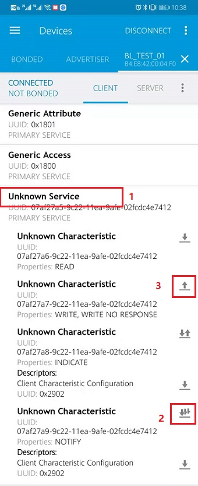
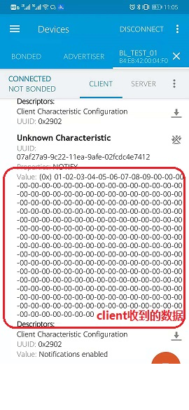

BLE Client And Server Interconnection
=======================================

This demo is based on **bl702** to demonstrate the connection and data sending and receiving of **ble server** and **ble client**.

Prepare
-----------------------

- Two bl702 boards or one bl702 board + mobile app

Software Implementation
----------------------------

BLE client software Implementation
^^^^^^^^^^^^^^^^^^^^^^^^^^^^^^^^^^^^^^^^^^^^

- For the software code, see ``examples/ble/ble_central``

.. code-block:: C
    :linenos:

    static struct bt_conn_cb ble_tp_conn_callbacks = {
     .connected = ble_tp_connected,
     .disconnected = ble_tp_disconnected,
    }

    void ble_tp_init()
    {
        if( !isRegister )
        {
            isRegister = 1;
            bt_conn_cb_register(&ble_tp_conn_callbacks);
        }
    }

- In the ``bt_conn_cb_register`` function, register the ``callback`` function for successful connection and disconnection

- In the ``ble_start_scan`` function, the device will start scanning

- In the ``device_found`` function, the device uploads the scanned Bluetooth device, the code uses ``adv_name`` to find the Bluetooth device that needs to be connected, and initiate the connection

.. code-block:: C
    :linenos:

    static void ble_write_data_task(void *pvParameters)
    {
        int error;
        uint8_t buf[20] = {0,1,2,3,4,5,6,7,8,9,10,11,12,13,14,15,16,17,18,19};
        while(1)
       {
            k_sem_take(&write_data_poll_sem, K_FOREVER);
            BT_WARN("ble_write_data\r\n");
            // Send data to server
            error =  bt_gatt_write_without_response(ble_tp_conn,char_hdl.tp_wr_hdl,buf,20,0);
            BT_WARN("Write Complete (err %d)\r\n", error);
       }
    }

- After the connection is successful, in the ``ble_write_data_task`` function, the client sends the data in ``buf`` to the server

.. code-block:: C
    :linenos:

    static u8_t notify_func(struct bt_conn *conn,struct bt_gatt_subscribe_params *params,const void *data, u16_t length);

- After the connection is successful, in the ``notify_func`` function, the client receives the data from the server, ``data`` is the data content, ``length`` is the data length

BLE server software implementation
^^^^^^^^^^^^^^^^^^^^^^^^^^^^^^^^^^^^^^^^^^^^

- See ``examples/ble/ble_peripheral`` for the software code

.. code-block:: C
    :linenos:

    int ble_start_adv(void)
    {
        struct bt_le_adv_param adv_param = {
            //options:3, connectable undirected, adv one time
            .options = 3, \
            .interval_min = BT_GAP_ADV_FAST_INT_MIN_3, \
            .interval_max = BT_GAP_ADV_FAST_INT_MAX_3, \
        };

        char *adv_name = "BL_TEST_01"; // This name must be the same as adv_name in ble_central
        uint8_t data[1] = {(BT_LE_AD_LIMITED | BT_LE_AD_NO_BREDR)};
        uint8_t data_uuid[2] = {0x12, 0x18};//0x1812
        uint8_t data_appearance[2] = {0x80, 0x01};//0x0180
        uint8_t data_manu[4] = {0x71, 0x01, 0x04, 0x13};
        struct bt_data adv_data[] = {
                BT_DATA(BT_DATA_FLAGS, data, 1),
                BT_DATA(BT_DATA_UUID16_ALL, data_uuid, sizeof(data_uuid)),
                BT_DATA(BT_DATA_GAP_APPEARANCE, data_appearance, sizeof(data_appearance)),
                BT_DATA(BT_DATA_NAME_COMPLETE, adv_name, strlen(adv_name)),
                BT_DATA(BT_DATA_MANUFACTURER_DATA, data_manu, sizeof(data_manu))
            };

        return bt_le_adv_start(&adv_param, adv_data, ARRAY_SIZE(adv_data), NULL, 0);
    }

- In the ``ble_start_adv`` function, ``adv_name`` sets the name of the broadcast device, and the device starts to broadcast

.. code-block:: C
    :linenos:

    static int ble_tp_recv_wr(struct bt_conn *conn, const struct bt_gatt_attr *attr,const void *buf, u16_t len, u16_t offset, u8_t flags);

-After the connection is successful, in ``ble_tp_recv_wr``, the server receives the data from the client, ``buf`` is the data content, ``len`` is the data length

.. code-block:: C
    :linenos:

    static void ble_tp_notify_task(void *pvParameters)
    {
        int err = -1;
        char data[244] = {0x01, 0x02, 0x03, 0x04, 0x05, 0x06, 0x07, 0x08, 0x09};
        k_sem_give(&notify_poll_sem);
        while(1)
        {
            k_sem_take(&notify_poll_sem, K_FOREVER);
            //send data to client
            err = bt_gatt_notify(ble_tp_conn, get_attr(BT_CHAR_BLE_TP_NOT_ATTR_VAL_INDEX), data, (tx_mtu_size - 3));
            BT_WARN("ble tp send notify : %d\n", err);

        }
    }

- After the connection is successful, in the ``ble_tp_notify_task`` function, the server sends the data in ``data`` to the client.

Compile and program
-----------------------------

- **CDK tool compilation**

    Not currently supported

- **Command compilation**

.. code-block:: bash
   :linenos:

    $ cd <sdk_path>/bl_mcu_sdk
    $ make BOARD=bl706_iot APP=ble_peripheral SUPPORT_FREERTOS=y SUPPORT_FLOAT=y SUPPORT_BLE=y

.. code-block:: bash
   :linenos:

    $ cd <sdk_path>/bl_mcu_sdk
    $ make BOARD=bl706_iot APP=ble_central SUPPORT_FREERTOS=y SUPPORT_FLOAT=y SUPPORT_BLE=y

-  **Program**

   See :ref:`bl_dev_cube`

Experimental phenomena
-----------------------------

- **Two bl702 connections**

.. figure:: img/ble_client.png
    :alt:

.. figure:: img/ble_server.png
    :alt:

- **Mobile phone connect bl702**

.. figure:: img/phone_connect.jpg
    :alt:

- The connection is successful, as shown in the figure below

.. figure:: img/phone_connected.png
    :alt:

-  Steps to send and receive data

    - Click ``1`` ``Unknow Service`` to display specific service properties

    - Click ``2`` to turn on ``Notification``, allowing the server to send data to the client

    - Click ``3`` where the client sends data to the server, fill in the data you want to send, and click the ``SEND`` button

.. figure:: img/write_data.jpg
    :alt:

