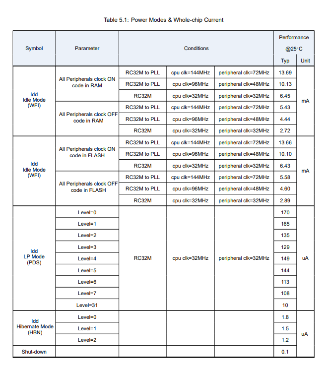
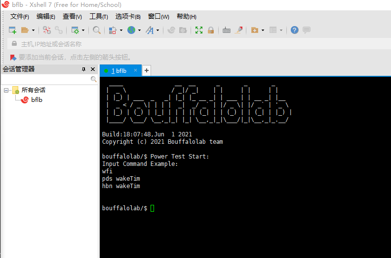
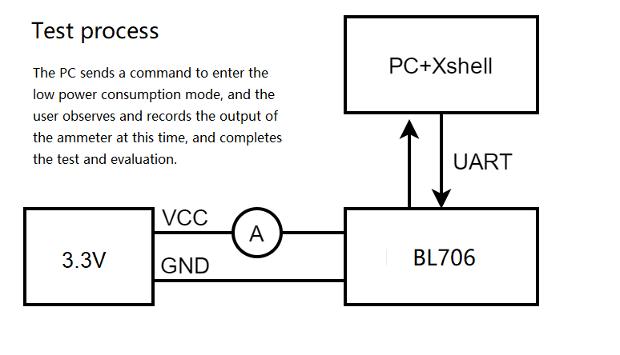

LowPower Evaluation
=========================

Introduction
------------------------
BL series chips have rich low-power features to adapt to different low-power applications. In order to facilitate users to quickly evaluate and use the low-power performance of bl series MCUs, bl_mcu_sdk provides a set of low-power interfaces. The low-power levels are divided into four levels.

1. Running: The power consumption when the CPU is running normally, and the power consumption is determined by the function executed by the customer application code.

2. WFI: WFI mode, the clock of the CPU is in the Gating state, the CPU stops running, and the program will continue to run when the user exits the WFI mode.

3. PDS: In PDS mode, most power domains on the chip are turned off, and the CPU is turned off at the same time. RAMs such as ITCM and DTCM in the same power domain as the CPU cannot be used. Only 64K OCTAM can save data. The internal RTC can be used to wake up, or use GPIO pins (when the GPIO power domain is not turned off) to wake up.

4. HBN: HBN mode, shuts down most of the power domains on the chip, shuts down the CPU and 64K OCRAM, only 4K RAM in the AON domain can save data. The internal RTC can be used to wake up, or a specific wake-up pin (pin located in the AON domain) can be used to wake up.

bl_mcu_sdk provides a simple low-power reference example (bl_mcu_sdk examples/power/lowpower_test/) to help users quickly evaluate low-power features. If you need to further adapt to your own low-power scenarios and adopt different low-power methods, please refer to the relevant datasheet or seek technical support from Boufflao Lab.
In this example, the clock selection of peripherals and CPU are both crystal oscillator 32M. The power consumption measurement results based on this example are shown in the following table:

    +------------+---------------------+------------+------------------------------+-----------------------------------------------------------+
    |Mode        |Reference current    |Basic mode  |Wake-up source                |Remark                                                     |
    +============+=====================+============+==============================+===========================================================+
    |Running     |5.68 mA              |Run         |                              |All peripheral clocks are turned on                        |
    +------------+---------------------+------------+------------------------------+-----------------------------------------------------------+
    |WFI         |3.14 mA              |WFI         |Any interruption              |Except the serial port, other peripheral clocks are closed |
    +------------+---------------------+------------+------------------------------+-----------------------------------------------------------+
    |PDS         |10 uA                |PDS 31      |Internal RTC/pin interrupt    |64K OCRAM to save data                                     |
    +------------+---------------------+------------+------------------------------+-----------------------------------------------------------+
    |HBN         |1 uA                 |HBN 1       |Internal RTC/pin interrupt    |4K AON RAM to save data                                    |
    +------------+---------------------+------------+------------------------------+-----------------------------------------------------------+

The reference current in the above table is obtained through the sample firmware test. The definition of four levels of "run" " wfi" "pds" "hbn" simplifies the original setting of hbn level and pds level.

See bl702_bl704_bl706_DS_EN_Combo_1.9.pdf page 28

**Low power consumption example test method**
-------------------------------------------------

**Compile low-power sample code**
^^^^^^^^^^^^^^^^^^^^^^^^^^^^^^^^^^^^^^^

Write ``make APP=lowpower_test SUPPORT_SHELL=y BOARD=bl706_lp`` in the project directory to complete the compilation of the low power consumption example bl706, or use the CDK project directly to complete the compilation and download.
You can refer to this document "Quick Development Guide" to get more information about compiling and programming.

When the compilation and programming are successful, connect the serial port to the computer and reset the chip, Xshell will display the page as shown in the figure below.

**Prepare the hardware environment required for low-power testing**
^^^^^^^^^^^^^^^^^^^^^^^^^^^^^^^^^^^^^^^^^^^^^^^^^^^^^^^^^^^^^^^^^^^^^^^

- It is possible to connect the ammeter and the circuit board of the power supply side in series
- Ammeter
- PC (running Windows or Linux system)
- TTL to USB

As shown in the figure below, connect the ammeter in series into the power supply circuit of the bl706 module, and issue different low-power commands through the serial debugging assistant software on the PC side, so that the bl706 enters the corresponding low-power mode.
Observe the indicated current value and complete the evaluation.

**Use Xshell to start evaluating low-power performance**
^^^^^^^^^^^^^^^^^^^^^^^^^^^^^^^^^^^^^^^^^^^^^^^^^^^^^^^^^^^^^^^^
The user can enter the corresponding low power consumption mode by entering the following commands in Xshell.

``run``

- After resetting the chip, it enters the run mode by default without entering any low power consumption mode. The chip is actually running the while(1); statement.

``wfi``

- Enter wfi mode without adding any parameters. After entering, the CPU is in clock gating state to reduce power consumption
- After entering wfi mode, any interrupt will wake up, such as uart interrupt. Pressing Enter in Xshell will trigger the BL706 UART RX interrupt, so the wfi low power consumption mode can be awakened by this method.

``pds sleeptime``

- pds can choose to take the parameter "sleeptime" to determine its internal RTC wake-up time. If the command does not carry this parameter, the RTC internal wake-up is not used by default. The current firmware only supports power-on reset wake-up.
- If the instruction contains the sleeptime parameter, pds will be awakened at the moment of ``sleeptime * clock_period``, which will behave as resetting the chip and reprinting the initial message.
- After entering the low-power mode, the RTC clock is 32K, so when the sleeptime is 32768, it appears to wake up after a second of sleep.

``hbn sleeptime``

- hbn can choose to take the parameter "sleeptime" to determine its internal RTC wake-up time. If the command does not carry this parameter, the RTC internal wake-up is not used by default. The current firmware only supports power-on reset wake-up.
- If the instruction contains the sleeptime parameter, hbn will be awakened at the moment of ``sleeptime * clock_period``, which will behave as resetting the chip and printing the start message again.
- After entering the low-power mode, the RTC clock is 32K, so when the sleeptime is 32768, it appears to wake up after a second of sleep.