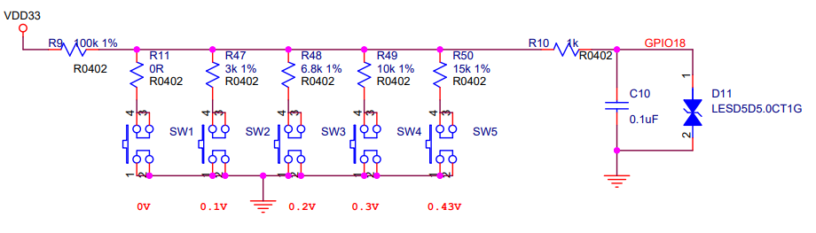

ADC - Key Detection Voltage
==============================

This demo mainly introduces the key functions of the ADC. The ADC is used to detect the voltage value of the key input pin and judge whether the corresponding key is pressed according to different voltage divisions.

Hardware Connection
-----------------------------
This demo is based on BL706_AVB:

::

       GPIO function         GPIO pin
    ----------------------------------
        ADC CH8      <-->     GPIO18

**Voltage divider circuit:**

    adc key

Software Implementation
-----------------------------

-  For the code see ``examples/adc/adc_key``

.. code-block:: C
    :linenos:

    #define BSP_ADC_CLOCK_SOURCE  ROOT_CLOCK_SOURCE_XCLK
    #define BSP_ADC_CLOCK_DIV  0

- Configure the ``ADC`` device clock source, see ``bsp/board/bl706_avb/clock_config.h``

.. code-block:: C
    :linenos:

    #define CONFIG_GPIO18_FUNC GPIO_FUN_ADC

- Configure ``ADC`` device multiplexing pins, see ``bsp/board/bl706_avb/pinmux_config.h``

.. code-block:: C
    :linenos:

    #define BSP_USING_ADC0

    #if defined(BSP_USING_ADC0)
    #ifndef ADC0_CONFIG
    #define ADC0_CONFIG \
    {   \
        .clk_div = ADC_CLOCK_DIV_32,\
        .vref = ADC_VREF_3P2V,\
        .continuous_conv_mode = DISABLE,\
        .differential_mode = DISABLE,\
        .data_width = ADC_DATA_WIDTH_16B_WITH_256_AVERAGE,\
        .fifo_threshold = ADC_FIFO_THRESHOLD_1BYTE,\
        .gain = ADC_GAIN_1\
    }
    #endif
    #endif

- Enable ``BSP_USING_ADC0`` and configure the ``ADC`` device, see ``bsp/board/bl706_iot/peripheral_config.h``

.. code-block:: C
    :linenos:

    adc_channel_cfg_t adc_channel_cfg;
    adc_channel_cfg.pos_channel = posChList;
    adc_channel_cfg.neg_channel = negChList;

    adc_register(ADC0_INDEX, "adc_key", DEVICE_OFLAG_STREAM_RX);

    adc_key = device_find("adc_key");

    if(adc_key)
    {
        ADC_DEV(adc_key)->continuous_conv_mode = ENABLE;
        device_open(adc_key, DEVICE_OFLAG_STREAM_RX);
        device_control(adc_key,DEVICE_CTRL_ADC_CHANNEL_CONFIG,&adc_channel_cfg);

    }else{
        MSG("device open failed\r\n");
    }

    adc_channel_start(adc_key);

- First call the ``adc_register`` function to register the ``adc_key`` device, which is currently registered as ADC0
- Then use the ``find`` function to find the handle corresponding to the device and save it in the ``adc_key`` handle
- Then use ``device_open`` to open the ``adc_key`` device in polling mode, and call ``device_control`` to complete the ADC related configuration
- Finally call ``adc_channel_start`` to enable ADC conversion

.. code-block:: C
    :linenos:

    device_read(adc_key,0,(void *)&result_val,1);
    keyValue = get_adc_key_value(result_val.volt * 1000);
    if( keyValue!=KEY_NO_VALUE){

        MSG("key %d pressed\r\n",keyValue);
        MSG("result_val.volt: %0.2f mv\n", (result_val.volt * 1000));
    }

- Call ``device_read`` to read the ``adc_key`` device information and save it to the ``result_val`` structure
- Call the ``get_adc_key_value`` function to get the current key value and voltage value

Compile and Program
-----------------------------

-  **CDK compilation**

   Open project：adc_key.cdkproj

   Refer to the steps of :ref:`windows_cdk_quick_start` to compile and download

-  **Command compilation**

.. code-block:: bash
   :linenos:

    $ cd <sdk_path>/bl_mcu_sdk
    $ make BOARD=bl706_avb APP=adc_key

-  **Program**

   See :ref:`bl_dev_cube`

Experimental Phenomena
-----------------------------
In this experiment, pressing SW1 ~ SW5 on the board in turn will get different voltage values:

- key 0: ~0V
- key 1: ~0.1V
- key 2: ~0.2V
- key 3: ~0.3V
- key 4: ~0.43V

operation result:

.. figure:: img/adc_key_result.png

Video display:

.. raw:: html

    <iframe src="https://player.bilibili.com/player.html?aid=887712205&bvid=BV1xK4y1P7ur&cid=330261457&page=5" scrolling="no" border="0" frameborder="no" framespacing="0" allowfullscreen="true"> </iframe>

