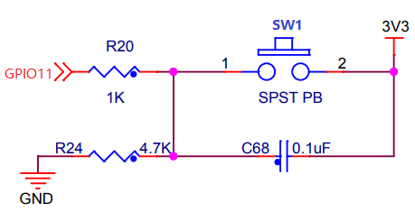

GPIO interrupt - Button detection
====================================

This demo is based on GPIO external interrupt mode.

Hardware Connection
-----------------------------

This demo is based on BL706_IOT, add the button circuit by yourself, the connection method is as follows

::

       GPIO function         GPIO pin
    ----------------------------------
        SW1      <-->     GPIO11

Software Implementation
-----------------------------

- See ``examples/gpio/gpio_int`` for the software code

.. code-block:: C
    :linenos:

    static void gpio11_int_callback(uint32_t pin)
    {
        MSG("gpio rising trigger !\r\n");
    }

    gpio_set_mode(GPIO_PIN_11,GPIO_SYNC_RISING_TRIGER_INT_MODE);
    gpio_attach_irq(GPIO_PIN_11,gpio11_int_callback);
    gpio_irq_enable(GPIO_PIN_11,ENABLE);

- Use the above code to configure ``GPIO11`` as the GPIO rising edge interrupt trigger mode, and register the interrupt callback function.

Compile and Program
-----------------------------

-  **CDK compilation**

   Open project:gpio_int.cdkproj

   Refer to the steps of :ref:`windows_cdk_quick_start` to compile and download

-  **Command compilation**

.. code-block:: bash
   :linenos:

    $ cd <sdk_path>/bl_mcu_sdk
    $ make BOARD=bl706_iot APP=gpio_int

-  **Program**

   See :ref:`bl_dev_cube`

Experimental Phenomena
-----------------------------

When the button is pressed, the serial port will print ``"gpio rising trigger !"``