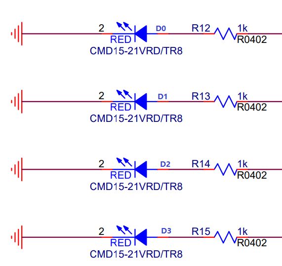

PWM - Breathing LED
=========================

    This demo is based on PWM polling mode.

Hardware Connection
-----------------------------

This demo is based on BL706_IOT, and the connection method is as follows

::

       GPIO function         GPIO pin
    ----------------------------------
        PWM_CH2      <-->     GPIO22

Software Implementation
-----------------------------

-See ``examples/pwm/pwm_breath_led`` for the software code

.. code-block:: C
    :linenos:

    #define BSP_PWM_CLOCK_SOURCE  ROOT_CLOCK_SOURCE_XCLK
    #define BSP_PWM_CLOCK_DIV  1

- Configure the ``PWM`` device clock source, see ``bsp/board/bl706_iot/clock_config.h``

.. code-block:: C
    :linenos:

    #define CONFIG_GPIO22_FUNC GPIO_FUN_PWM

- Configure ``PWM`` device multiplexing pins, see ``bsp/board/bl706_iot/pinmux_config.h``

.. code-block:: C
    :linenos:

    #define BSP_USING_PWM_CH2

    #if defined(BSP_USING_PWM_CH2)
    #ifndef PWM_CH2_CONFIG
    #define PWM_CH2_CONFIG \
    {   \
        .ch = 2, \
        .frequency = 1000000, \
        .dutycycle = 0, \
        .it_pulse_count = 0,\
    }
    #endif
    #endif

- Enable ``BSP_USING_PWM_CH2`` and configure ``PWM`` device configuration, see ``bsp/board/bl706_iot/peripheral_config.h``

.. code-block:: C
    :linenos:

    pwm_register(PWM_CH2_INDEX, "led_breath", DEVICE_OFLAG_RDWR);

    struct device *led_breath = device_find("led_breath");

    if (led_breath) {
        PWM_DEV(led_breath)->period = 32; //frequence = 32M/1/32 = 1Mhz
        PWM_DEV(led_breath)->threshold_low = 16;
        PWM_DEV(led_breath)->threshold_high = 32;
        device_open(led_breath, DEVICE_OFLAG_STREAM_TX);
        pwm_channel_start(led_breath);
    }

- First call the ``pwm_register`` function to register a channel of the ``PWM`` device, currently register ``PWM_CH2``
- Then use the ``find`` function to find the handle corresponding to the device and save it in the ``led_breath`` handle
- Set the frequency of ``PWM_CH2`` to 1Mhz, and the duty cycle to 50%
- Use ``device_open`` to open the ``led_breath`` device in polling mode

.. code-block:: C
    :linenos:

        for (pwm_cfg.threshold_high = 0; pwm_cfg.threshold_high <= 32; pwm_cfg.threshold_high++) {
            device_control(led_breath, DEIVCE_CTRL_PWM_DUTYCYCLE_CONFIG, &pwm_cfg);
            bflb_platform_delay_ms(50);
        }

        for (pwm_cfg.threshold_high = 32; 0 <= pwm_cfg.threshold_high && pwm_cfg.threshold_high <= 32; pwm_cfg.threshold_high--) {
            device_control(led_breath, DEIVCE_CTRL_PWM_DUTYCYCLE_CONFIG, &pwm_cfg);
            bflb_platform_delay_ms(50);
        }

- Use the ``device_contorl`` function with the ``DEIVCE_CTRL_PWM_DUTYCYCLE_CONFIG`` instruction to modify the duty cycle of the current PWM channel.

Compile and Program
-----------------------------

-  **CDK compilation**

   Open project:pwm_breath_led.cdkproj

   Refer to the steps of :ref:`windows_cdk_quick_start` to compile and download

-  **Command compilation**

.. code-block:: bash
   :linenos:

    $ cd <sdk_path>/bl_mcu_sdk
    $ make BOARD=bl706_iot APP=pwm_breath_led

-  **Program**

   See :ref:`bl_dev_cube`

Experimental Phenomena
-----------------------------

.. figure:: img/pwm_demo.gif
   :alt:

pwm breath led!

Video display:

.. raw:: html

    <iframe src="//player.bilibili.com/player.html?aid=887712205&bvid=BV1xK4y1P7ur&cid=326227924&page=4" scrolling="no" border="0" frameborder="no" framespacing="0" allowfullscreen="true"> </iframe>
