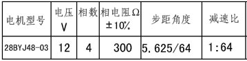
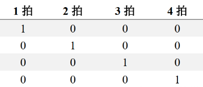
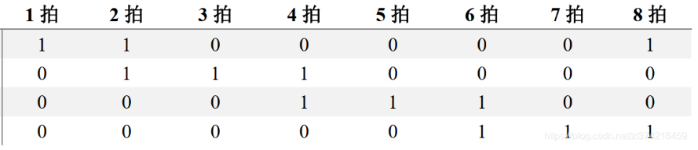
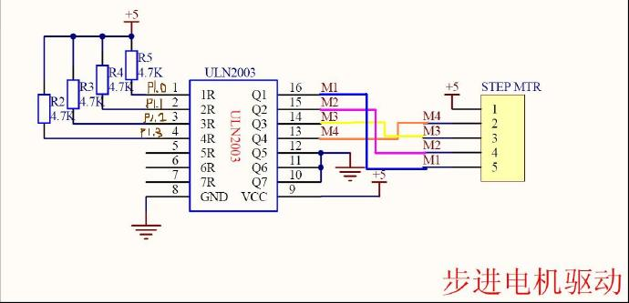

PWM - 驱动步进电机
====================

步进电机是一种将电脉冲转化为角位移的执行机构。当步进驱动器接收到一个脉冲信号，它就驱动步进电机按设定的方向转动一个固定的角度（及步进角）。可以通过控制脉冲个来控制角位移量，从而达到准确定位的目的；同时可以通过控制脉冲频率来控制电机转动的速度和加速度，从而达到调速的目的。

本 demo 采用步进电机 28BYJ48 型四相八拍电机，使用 ULN2003 芯片驱动，电压为 DC5V—DC12V。当对步进电机施加一系列连续不断的控制脉冲时，它可以连续不断地转动。每一个脉冲信号对应步进电机的某一相或两相绕组的通电状态改变一次，也就对应转子转过一定的角度（一个步距角）。当通电状态的改变完成一个循环时，转子转过一个齿距。

.. figure:: img/step_motor.png
    :alt:

    28BYJ48

.. figure:: img/uln2003.png
    :alt:

    ULN2003

这个步进电机内部有个真正的步进马达转子，每一个脉冲能使这个真正的转子转动5.625°，看下图的数据表格中的减速比是1:64，意思是这个真正的步进马达转子转动64周才能让输出轴转动1周，因此下图的表格中步距角度才写的是5.625°/64，表明的意思是一个脉冲可以让输出轴转动5.625°/64的角度。所以要让马达转一周（360°）， 则需要360/5.625*64=4096个脉冲。
脉冲(或拍)的数量决定转动的角度，单位时间内脉冲(或拍)的数量决定转动的速度

四相步进电机可以在不同的通电方式下运行，常见的通电方式有如下三种：

- 一相励磁：单（单相绕组通电）四拍（A+,B+,A-,B-......）

- 二相励磁：双（双相绕组通电）四拍（A+B+,B+A-,A-B-,B-A+......）

.. figure:: img/pwm_step_motor2.png
    :alt:

- 一二相励磁：八拍（A+B+,B+,B+A-,A-,A-B-,B-,B-A+,A+......）

硬件连接
-----------------------------

本 demo 基于BL706_IOT开发板，连接方式如下

::

       GPIO function         GPIO pin
    ----------------------------------
        PWM_CH0      <-->     GPIO10
        PWM_CH1      <-->     GPIO11
        PWM_CH2      <-->     GPIO12
        PWM_CH3      <-->     GPIO3

    参考电路

软件实现
-----------------------------

-  软件代码见 ``examples/pwm/pwm_step_motor``

.. code-block:: C
    :linenos:

    #define BSP_PWM_CLOCK_SOURCE  ROOT_CLOCK_SOURCE_RC_32K
    #define BSP_PWM_CLOCK_DIV  32

-  配置 ``PWM`` 设备时钟源，见 ``bsp/board/bl706_iot/clock_config.h``

.. code-block:: C
    :linenos:

    #define CONFIG_GPIO3_FUNC GPIO_FUN_PWM
    #define CONFIG_GPIO10_FUNC GPIO_FUN_PWM
    #define CONFIG_GPIO11_FUNC GPIO_FUN_PWM
    #define CONFIG_GPIO12_FUNC GPIO_FUN_PWM

-  配置 ``PWM`` 设备复用引脚，见 ``bsp/board/bl706_iot/pinmux_config.h``

.. code-block:: C
    :linenos:

    #define BSP_USING_PWM_CH0
    #define BSP_USING_PWM_CH1
    #define BSP_USING_PWM_CH2
    #define BSP_USING_PWM_CH3

    #if defined(BSP_USING_PWM_CH0)
    #ifndef PWM_CH0_CONFIG
    #define PWM_CH0_CONFIG                   \
        {                                    \
            .ch = 0,                         \
            .polarity_invert_mode = DISABLE, \
            .period = 0,                     \
            .threshold_low = 0,              \
            .threshold_high = 0,             \
            .it_pulse_count = 0,             \
        }
    #endif
    #endif

    #if defined(BSP_USING_PWM_CH1)
    #ifndef PWM_CH1_CONFIG
    #define PWM_CH1_CONFIG                   \
        {                                    \
            .ch = 1,                         \
            .polarity_invert_mode = DISABLE, \
            .period = 0,                     \
            .threshold_low = 0,              \
            .threshold_high = 0,             \
            .it_pulse_count = 0,             \
        }
    #endif
    #endif

    #if defined(BSP_USING_PWM_CH2)
    #ifndef PWM_CH2_CONFIG
    #define PWM_CH2_CONFIG                   \
        {                                    \
            .ch = 2,                         \
            .polarity_invert_mode = DISABLE, \
            .period = 0,                     \
            .threshold_low = 0,              \
            .threshold_high = 0,             \
            .it_pulse_count = 0,             \
        }
    #endif
    #endif

    #if defined(BSP_USING_PWM_CH3)
    #ifndef PWM_CH3_CONFIG
    #define PWM_CH3_CONFIG                   \
        {                                    \
            .ch = 3,                         \
            .polarity_invert_mode = DISABLE, \
            .period = 0,                     \
            .threshold_low = 0,              \
            .threshold_high = 0,             \
            .it_pulse_count = 0,             \
        }
    #endif
    #endif

-  使能 ``BSP_USING_PWM_CH0``, ``BSP_USING_PWM_CH1`` , ``BSP_USING_PWM_CH2``, ``BSP_USING_PWM_CH3`` 并配置 ``PWM`` 设备配置，见 ``bsp/board/bl706_iot/peripheral_config.h``

.. code-block:: C
    :linenos:

    pwm_register(PWM_CH0_INDEX, "motor_ch0", DEVICE_OFLAG_RDWR);
    pwm_register(PWM_CH1_INDEX, "motor_ch1", DEVICE_OFLAG_RDWR);
    pwm_register(PWM_CH2_INDEX, "motor_ch2", DEVICE_OFLAG_RDWR);
    pwm_register(PWM_CH3_INDEX, "motor_ch3", DEVICE_OFLAG_RDWR);

    motor_ch0 = device_find("motor_ch0");
    motor_ch1 = device_find("motor_ch1");
    motor_ch2 = device_find("motor_ch2");
    motor_ch3 = device_find("motor_ch3");

    if (motor_ch0) {
        PWM_DEV(motor_ch0)->period = 8; //frequence = 32K/160/8 = 25hz
        PWM_DEV(motor_ch0)->threshold_low = 2;
        PWM_DEV(motor_ch0)->threshold_high = 7;
        PWM_DEV(motor_ch0)->polarity_invert_mode = ENABLE;
        device_open(motor_ch0, DEVICE_OFLAG_STREAM_TX);
    }
    if (motor_ch1) {
        PWM_DEV(motor_ch1)->period = 8; //frequence = 32K/160/8 = 25hz
        PWM_DEV(motor_ch1)->threshold_low = 1;
        PWM_DEV(motor_ch1)->threshold_high = 4;
        device_open(motor_ch1, DEVICE_OFLAG_STREAM_TX);
    }
    if (motor_ch2) {
        PWM_DEV(motor_ch2)->period = 8; //frequence = 32K/160/8 = 25hz
        PWM_DEV(motor_ch2)->threshold_low = 3;
        PWM_DEV(motor_ch2)->threshold_high = 6;
        device_open(motor_ch2, DEVICE_OFLAG_STREAM_TX);
    }
    if (motor_ch3) {
        PWM_DEV(motor_ch3)->period = 8; //frequence = 32K/160/8 = 25hz
        PWM_DEV(motor_ch3)->threshold_low = 5;
        PWM_DEV(motor_ch3)->threshold_high = 8;
        device_open(motor_ch3, DEVICE_OFLAG_STREAM_TX);
    }
    pwm_channel_start(motor_ch0);
    pwm_channel_start(motor_ch1);
    pwm_channel_start(motor_ch2);
    pwm_channel_start(motor_ch3);

-  首先调用 ``pwm_register`` 函数注册 ``PWM`` 设备的一个通道，当前注册 PWM 通道0/1/2/3
-  然后通过 ``find`` 函数找到设备对应的句柄，保存于4个句柄中
-  设置 4个通道 的频率为 125hz，占空比为37.5%
-  使用 ``device_open`` 以轮询模式来打开 4个通道

.. code-block:: C
    :linenos:

    enum motor_dir_type {
        CW,
        CCW,
        STOP
    };

    void motor_set_dir(enum motor_dir_type dir)
    {
        pwm_dutycycle_config_t pwm_cfg[4];

        if (dir == CW) {
            pwm_cfg[0].threshold_low = 2;
            pwm_cfg[0].threshold_high = 7;
            pwm_cfg[1].threshold_low = 1;
            pwm_cfg[1].threshold_high = 4;
            pwm_cfg[2].threshold_low = 3;
            pwm_cfg[2].threshold_high = 6;
            pwm_cfg[3].threshold_low = 5;
            pwm_cfg[3].threshold_high = 8;
        }

        else if (dir == CCW) {
            pwm_cfg[0].threshold_low = 2;
            pwm_cfg[0].threshold_high = 7;
            pwm_cfg[1].threshold_low = 5;
            pwm_cfg[1].threshold_high = 8;
            pwm_cfg[2].threshold_low = 3;
            pwm_cfg[2].threshold_high = 6;
            pwm_cfg[3].threshold_low = 1;
            pwm_cfg[3].threshold_high = 4;
        } else if (dir == STOP) {
            pwm_cfg[0].threshold_low = 0;
            pwm_cfg[0].threshold_high = 0;
            pwm_cfg[1].threshold_low = 0;
            pwm_cfg[1].threshold_high = 0;
            pwm_cfg[2].threshold_low = 0;
            pwm_cfg[2].threshold_high = 0;
            pwm_cfg[3].threshold_low = 0;
            pwm_cfg[3].threshold_high = 0;
        }
        device_control(motor_ch0, DEIVCE_CTRL_PWM_DUTYCYCLE_CONFIG, &pwm_cfg[0]);
        device_control(motor_ch1, DEIVCE_CTRL_PWM_DUTYCYCLE_CONFIG, &pwm_cfg[1]);
        device_control(motor_ch2, DEIVCE_CTRL_PWM_DUTYCYCLE_CONFIG, &pwm_cfg[2]);
        device_control(motor_ch3, DEIVCE_CTRL_PWM_DUTYCYCLE_CONFIG, &pwm_cfg[3]);
    }

- 使用 ``device_contorl`` 函数，配合 ``DEIVCE_CTRL_PWM_DUTYCYCLE_CONFIG`` 指令，修改4个 PWM 通道的的高低阈值。

.. note:: 该函数的功能主要用于切换步进电机的方向

编译和烧录
-----------------------------

-  **CDK 编译**

   打开项目中提供的工程文件：pwm_step_motor.cdkproj

   参照 :ref:`windows_cdk_quick_start` 的步骤编译下载即可

-  **命令行编译**

.. code-block:: bash
   :linenos:

    $ cd <sdk_path>/bl_mcu_sdk
    $ make BOARD=bl706_iot APP=pwm_step_motor

-  **烧录**

   详见 :ref:`bl_dev_cube`

实验现象
-----------------------------

.. figure:: img/pwm_step_motor.gif
   :alt:

